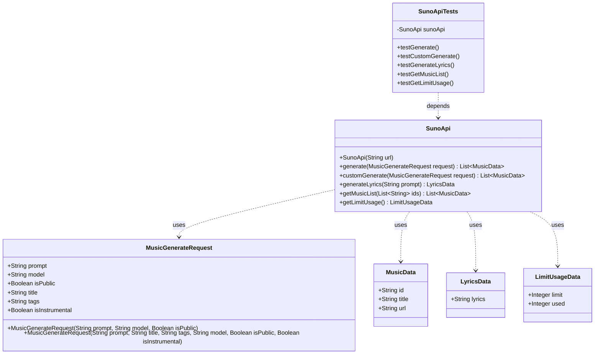
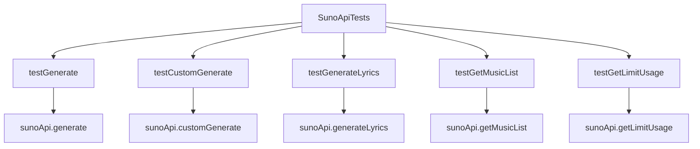

# 基础信息

|      |      |
|------|------|
| 编码语言 | .java |
| 代码路径 | yudao-module-ai/yudao-spring-boot-starter-ai/src/test/java/cn/iocoder/yudao/framework/ai/music/SunoApiTests.java |
| 包名 | cn.iocoder.yudao.framework.ai.music |
| 依赖项 | ['cn.hutool.core.collection.ListUtil', 'cn.iocoder.yudao.framework.ai.core.model.suno.api.SunoApi', 'org.junit.jupiter.api.Disabled', 'org.junit.jupiter.api.Test', 'java.util.List'] |
| 概述说明 | SunoApiTests类包含多个测试方法，用于测试SunoApi的不同功能，包括音乐生成、带歌词的音乐生成、歌词生成、获取音乐列表和获取使用限制信息。所有测试方法均被禁用，未实际执行。 |

# 说明

SunoApiTests类是一个包含多个测试方法的类，专门用于测试SunoApi的不同功能。该类中的测试方法涵盖了SunoApi的多个核心功能，包括音乐生成、带歌词的音乐生成、歌词生成、获取音乐列表以及获取使用限制信息。具体来说，testGenerate方法用于测试音乐生成功能，testCustomGenerate方法则专注于测试带歌词的音乐生成功能。此外，testGenerateLyrics方法用于测试歌词生成功能，而testGetMusicList方法则用于测试获取音乐列表的功能。最后，testGetLimitUsage方法用于测试获取使用限制信息的功能。尽管这些测试方法涵盖了SunoApi的多个关键功能，但所有测试方法目前均被禁用，未实际执行。这意味着这些测试方法尚未被用于验证SunoApi的功能是否正常工作。

# 类列表 Class Summary

| 名称   | 类型  | 说明 |
|-------|------|-------------|
| SunoApiTests | class | SunoApiTests类包含多个测试方法，用于测试SunoApi的不同功能。testGenerate测试音乐生成功能，testCustomGenerate测试带歌词的音乐生成，testGenerateLyrics测试歌词生成，testGetMusicList测试获取音乐列表，testGetLimitUsage测试获取使用限制信息。所有测试方法均被禁用，未实际执行。 |

## 类 SunoApiTests

|      |      |
|------|------|
| 访问范围 | public |
| 类型 | class |
| 名称 | SunoApiTests |
| 说明 | SunoApiTests类包含多个测试方法，用于测试SunoApi的不同功能。testGenerate测试音乐生成功能，testCustomGenerate测试带歌词的音乐生成，testGenerateLyrics测试歌词生成，testGetMusicList测试获取音乐列表，testGetLimitUsage测试获取使用限制信息。所有测试方法均被禁用，未实际执行。 |

### UML类图

### 描述信息：
该UML类图展示了`SunoApiTests`类与`SunoApi`类之间的关系，`SunoApi`类通过多个方法生成音乐数据、歌词数据以及获取使用限制信息。`MusicGenerateRequest`类用于封装生成音乐的请求参数，`MusicData`、`LyricsData`和`LimitUsageData`类分别用于存储音乐数据、歌词数据和使用限制数据。

### 内部方法调用关系图

### 描述信息：
该图展示了`SunoApiTests`类中的测试方法如何调用`SunoApi`类的不同方法。每个测试方法（如`testGenerate`、`testCustomGenerate`等）都调用了`SunoApi`类中的相应方法（如`generate`、`customGenerate`等），以测试不同的功能模块。

### 字段列表 Field List

| 名称  | 类型  | 说明 |
|-------|-------|------|
| sunoApi = new SunoApi("https://suno-3tah0ycyt-status2xxs-projects.vercel.app") | SunoApi | private final SunoApi sunoApi = new SunoApi("https://suno-3tah0ycyt-status2xxs-projects.vercel.app"); 创建了一个SunoApi实例，使用指定的URL进行初始化。 |

### 方法列表 Method List

| 名称  | 类型  | 说明 |
|-------|-------|------|
| testGetLimitUsage | void | 该代码片段展示了一个被禁用的测试方法`testGetLimitUsage`，该方法调用`sunoApi.getLimitUsage()`获取限用数据，并打印结果。 |
| testGenerateLyrics | void | 该代码片段是一个被禁用的测试方法，用于生成歌词。方法调用SunoApi的generateLyrics方法，传入参数"A soothing lullaby"，并打印生成的歌词数据。 |
| testGetMusicList | void | 该代码片段是一个被禁用的测试方法，用于测试获取音乐列表的功能。方法中准备了一个ID参数，调用`sunoApi.getMusicList`方法获取音乐列表，并打印结果。 |
| testGenerate | void | 该代码片段展示了一个被禁用的测试方法`testGenerate`，用于生成音乐。方法中创建了一个`MusicGenerateRequest`对象，包含音乐描述、模型版本和是否启用选项。随后调用`sunoApi.generate`方法生成音乐数据列表，并打印结果。 |
| testCustomGenerate | void | 该代码片段展示了一个测试方法，用于生成带有轻松吉他旋律的流行歌曲。歌曲描述夏日海滩的宁静，并在副歌部分加快节奏，表达对自由的向往。方法通过调用SunoApi的customGenerate接口，传入包含歌词、情绪、标题等参数的请求对象，最终输出生成的音乐数据列表。 |

