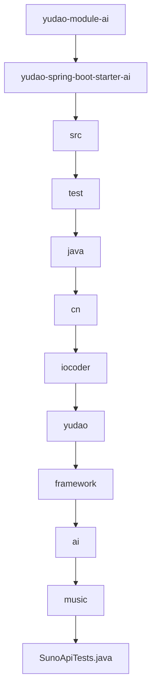

# 基础信息

|      |      |
|------|------|
| 编码语言 | .java |
| 代码路径 | yudao-module-ai/yudao-spring-boot-starter-ai/src/test/java/cn/iocoder/yudao/framework/ai/music |
| 包名 | cn.iocoder.yudao.framework.ai.music |
| 概述说明 | SunoApiTests类包含多个测试方法，用于测试SunoApi的不同功能，包括音乐生成、带歌词的音乐生成、歌词生成、获取音乐列表和获取使用限制信息。所有测试方法均被禁用，未实际执行。 |

# 说明

SunoApiTests类是一个包含多个测试方法的类，专门用于测试SunoApi的不同功能。该类中的测试方法涵盖了SunoApi的多个核心功能，包括音乐生成、带歌词的音乐生成、歌词生成、获取音乐列表以及获取使用限制信息。具体来说，testGenerate方法用于测试音乐生成功能，testCustomGenerate方法则专注于测试带歌词的音乐生成功能。此外，testGenerateLyrics方法用于测试歌词生成功能，而testGetMusicList方法则用于测试获取音乐列表的功能。最后，testGetLimitUsage方法用于测试获取使用限制信息的功能。尽管这些测试方法涵盖了SunoApi的多个关键功能，但所有测试方法目前均被禁用，未实际执行。这意味着这些测试方法尚未被用于验证SunoApi的功能是否正常工作。

### 包内部结构视图

### 描述信息：
该Mermaid图展示了从`yudao-module-ai`到`SunoApiTests.java`的文件层级路径。每个节点代表一个文件夹或文件，箭头表示层级关系，最终指向测试文件`SunoApiTests.java`。

# 文件列表 File List

| 名称   | 类型  | 说明 |
|-------|------|-------------|
| [SunoApiTests.java](SunoApiTests.md) | file | SunoApiTests类包含多个测试方法，用于测试SunoApi的不同功能，包括音乐生成、带歌词的音乐生成、歌词生成、获取音乐列表和获取使用限制信息。所有测试方法均被禁用，未实际执行。 |

