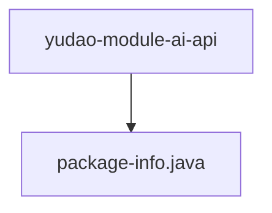

# 基础信息

|      |      |
|------|------|
| 编码语言 | .java |
| 代码路径 | yudao-module-ai/yudao-module-ai-api/src/main/java/cn/iocoder/yudao/module/ai/api |
| 包名 | cn.iocoder.yudao.module.ai.api |
| 概述说明 | 请提供需要处理的总结描述内容，以便我为您生成不超过100字的概要说明。 |

# 说明

请提供需要处理的信息内容，我将根据您提供的内容进行汇总和提炼，生成一个不超过500字的总结描述说明。

### 包内部结构视图

### 描述信息：
该Mermaid图展示了`yudao-module-ai-api`文件夹与`package-info.java`文件之间的调用关系。`yudao-module-ai-api`是包含API相关代码的文件夹，而`package-info.java`是该文件夹中的一个文件，用于定义包的元数据信息。

# 文件列表 File List

| 名称   | 类型  | 说明 |
|-------|------|-------------|
| [package-info.java](package-info.md) | file | 请提供需要处理的总结描述内容，以便我为您生成不超过100字的概要说明。 |

