# 基础信息

|      |      |
|------|------|
| 编码语言 | .java |
| 代码路径 | yudao-module-ai/yudao-module-ai-biz/src/main/java/cn/iocoder/yudao/module/ai/controller |
| 包名 | cn.iocoder.yudao.module.ai.controller |
| 概述说明 | 该代码实现了一个综合性管理后台系统，涵盖AI聊天对话、写作、知识库、思维导图、音乐、绘画及角色和模型管理等多个模块。各模块通过RESTful API提供服务，确保操作经过权限验证，保障数据安全。系统设计高效、灵活，满足用户对文本生成、知识管理、思维导图生成、音乐和绘画创作等多样化需求，同时提供详细的请求和响应数据结构，确保信息的完整性和可追溯性。 |

# 说明

该管理后台系统是一个综合性的AI解决方案，涵盖了多个功能模块，包括AI聊天对话、AI写作、AI知识库、AI思维导图、AI音乐、AI绘画以及AI聊天角色和模型管理。每个模块通过RESTful API提供服务，并经过用户权限验证，确保数据的安全性和合法性。

在AI聊天对话模块中，系统支持对话的创建、更新、获取和删除操作，并允许分页查询和删除指定对话记录。创建和更新请求中包含聊天角色编号、知识库编号、模型编号等关键字段，确保对话的相关性和准确性。响应数据包含对话编号、用户编号、对话标题、是否置顶标志、角色编号、模型编号等详细信息，全面描述对话的各个方面。

AI写作模块旨在提供一个高效、灵活且安全的文本生成平台。系统通过请求类设计确保生成的文本符合用户需求，包含多个必填字段和可选字段。响应数据结构用于记录和管理AI写作生成的内容及其相关元数据，确保管理后台可以全面追踪和管理AI写作的生成过程及其结果。

AI知识库模块涉及知识库的创建、更新、查询和管理功能。系统通过多个请求和响应数据结构确保知识库信息的完整性、权限控制和高效检索。更新请求包含知识库编号、名称、描述、可见权限列表和嵌入模型编号等必填字段，而分页请求则支持按名称查询知识库信息。

AI思维导图模块提供流式生成、删除和分页查询功能。流式生成接口采用SSE技术，能够实时响应用户请求并快速生成思维导图。删除接口设计有权限验证机制，确保只有具备相应权限的用户可以执行删除操作。分页查询接口则支持返回思维导图的分页结果，方便用户浏览和管理大量数据。

AI音乐模块支持音乐修改、生成和查询请求的处理。修改请求包含编号和音乐名称两个字段，确保请求的唯一性和可追溯性。响应数据则包含更多详细信息，如唯一编号、用户编号、音乐名称、歌词、图片地址、音频地址等，构成完整的AI音乐生成记录。

AI绘画模块基于Midjourney技术，允许用户提交绘画请求。每个请求包含提示词、模型、图片宽度、图片高度和版本号等必填参数。修改请求包含编号和是否发布两个关键字段，确保每项请求都有唯一的标识和明确的发布状态。

AI聊天角色和模型管理系统涉及多个关键字段和数据结构，用于详细描述和管理AI聊天角色、模型以及API密钥的信息。新增或修改AI聊天角色的请求必须包含角色编号、模型编号、角色名称等必填字段，确保每个角色都有完整的定义和信息。

整体设计旨在提供一个高效、安全且易于管理的AI解决方案，满足用户对AI聊天、写作、知识库、思维导图、音乐、绘画以及角色和模型管理的多样化需求。

### 包内部结构视图

```mermaid
graph TD
    controller --> app
    controller --> admin
    app --> package-info.java
    admin --> chat
    admin --> write
    admin --> knowledge
    admin --> mindmap
    admin --> music
    admin --> image
    admin --> model
    chat --> AiChatConversationController.java
    chat --> vo
    vo --> conversation
    vo --> message
    conversation --> AiChatConversationCreateMyReqVO.java
    conversation --> AiChatConversationRespVO.java
    conversation --> AiChatConversationUpdateMyReqVO.java
    conversation --> AiChatConversationPageReqVO.java
    message --> AiChatMessageRespVO.java
    message --> AiChatMessageSendReqVO.java
    message --> AiChatMessageSendRespVO.java
    message --> AiChatMessagePageReqVO.java
    chat --> AiChatMessageController.java
    write --> vo
    vo --> AiWriteGenerateReqVO.java
    vo --> AiWriteRespVO.java
    vo --> AiWritePageReqVO.java
    write --> AiWriteController.java
    knowledge --> AiKnowledgeController.java
    knowledge --> vo
    vo --> knowledge
    vo --> document
    vo --> segment
    knowledge --> AiKnowledgeSegmentController.java
    knowledge --> AiKnowledgeDocumentController.java
    knowledge --> AiKnowledgeUpdateReqVO.java
    knowledge --> AiKnowledgePageReqVO.java
    knowledge --> AiKnowledgeRespVO.java
    knowledge --> AiKnowledgeCreateReqVO.java
    knowledge --> AiKnowledgeDocumentCreateReqVO.java
    document --> AiKnowledgeDocumentRespVO.java
    document --> AiKnowledgeDocumentUpdateReqVO.java
    document --> AiKnowledgeDocumentPageReqVO.java
    segment --> AiKnowledgeSegmentSearchReqVO.java
    segment --> AiKnowledgeSegmentUpdateStatusReqVO.java
    segment --> AiKnowledgeSegmentUpdateReqVO.java
    segment --> AiKnowledgeSegmentRespVO.java
    segment --> AiKnowledgeSegmentPageReqVO.java
    mindmap --> AiMindMapController.java
    mindmap --> vo
    vo --> AiMindMapRespVO.java
    vo --> AiMindMapPageReqVO.java
    vo --> AiMindMapGenerateReqVO.java
    music --> AiMusicController.java
    music --> vo
    vo --> AiMusicUpdateMyReqVO.java
    vo --> AiMusicRespVO.java
    vo --> AiMusicPageReqVO.java
    vo --> AiSunoGenerateReqVO.java
    vo --> AiMusicUpdateReqVO.java
    image --> AiImageController.java
    image --> vo
    vo --> AiImageRespVO.java
    vo --> AiImageUpdateReqVO.java
    vo --> midjourney
    vo --> AiImagePublicPageReqVO.java
    vo --> AiImagePageReqVO.java
    vo --> AiImageDrawReqVO.java
    midjourney --> AiMidjourneyImagineReqVO.java
    midjourney --> AiMidjourneyActionReqVO.java
    model --> AiApiKeyController.java
    model --> AiChatModelController.java
    model --> AiChatRoleController.java
    model --> vo
    vo --> chatRole
    vo --> chatModel
    vo --> apikey
    chatRole --> AiChatRoleRespVO.java
    chatRole --> AiChatRoleSaveReqVO.java
    chatRole --> AiChatRolePageReqVO.java
    chatRole --> AiChatRoleSaveMyReqVO.java
    chatModel --> AiChatModelSaveReqVO.java
    chatModel --> AiChatModelRespVO.java
    chatModel --> AiChatModelPageReqVO.java
    apikey --> AiApiKeyRespVO.java
    apikey --> AiApiKeyPageReqVO.java
    apikey --> AiApiKeySaveReqVO.java
```

### 描述信息：
该Mermaid图展示了`yudao-module-ai`模块中控制器（Controller）与相关VO（Value Object）之间的调用关系。图中展示了多个控制器（如`AiChatConversationController`、`AiWriteController`等）与其对应的VO类之间的调用关系，清晰地反映了模块中各个功能模块的层次结构和依赖关系。

# 文件列表 File List

| 名称   | 类型  | 说明 |
|-------|------|-------------|
| [admin](admin/_package.md) | folder | 该代码实现了一个管理后台的AI聊天对话控制器，支持创建、更新、获取和删除用户聊天对话，并通过REST API提供服务，确保权限验证和数据安全。控制器支持分页查询和删除对话记录，涉及的数据会进行格式转换。系统通过角色编号和知识库编号标识对话角色及其关联知识库，确保对话相关性和准确性。响应VO包含对话编号、用户编号、对话标题、角色设定等详细信息。更新请求允许用户灵活配置对话。分页请求VO包含用户编号、对话标题和创建时间范围，确保查询结果精确。消息管理支持发送、获取、删除和分页查询消息，确保消息的完整性和可追溯性。整体设计旨在提供高效、安全且易于管理的AI聊天对话解决方案。 |
| [package-info.java](package-info.md) | file | 请提供需要处理的总结描述内容，以便我为您生成不超过100字的概要说明。 |
| [app](app/_package.md) | folder | 请提供需要总结的具体信息内容，以便我为您生成符合要求的概要说明。 |

