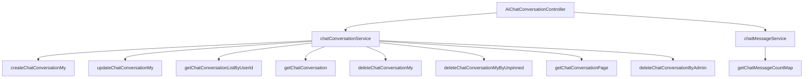

# 基础信息

|      |      |
|------|------|
| 编码语言 | .java |
| 代码路径 | yudao-module-ai/yudao-module-ai-biz/src/main/java/cn/iocoder/yudao/module/ai/controller/admin/chat/AiChatConversationController.java |
| 包名 | cn.iocoder.yudao.module.ai.controller.admin.chat |
| 依赖项 | ['cn.hutool.core.collection.CollUtil', 'cn.hutool.core.util.ObjUtil', 'cn.iocoder.yudao.framework.common.pojo.CommonResult', 'cn.iocoder.yudao.framework.common.pojo.PageResult', 'cn.iocoder.yudao.framework.common.util.object.BeanUtils', 'cn.iocoder.yudao.module.ai.controller.admin.chat.vo.conversation.AiChatConversationCreateMyReqVO', 'cn.iocoder.yudao.module.ai.controller.admin.chat.vo.conversation.AiChatConversationPageReqVO', 'cn.iocoder.yudao.module.ai.controller.admin.chat.vo.conversation.AiChatConversationRespVO', 'cn.iocoder.yudao.module.ai.controller.admin.chat.vo.conversation.AiChatConversationUpdateMyReqVO', 'cn.iocoder.yudao.module.ai.dal.dataobject.chat.AiChatConversationDO', 'cn.iocoder.yudao.module.ai.service.chat.AiChatConversationService', 'cn.iocoder.yudao.module.ai.service.chat.AiChatMessageService', 'io.swagger.v3.oas.annotations.Operation', 'io.swagger.v3.oas.annotations.Parameter', 'io.swagger.v3.oas.annotations.tags.Tag', 'jakarta.annotation.Resource', 'jakarta.validation.Valid', 'org.springframework.security.access.prepost.PreAuthorize', 'org.springframework.validation.annotation.Validated', 'org.springframework.web.bind.annotation', 'java.util.List', 'java.util.Map', 'cn.iocoder.yudao.framework.common.pojo.CommonResult.success', 'cn.iocoder.yudao.framework.common.util.collection.CollectionUtils.convertList', 'cn.iocoder.yudao.framework.security.core.util.SecurityFrameworkUtils.getLoginUserId'] |
| 概述说明 | 该代码实现了一个管理后台的AI聊天对话控制器，提供创建、更新、获取、删除用户聊天对话的功能，支持管理员进行分页查询和删除操作。所有功能通过REST API实现，包含用户权限验证和数据转换。 |

# 说明

该代码实现了一个管理后台的AI聊天对话控制器，主要用于处理用户聊天对话的创建、更新、获取和删除操作。控制器通过REST API提供服务，确保所有操作都经过用户权限验证，以保证数据的安全性和合法性。此外，控制器还支持管理员对用户聊天对话进行分页查询，方便管理员高效地管理和监控对话内容。管理员还可以通过该控制器删除指定的对话记录，进一步简化了后台管理流程。所有操作过程中涉及的数据都会进行必要的转换，以确保数据的格式和结构符合系统要求。整体设计旨在提供一个高效、安全且易于管理的AI聊天对话管理解决方案。

# 类列表 Class Summary

| 名称   | 类型  | 说明 |
|-------|------|-------------|
| AiChatConversationController | class | 该代码定义了一个管理后台的AI聊天对话控制器，包含创建、更新、获取、删除用户聊天对话的功能，并支持管理员进行对话分页查询和删除操作。所有操作均通过REST API实现，涉及用户权限验证和数据转换。 |


## 类 AiChatConversationController

|      |      |
|------|------|
| 访问范围 | @Tag(name = "管理后台 - AI 聊天对话");@RestController;@RequestMapping("/ai/chat/conversation");@Validated;public |
| 类型 | class |
| 名称 | AiChatConversationController |
| 说明 | 该代码定义了一个管理后台的AI聊天对话控制器，包含创建、更新、获取、删除用户聊天对话的功能，并支持管理员进行对话分页查询和删除操作。所有操作均通过REST API实现，涉及用户权限验证和数据转换。 |


### UML类图

```mermaid
classDiagram
    class AiChatConversationController {
        +AiChatConversationService chatConversationService
        +AiChatMessageService chatMessageService
        +createChatConversationMy(AiChatConversationCreateMyReqVO createReqVO) CommonResult~Long~
        +updateChatConversationMy(AiChatConversationUpdateMyReqVO updateReqVO) CommonResult~Boolean~
        +getChatConversationMyList() CommonResult~List~AiChatConversationRespVO~~
        +getChatConversationMy(Long id) CommonResult~AiChatConversationRespVO~
        +deleteChatConversationMy(Long id) CommonResult~Boolean~
        +deleteChatConversationMyByUnpinned() CommonResult~Boolean~
        +getChatConversationPage(AiChatConversationPageReqVO pageReqVO) CommonResult~PageResult~AiChatConversationRespVO~~
        +deleteChatConversationByAdmin(Long id) CommonResult~Boolean~
    }

    class AiChatConversationService {
        +createChatConversationMy(AiChatConversationCreateMyReqVO createReqVO, Long userId) Long
        +updateChatConversationMy(AiChatConversationUpdateMyReqVO updateReqVO, Long userId) void
        +getChatConversationListByUserId(Long userId) List~AiChatConversationDO~
        +getChatConversation(Long id) AiChatConversationDO
        +deleteChatConversationMy(Long id, Long userId) void
        +deleteChatConversationMyByUnpinned(Long userId) void
        +getChatConversationPage(AiChatConversationPageReqVO pageReqVO) PageResult~AiChatConversationDO~
        +deleteChatConversationByAdmin(Long id) void
    }

    class AiChatMessageService {
        +getChatMessageCountMap(List~Long~ conversationIds) Map~Long, Integer~
    }

    class AiChatConversationCreateMyReqVO {
        +String title
        +String content
    }

    class AiChatConversationUpdateMyReqVO {
        +Long id
        +String title
        +String content
    }

    class AiChatConversationRespVO {
        +Long id
        +String title
        +String content
        +Integer messageCount
    }

    class AiChatConversationDO {
        +Long id
        +String title
        +String content
        +Long userId
    }

    class AiChatConversationPageReqVO {
        +Integer pageNo
        +Integer pageSize
    }

    class CommonResult~T~ {
        +T data
        +Integer code
        +String message
    }

    class PageResult~T~ {
        +List~T~ list
        +Long total
    }

    AiChatConversationController --> AiChatConversationService : depends on
    AiChatConversationController --> AiChatMessageService : depends on
    AiChatConversationService --> AiChatConversationDO : uses
    AiChatMessageService --> AiChatConversationDO : uses
    AiChatConversationCreateMyReqVO <.. AiChatConversationController : used in
    AiChatConversationUpdateMyReqVO <.. AiChatConversationController : used in
    AiChatConversationRespVO <.. AiChatConversationController : used in
    AiChatConversationPageReqVO <.. AiChatConversationController : used in
    CommonResult~Long~ <.. AiChatConversationController : returns
    CommonResult~Boolean~ <.. AiChatConversationController : returns
    CommonResult~List~AiChatConversationRespVO~~ <.. AiChatConversationController : returns
    CommonResult~PageResult~AiChatConversationRespVO~~ <.. AiChatConversationController : returns
```

### 描述：
该UML类图展示了`AiChatConversationController`类与其依赖的服务类（`AiChatConversationService`和`AiChatMessageService`）之间的关系。控制器类通过调用服务类的方法来处理聊天对话的创建、更新、删除和查询操作。图中还展示了请求和响应对象（如`AiChatConversationCreateMyReqVO`、`AiChatConversationRespVO`等）与控制器类之间的依赖关系。


### 内部方法调用关系图



### 描述信息：
该图展示了`AiChatConversationController`与`chatConversationService`和`chatMessageService`之间的调用关系。`chatConversationService`负责处理聊天对话的创建、更新、删除和查询操作，而`chatMessageService`则用于获取聊天消息的统计信息。控制器通过调用这些服务方法来实现对聊天对话的管理。

### 字段列表 Field List

| 名称  | 类型  | 说明 |
|-------|-------|------|
| chatMessageService | AiChatMessageService | 在代码中，通过@Resource注解注入了AiChatMessageService服务，用于处理与AI聊天消息相关的功能。 |
| chatConversationService | AiChatConversationService | 概要说明：该代码片段定义了一个私有变量chatConversationService，其类型为AiChatConversationService，并通过@Resource注解进行依赖注入。 |

### 方法列表 Method List

| 名称  | 类型  | 说明 |
|-------|-------|------|
| createChatConversationMy | CommonResult<Long> | 该代码片段定义了一个POST请求接口，路径为"/create-my"，用于创建“我的”聊天对话。接口接收一个经过验证的请求体AiChatConversationCreateMyReqVO，并调用chatConversationService的createChatConversationMy方法，传入请求体和当前登录用户ID，最终返回一个包含长整型ID的通用结果CommonResult<Long>。 |
| deleteChatConversationByAdmin | CommonResult<Boolean> | 管理员通过指定对话编号删除对话，需具备相应权限，操作成功返回布尔值true。 |
| deleteChatConversationMyByUnpinned | CommonResult<Boolean> | 该代码片段定义了一个删除未置顶聊天对话的API接口。通过调用`deleteChatConversationMyByUnpinned`方法，删除当前登录用户的未置顶聊天记录，并返回操作成功的布尔值。 |
| getChatConversationMyList | CommonResult<List<AiChatConversationRespVO>> | 该代码定义了一个GET请求接口，路径为"/my-list"，用于获取当前登录用户的聊天对话列表。通过调用chatConversationService的getChatConversationListByUserId方法，获取用户ID对应的聊天对话数据，并将其转换为AiChatConversationRespVO类型的响应对象，最终返回成功结果。 |
| updateChatConversationMy | CommonResult<Boolean> | 该代码片段定义了一个用于更新“我的”聊天对话的API接口。通过PUT请求访问路径“/update-my”，接收并验证请求体中的更新数据，调用服务层方法更新当前登录用户的聊天对话，并返回操作成功的布尔结果。 |
| getChatConversationPage | CommonResult<PageResult<AiChatConversationRespVO>> | 该代码实现了一个获取对话分页的接口，用于【对话管理】菜单。接口通过权限校验后，调用服务层获取对话分页数据，若数据为空则返回空分页结果。否则，拼接关联的聊天消息数量，并将结果转换为响应对象返回。 |
| deleteChatConversationMy | CommonResult<Boolean> | 该API接口用于删除用户的聊天对话，请求方法为DELETE，路径为"/delete-my"。接口需要一个必填参数"id"，表示对话编号。调用该接口时，系统会根据当前登录用户ID和提供的对话编号删除对应的聊天记录，并返回操作结果。 |
| getChatConversationMy | CommonResult<AiChatConversationRespVO> | 该代码定义了一个GET请求接口，路径为"/get-my"，用于获取指定编号的【我的】聊天对话。接口要求传入对话编号作为参数，并验证当前用户是否为对话的所有者。如果验证通过，返回对话信息；否则返回空。返回结果为通用响应格式，包含转换后的对话响应对象。 |


