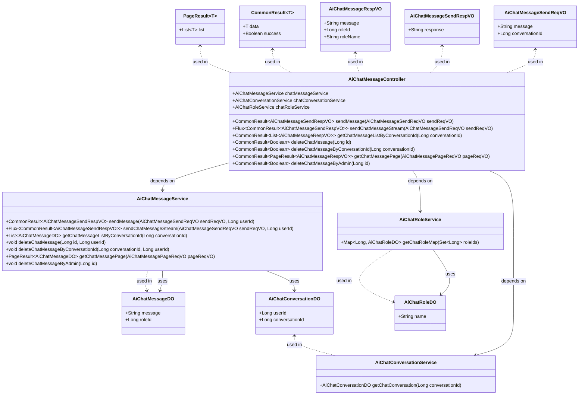
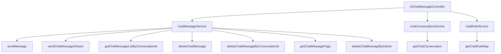

# 基础信息

|      |      |
|------|------|
| 编码语言 | .java |
| 代码路径 | yudao-module-ai/yudao-module-ai-biz/src/main/java/cn/iocoder/yudao/module/ai/controller/admin/chat/AiChatMessageController.java |
| 包名 | cn.iocoder.yudao.module.ai.controller.admin.chat |
| 依赖项 | ['cn.hutool.core.collection.CollUtil', 'cn.hutool.core.util.ObjUtil', 'cn.iocoder.yudao.framework.common.pojo.CommonResult', 'cn.iocoder.yudao.framework.common.pojo.PageResult', 'cn.iocoder.yudao.framework.common.util.collection.MapUtils', 'cn.iocoder.yudao.framework.common.util.object.BeanUtils', 'cn.iocoder.yudao.module.ai.controller.admin.chat.vo.message.AiChatMessagePageReqVO', 'cn.iocoder.yudao.module.ai.controller.admin.chat.vo.message.AiChatMessageRespVO', 'cn.iocoder.yudao.module.ai.controller.admin.chat.vo.message.AiChatMessageSendReqVO', 'cn.iocoder.yudao.module.ai.controller.admin.chat.vo.message.AiChatMessageSendRespVO', 'cn.iocoder.yudao.module.ai.dal.dataobject.chat.AiChatConversationDO', 'cn.iocoder.yudao.module.ai.dal.dataobject.chat.AiChatMessageDO', 'cn.iocoder.yudao.module.ai.dal.dataobject.model.AiChatRoleDO', 'cn.iocoder.yudao.module.ai.service.chat.AiChatConversationService', 'cn.iocoder.yudao.module.ai.service.chat.AiChatMessageService', 'cn.iocoder.yudao.module.ai.service.model.AiChatRoleService', 'io.swagger.v3.oas.annotations.Operation', 'io.swagger.v3.oas.annotations.Parameter', 'io.swagger.v3.oas.annotations.tags.Tag', 'jakarta.annotation.Resource', 'jakarta.annotation.security.PermitAll', 'jakarta.validation.Valid', 'lombok.extern.slf4j.Slf4j', 'org.springframework.http.MediaType', 'org.springframework.security.access.prepost.PreAuthorize', 'org.springframework.web.bind.annotation', 'reactor.core.publisher.Flux', 'java.util.Collections', 'java.util.List', 'java.util.Map', 'cn.iocoder.yudao.framework.common.pojo.CommonResult.success', 'cn.iocoder.yudao.framework.common.util.collection.CollectionUtils.convertSet', 'cn.iocoder.yudao.framework.security.core.util.SecurityFrameworkUtils.getLoginUserId'] |
| 概述说明 | 该控制器类负责管理聊天消息功能，涵盖发送消息（段式和流式）、获取指定对话消息列表、删除消息（单个或整个对话）、分页获取消息及管理员删除消息。所有操作通过调用服务类实现，返回统一格式的响应结果。 |

# 说明

该控制器类主要负责管理聊天消息的相关功能，涵盖了多种操作以满足不同的需求。首先，它支持发送消息的功能，包括段式和流式两种发送方式，以适应不同的消息传输场景。其次，控制器提供了获取指定对话的消息列表的功能，允许用户查看特定对话中的所有消息。此外，用户还可以通过该控制器删除消息，既可以删除单个消息，也可以删除整个对话中的所有消息。为了处理大量消息的情况，控制器还支持分页获取消息的功能，确保用户能够高效地浏览和管理消息。最后，管理员可以通过该控制器删除消息，这一功能通常用于管理或维护目的。所有操作均通过调用相关的服务类来实现，并且每个操作都会返回统一格式的响应结果，确保系统的接口一致性和易用性。

# 类列表 Class Summary

| 名称   | 类型  | 说明 |
|-------|------|-------------|
| AiChatMessageController | class | 该控制器类管理聊天消息相关功能，包括发送消息（段式和流式）、获取指定对话的消息列表、删除消息（单个或整个对话）、分页获取消息以及管理员删除消息。所有操作均通过调用相关服务类实现，并返回统一格式的响应结果。 |

## 类 AiChatMessageController

|      |      |
|------|------|
| 访问范围 | @Tag(name = "管理后台 - 聊天消息");@RestController;@RequestMapping("/ai/chat/message");@Slf4j;public |
| 类型 | class |
| 名称 | AiChatMessageController |
| 说明 | 该控制器类管理聊天消息相关功能，包括发送消息（段式和流式）、获取指定对话的消息列表、删除消息（单个或整个对话）、分页获取消息以及管理员删除消息。所有操作均通过调用相关服务类实现，并返回统一格式的响应结果。 |

### UML类图

### 描述信息：
该UML类图展示了管理后台中聊天消息模块的类结构及其关系。`AiChatMessageController`作为控制器，依赖`AiChatMessageService`、`AiChatConversationService`和`AiChatRoleService`来处理消息的发送、删除和查询等操作。各类之间通过依赖、关联等关系进行交互，确保功能的完整性和数据的正确传递。

### 内部方法调用关系图

### 描述信息：
该图展示了`AiChatMessageController`类中各个方法之间的调用关系。控制器依赖于`chatMessageService`、`chatConversationService`和`chatRoleService`三个服务类来完成消息的发送、查询、删除等操作。每个服务类中的方法被控制器中的不同API调用，以实现具体的业务逻辑。

### 字段列表 Field List

| 名称  | 类型  | 说明 |
|-------|-------|------|
| chatRoleService | AiChatRoleService | 概要说明：通过注入AiChatRoleService服务，实现对聊天角色相关功能的调用和管理。 |
| chatMessageService | AiChatMessageService | 在代码中，通过@Resource注解将AiChatMessageService注入到当前类中，以便使用其功能。 |
| chatConversationService | AiChatConversationService | 概要：使用`@Resource`注解注入`AiChatConversationService`实例，以便在当前类中调用其服务功能。 |

### 方法列表 Method List

| 名称  | 类型  | 说明 |
|-------|-------|------|
| deleteChatMessageByAdmin | CommonResult<Boolean> | 管理员通过调用删除消息接口，需提供消息编号并具备相应权限，系统将删除指定消息并返回操作结果。 |
| deleteChatMessageByConversationId | CommonResult<Boolean> | 该接口用于删除指定对话的所有消息，通过DELETE请求访问路径“/delete-by-conversation-id”，需提供必填参数“conversationId”（对话编号），调用服务层方法删除消息，并返回操作结果。 |
| deleteChatMessage | CommonResult<Boolean> | 该API操作用于删除消息，使用DELETE方法访问路径"/delete"，需提供必填参数"id"（消息编号，示例值为1024），调用chatMessageService的deleteChatMessage方法删除指定消息，并返回操作结果。 |
| getChatMessageListByConversationId | CommonResult<List<AiChatMessageRespVO>> | 该接口通过GET请求获取指定对话的消息列表，需提供对话编号作为参数。首先验证对话是否存在及用户权限，若验证失败返回空列表，成功则返回该对话的消息列表，并将消息数据转换为响应对象返回。 |
| sendMessage | CommonResult<AiChatMessageSendRespVO> | 该接口用于发送消息（段式），通过POST请求访问"/send"路径，接收并验证请求体中的AiChatMessageSendReqVO对象，调用chatMessageService的sendMessage方法处理消息发送，并返回AiChatMessageSendRespVO响应。该接口一次性返回结果，响应速度较慢。 |
| getChatMessagePage | CommonResult<PageResult<AiChatMessageRespVO>> | 该接口用于获取消息分页数据，适用于对话管理菜单。需要具备ai:chat-conversation:query权限。通过传入分页请求参数，调用服务层获取分页结果。若结果为空，返回空分页；否则，根据角色ID拼接角色名称，并返回转换后的响应数据。 |
| sendChatMessageStream | Flux<CommonResult<AiChatMessageSendRespVO>> | 该接口用于流式发送消息，采用POST请求，路径为/send-stream，返回类型为TEXT_EVENT_STREAM_VALUE，响应速度快。接口允许所有用户访问，避免SSE响应被拦截。方法接收一个有效的AiChatMessageSendReqVO对象作为请求体，并返回Flux<CommonResult<AiChatMessageSendRespVO>>类型的结果，调用chatMessageService的sendChatMessageStream方法处理请求。 |

