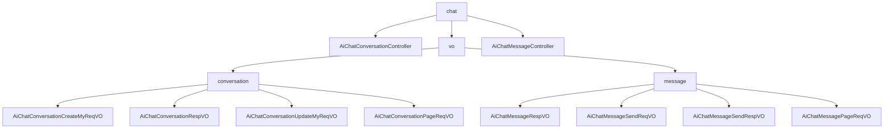

# 基础信息

|      |      |
|------|------|
| 编码语言 | .java |
| 代码路径 | yudao-module-ai/yudao-module-ai-biz/src/main/java/cn/iocoder/yudao/module/ai/controller/admin/chat |
| 包名 | cn.iocoder.yudao.module.ai.controller.admin.chat |
| 概述说明 | 该代码实现了一个管理后台的AI聊天对话控制器，通过REST API处理聊天对话的创建、更新、获取和删除操作，确保用户权限验证和数据安全性。控制器支持分页查询和删除对话记录，便于管理员高效管理。系统使用关键字段如角色编号、知识库编号等确保对话的准确性和灵活性，并通过响应VO详细描述对话和消息属性。控制器还支持发送消息、获取消息列表、删除消息及分页获取消息等功能，确保系统接口一致性和易用性。 |

# 说明

该代码实现了一个管理后台的AI聊天对话控制器，主要用于处理用户聊天对话的创建、更新、获取和删除操作。控制器通过REST API提供服务，确保所有操作都经过用户权限验证，以保证数据的安全性和合法性。控制器支持管理员对用户聊天对话进行分页查询，方便高效地管理和监控对话内容，并允许删除指定的对话记录。所有操作过程中涉及的数据都会进行必要的转换，以确保数据的格式和结构符合系统要求。

在创建请求中，系统使用聊天角色编号和知识库编号来标识对话中的角色及其关联的知识库，确保对话的相关性和准确性。响应VO包含对话编号、用户编号、对话标题、是否置顶标志、角色编号、模型编号、模型标志、模型名字、角色设定、温度参数、单条回复最大Token数量、上下文最大Message数量、创建时间、角色头像、角色名字和消息数量等详细信息，全面描述了对话的各个方面。

更新请求通过对话编号、对话标题、是否置顶、模型编号、知识库编号、角色设定、温度参数、单条回复最大Token数量和上下文最大Message数量等字段，允许用户灵活配置和管理对话。分页请求VO包含用户编号、对话标题和创建时间范围三个关键字段，确保查询结果仅返回与特定用户、主题或时间段相关的对话记录。

管理后台AI聊天消息响应VO包含编号、对话编号、回复消息编号、消息类型、用户编号、角色编号、模型标志、模型编号、聊天内容、是否携带上下文以及创建时间等字段，全面描述每条消息的属性和上下文信息。消息发送请求包含聊天对话编号、聊天内容和是否携带上下文三个关键字段，确保消息的准确性和上下文的相关性。消息发送响应VO包含发送消息和接收消息，每个消息都包含编号、消息类型、聊天内容和创建时间四个必填项，确保消息的完整性和可追溯性。

分页请求VO包含对话编号、用户编号、消息内容和创建时间等字段，支持对聊天消息的检索和管理。控制器类支持发送消息、获取指定对话的消息列表、删除消息、分页获取消息等功能，所有操作均通过调用相关的服务类来实现，并返回统一格式的响应结果，确保系统的接口一致性和易用性。整体设计旨在提供一个高效、安全且易于管理的AI聊天对话管理解决方案。

### 包内部结构视图

### 描述信息：
该图展示了`chat`文件夹下的文件与子文件夹之间的调用关系。`AiChatConversationController`和`AiChatMessageController`是主要的控制器类，分别处理聊天会话和消息的请求。`vo`文件夹包含`conversation`和`message`两个子文件夹，分别存放与会话和消息相关的VO类。

# 文件列表 File List

| 名称   | 类型  | 说明 |
|-------|------|-------------|
| [AiChatMessageController.java](AiChatMessageController.md) | file | 该控制器类负责管理聊天消息功能，涵盖发送消息（段式和流式）、获取指定对话消息列表、删除消息（单个或整个对话）、分页获取消息及管理员删除消息。所有操作通过调用服务类实现，返回统一格式的响应结果。 |
| [AiChatConversationController.java](AiChatConversationController.md) | file | 该代码实现了一个管理后台的AI聊天对话控制器，提供创建、更新、获取、删除用户聊天对话的功能，支持管理员进行分页查询和删除操作。所有功能通过REST API实现，包含用户权限验证和数据转换。 |
| [vo](vo/_package.md) | folder | 管理后台的AI聊天系统通过多个关键字段和数据结构创建、管理和更新聊天对话，确保对话的准确性和灵活性。系统使用角色编号和知识库编号标识对话角色及其关联知识库，响应VO包含对话编号、用户编号、对话标题等详细信息。更新请求通过对话编号、标题、模型编号等字段灵活配置对话。分页请求VO支持按用户、主题或时间段查询对话记录。消息响应VO记录每条消息的属性，包括编号、对话编号、消息类型等。消息发送请求包含对话编号、聊天内容和是否携带上下文。消息发送响应VO记录发送和接收消息的编号、类型、内容和时间。分页请求VO支持按对话、用户、时间等条件检索聊天记录。 |

