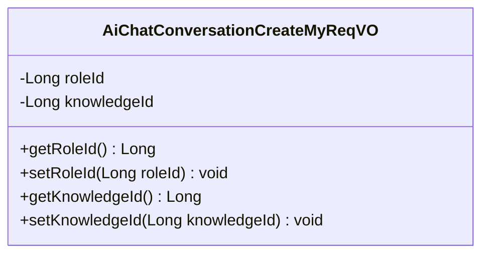
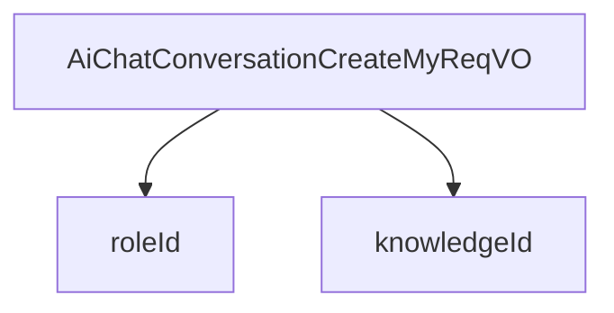

# 基础信息

|      |      |
|------|------|
| 编码语言 | .java |
| 代码路径 | yudao-module-ai/yudao-module-ai-biz/src/main/java/cn/iocoder/yudao/module/ai/controller/admin/chat/vo/conversation/AiChatConversationCreateMyReqVO.java |
| 包名 | cn.iocoder.yudao.module.ai.controller.admin.chat.vo.conversation |
| 依赖项 | ['io.swagger.v3.oas.annotations.media.Schema', 'lombok.Data'] |
| 概述说明 | 管理后台AI聊天对话创建请求VO包含两个关键字段：聊天角色编号（roleId）和知识库编号（knowledgeId），用于标识聊天角色和相关知识库。 |

# 说明

管理后台AI聊天对话创建请求VO包含两个关键字段：聊天角色编号（roleId）和知识库编号（knowledgeId）。这两个字段分别用于标识聊天角色和相关知识库。具体来说，roleId用于指定聊天对话中的角色，而knowledgeId则用于关联与该角色相关的知识库。通过这两个字段，系统能够准确地识别和配置聊天对话中的角色及其对应的知识库，从而确保对话的准确性和相关性。这种设计使得管理后台能够灵活地创建和管理AI聊天对话，满足不同场景和需求下的对话配置要求。

# 类列表 Class Summary

| 名称   | 类型  | 说明 |
|-------|------|-------------|
| AiChatConversationCreateMyReqVO | class | 管理后台AI聊天对话创建请求VO包含两个关键字段：聊天角色编号（roleId）和知识库编号（knowledgeId），分别用于标识聊天角色和相关知识库。 |

## 类 AiChatConversationCreateMyReqVO

|      |      |
|------|------|
| 访问范围 | @Schema(description = "管理后台 - AI 聊天对话创建【我的】 Request VO");@Data;public |
| 类型 | class |
| 名称 | AiChatConversationCreateMyReqVO |
| 说明 | 管理后台AI聊天对话创建请求VO包含两个关键字段：聊天角色编号（roleId）和知识库编号（knowledgeId），分别用于标识聊天角色和相关知识库。 |

### UML类图

### 描述信息：
该UML类图展示了一个名为`AiChatConversationCreateMyReqVO`的类，用于管理后台的AI聊天对话创建请求。该类包含两个私有属性`roleId`和`knowledgeId`，分别表示聊天角色编号和知识库编号。类中还提供了相应的getter和setter方法用于访问和修改这些属性。

### 内部方法调用关系图

### 描述信息：
该图展示了 `AiChatConversationCreateMyReqVO` 类与其属性 `roleId` 和 `knowledgeId` 之间的调用关系。`AiChatConversationCreateMyReqVO` 类通过 `roleId` 和 `knowledgeId` 两个属性来管理聊天角色编号和知识库编号。

### 字段列表 Field List

| 名称  | 类型  | 说明 |
|-------|-------|------|
| knowledgeId | Long | 知识库编号为长整型，示例值为1204。 |
| roleId | Long | 聊天角色编号字段，类型为长整型，示例值为666。 |

### 方法列表 Method List

| 名称  | 类型  | 说明 |
|-------|-------|------|

