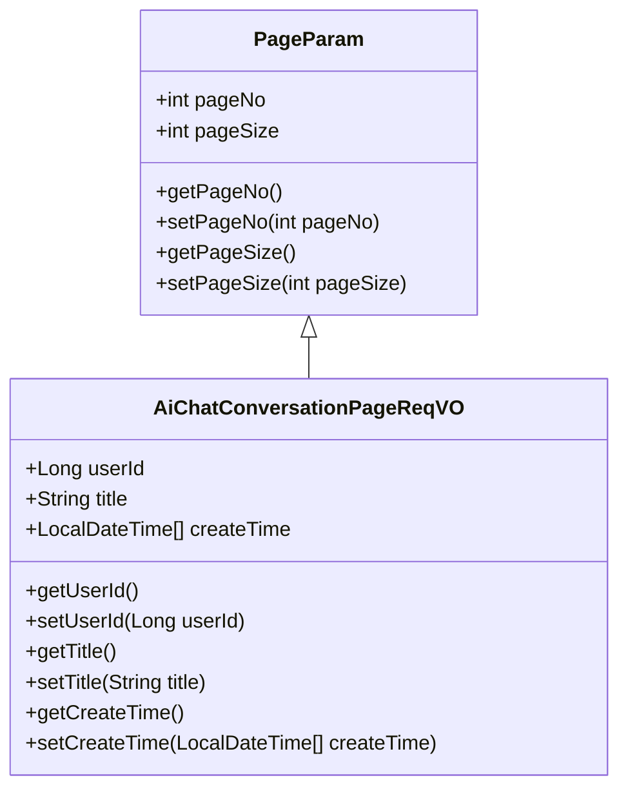
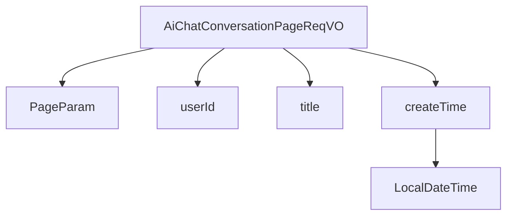

# 基础信息

|      |      |
|------|------|
| 编码语言 | .java |
| 代码路径 | yudao-module-ai/yudao-module-ai-biz/src/main/java/cn/iocoder/yudao/module/ai/controller/admin/chat/vo/conversation/AiChatConversationPageReqVO.java |
| 包名 | cn.iocoder.yudao.module.ai.controller.admin.chat.vo.conversation |
| 依赖项 | ['cn.iocoder.yudao.framework.common.pojo.PageParam', 'io.swagger.v3.oas.annotations.media.Schema', 'lombok.Data', 'org.springframework.format.annotation.DateTimeFormat', 'java.time.LocalDateTime', 'cn.iocoder.yudao.framework.common.util.date.DateUtils.FORMAT_YEAR_MONTH_DAY_HOUR_MINUTE_SECOND'] |
| 概述说明 | 管理后台AI聊天对话分页请求VO包含用户编号、对话标题和创建时间范围，用于分页查询相关对话记录。 |

# 说明

管理后台AI聊天对话分页请求VO是一个用于分页查询相关对话记录的数据结构。该结构包含三个关键字段：用户编号、对话标题和创建时间范围。用户编号用于标识特定的用户，确保查询结果仅返回与该用户相关的对话记录。对话标题字段允许根据对话的主题或标题进行筛选，以便快速定位特定内容的对话。创建时间范围字段则用于指定查询的时间区间，确保只返回在该时间段内创建的对话记录。通过这三个字段的组合，管理后台可以高效地进行分页查询，获取符合特定条件的对话记录，从而实现对用户对话历史的管理和分析。

# 类列表 Class Summary

| 名称   | 类型  | 说明 |
|-------|------|-------------|
| AiChatConversationPageReqVO | class | 管理后台AI聊天对话分页请求VO包含用户编号、对话标题和创建时间范围，用于分页查询相关对话记录。 |

## 类 AiChatConversationPageReqVO

|      |      |
|------|------|
| 访问范围 | @Schema(description = "管理后台 - AI 聊天对话的分页 Request VO");@Data;public |
| 类型 | class |
| 名称 | AiChatConversationPageReqVO |
| 说明 | 管理后台AI聊天对话分页请求VO包含用户编号、对话标题和创建时间范围，用于分页查询相关对话记录。 |

### UML类图

### 描述信息：
该UML类图展示了`AiChatConversationPageReqVO`类继承自`PageParam`类，并包含用户编号、对话标题和创建时间等属性。`AiChatConversationPageReqVO`类用于管理后台的AI聊天对话分页请求。

### 内部方法调用关系图

### 描述信息：
`AiChatConversationPageReqVO` 类继承自 `PageParam`，并包含 `userId`、`title` 和 `createTime` 三个属性。其中 `createTime` 是一个 `LocalDateTime` 数组，用于存储创建时间。该类的结构清晰，主要用于管理后台的 AI 聊天对话分页请求。

### 字段列表 Field List

| 名称  | 类型  | 说明 |
|-------|-------|------|
| title | String | 对话标题字段，类型为字符串，示例值为“你好”。 |
| userId | Long | 用户编号，示例值为1024，类型为长整型。 |
| createTime | LocalDateTime[] | 该代码片段定义了一个名为`createTime`的私有变量，类型为`LocalDateTime[]`，用于存储创建时间。通过`@Schema`注解描述为“创建时间”，并使用`@DateTimeFormat`注解指定时间格式为“年-月-日 时:分:秒”。 |

### 方法列表 Method List

| 名称  | 类型  | 说明 |
|-------|-------|------|

