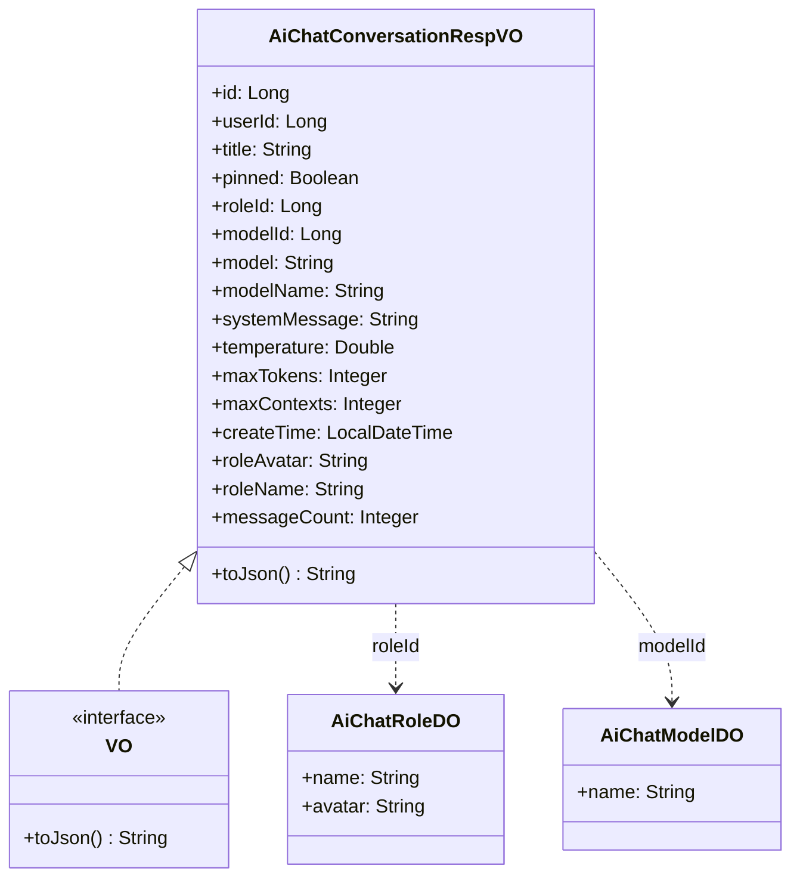

# 基础信息

|      |      |
|------|------|
| 编码语言 | .java |
| 代码路径 | yudao-module-ai/yudao-module-ai-biz/src/main/java/cn/iocoder/yudao/module/ai/controller/admin/chat/vo/conversation/AiChatConversationRespVO.java |
| 包名 | cn.iocoder.yudao.module.ai.controller.admin.chat.vo.conversation |
| 依赖项 | ['cn.iocoder.yudao.module.ai.dal.dataobject.model.AiChatModelDO', 'cn.iocoder.yudao.module.ai.dal.dataobject.model.AiChatRoleDO', 'com.fhs.core.trans.anno.Trans', 'com.fhs.core.trans.constant.TransType', 'com.fhs.core.trans.vo.VO', 'io.swagger.v3.oas.annotations.media.Schema', 'lombok.Data', 'java.time.LocalDateTime'] |
| 概述说明 | 管理后台AI聊天对话响应VO包含对话编号、用户编号、对话标题、置顶状态、角色编号、模型编号、模型标志、模型名字、角色设定、温度参数、单条回复最大Token数量、上下文最大Message数量、创建时间、角色头像、角色名字及消息数量等关键信息。 |

# 说明

管理后台的AI聊天对话响应VO包含了多个关键信息，用于详细描述和管理聊天对话的各个方面。首先，每个对话都有唯一的对话编号和用户编号，用于标识特定的对话和用户。对话标题提供了对话的主题或简要描述，帮助用户快速识别对话内容。是否置顶标志用于指示该对话是否被用户置顶，以便优先查看。

在角色和模型方面，角色编号和模型编号分别标识了对话中使用的角色和模型。模型标志和模型名字进一步描述了所使用的AI模型的具体类型和名称。角色设定则定义了该角色在对话中的行为和风格，确保对话符合预期。温度参数和单条回复最大Token数量是模型生成回复时的关键参数，温度参数影响回复的随机性和创造性，而单条回复最大Token数量限制了每次回复的长度。上下文最大Message数量则限制了对话中可以包含的最大消息数量，确保对话的连贯性和可控性。

创建时间记录了对话的生成时间，便于用户追踪和管理历史对话。角色头像和角色名字为用户提供了视觉和文本上的标识，增强了对话的个性化和可识别性。最后，消息数量统计了对话中的消息总数，帮助用户了解对话的活跃程度和内容量。这些信息共同构成了一个全面的对话管理框架，使用户能够高效地管理和分析AI聊天对话。

# 类列表 Class Summary

| 名称   | 类型  | 说明 |
|-------|------|-------------|
| AiChatConversationRespVO | class | 管理后台AI聊天对话响应VO包含对话编号、用户编号、对话标题、是否置顶、角色编号、模型编号、模型标志、模型名字、角色设定、温度参数、单条回复最大Token数量、上下文最大Message数量、创建时间、角色头像、角色名字及消息数量等关键信息。 |

## 类 AiChatConversationRespVO

|      |      |
|------|------|
| 访问范围 | @Schema(description = "管理后台 - AI 聊天对话 Response VO");@Data;public |
| 类型 | class |
| 名称 | AiChatConversationRespVO |
| 说明 | 管理后台AI聊天对话响应VO包含对话编号、用户编号、对话标题、是否置顶、角色编号、模型编号、模型标志、模型名字、角色设定、温度参数、单条回复最大Token数量、上下文最大Message数量、创建时间、角色头像、角色名字及消息数量等关键信息。 |

### UML类图

### 描述信息：
该UML类图展示了`AiChatConversationRespVO`类及其与`VO`接口、`AiChatRoleDO`和`AiChatModelDO`类的关系。`AiChatConversationRespVO`实现了`VO`接口，并通过`roleId`和`modelId`分别关联到`AiChatRoleDO`和`AiChatModelDO`类。

### 内部方法调用关系图

```mermaid
graph TD
    AiChatConversationRespVO --> id
    AiChatConversationRespVO --> userId
    AiChatConversationRespVO --> title
    AiChatConversationRespVO --> pinned
    AiChatConversationRespVO --> roleId
    AiChatConversationRespVO --> modelId
    AiChatConversationRespVO --> model
    AiChatConversationRespVO --> modelName
    AiChatConversationRespVO --> systemMessage
    AiChatConversationRespVO --> temperature
    AiChatConversationRespVO --> maxTokens
    AiChatConversationRespVO --> maxContexts
    AiChatConversationRespVO --> createTime
    AiChatConversationRespVO --> roleAvatar
    AiChatConversationRespVO --> roleName
    AiChatConversationRespVO --> messageCount
```

### 描述信息
该图展示了 `AiChatConversationRespVO` 类与其内部字段之间的调用关系。`AiChatConversationRespVO` 类包含了多个字段，如 `id`、`userId`、`title` 等，这些字段用于存储和管理 AI 聊天对话的相关信息。每个字段都通过 `-->` 符号与 `AiChatConversationRespVO` 类连接，表示它们之间的调用关系。

### 字段列表 Field List

| 名称  | 类型  | 说明 |
|-------|-------|------|
| messageCount | Integer | 消息数量字段，类型为整数，示例值为20。 |
| modelName | String | 模型名字为必填项，示例为“张三”。 |
| createTime | LocalDateTime | 创建时间是必填项，类型为LocalDateTime。 |
| title | String | 对话标题是必填项，示例为“我是一个标题”。 |
| maxContexts | Integer | 上下文的最大Message数量为必需参数，示例值为10。 |
| systemMessage | String | 角色设定为一个快乐的程序员，系统消息示例为“一个快乐的程序员”。 |
| maxTokens | Integer | 单条回复的最大Token数量为4096，且为必填项。 |
| id | Long | 对话编号为必填项，示例值为1024，数据类型为长整型。 |
| temperature | Double | 温度参数为必填项，示例值为0.8，数据类型为Double。 |
| userId | Long | 用户编号为必填项，示例值为2048，数据类型为长整型。 |
| pinned | Boolean | 该字段表示内容是否置顶，类型为布尔值，必填项，示例值为“true”。 |
| model | String | 模型标志为必填项，示例值为ERNIE-Bot-turbo-0922。 |
| modelId | Long | 模型编号为必填项，示例值为1，通过简单转换类型映射到AiChatModelDO类的name字段，引用名为modelName。 |
| roleId | Long | 角色编号为长整型，示例值为1，通过简单转换映射到AiChatRoleDO类的name和avatar字段，分别对应roleName和roleAvatar。 |
| roleAvatar | String | 角色头像字段，类型为字符串，示例值为"https://www.iocoder.cn/1.png"。 |
| roleName | String | 角色名字字段，示例为“小黄”。 |

### 方法列表 Method List

| 名称  | 类型  | 说明 |
|-------|-------|------|

