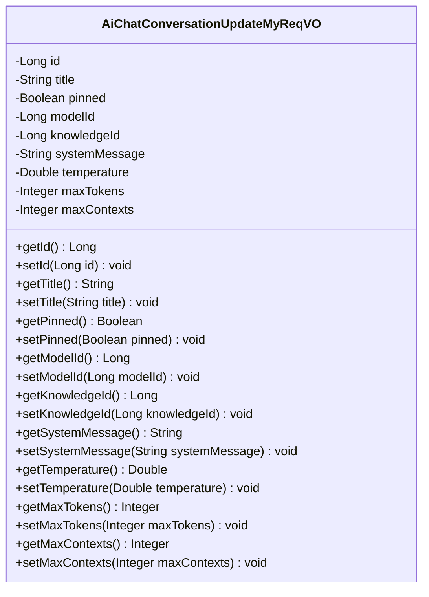
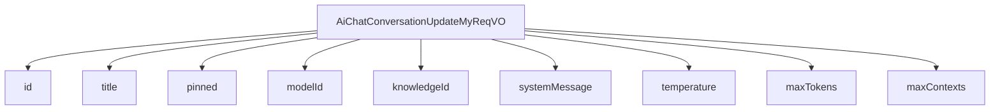

# 基础信息

|      |      |
|------|------|
| 编码语言 | .java |
| 代码路径 | yudao-module-ai/yudao-module-ai-biz/src/main/java/cn/iocoder/yudao/module/ai/controller/admin/chat/vo/conversation/AiChatConversationUpdateMyReqVO.java |
| 包名 | cn.iocoder.yudao.module.ai.controller.admin.chat.vo.conversation |
| 依赖项 | ['io.swagger.v3.oas.annotations.media.Schema', 'jakarta.validation.constraints.NotNull', 'lombok.Data'] |
| 概述说明 | 管理后台AI聊天对话更新请求需包含以下必填和可选字段：对话编号（必填）、对话标题、是否置顶、模型编号、知识库编号、角色设定、温度参数、单条回复的最大Token数量、上下文的最大Message数量。 |

# 说明

管理后台AI聊天对话更新请求包含多个关键字段，以确保对话的设置和功能能够满足特定需求。首先，对话编号是必填字段，用于唯一标识每个对话。对话标题字段允许用户为对话设置一个描述性的名称，便于识别和管理。是否置顶字段用于决定该对话是否在列表中优先显示，方便用户快速访问重要对话。

模型编号字段用于指定对话所使用的AI模型，确保对话基于特定的模型进行响应。知识库编号字段则允许用户关联特定的知识库，以便AI在对话中引用相关知识库中的信息。角色设定字段用于定义AI在对话中的角色或行为模式，使其能够以特定的身份或风格进行交流。

温度参数字段用于控制AI生成回复的随机性和创造性，较高的温度值会使回复更加多样化和不可预测，而较低的温度值则会使回复更加确定和一致。单条回复的最大Token数量字段限制了AI每次回复的长度，确保回复内容简洁且符合要求。上下文的最大Message数量字段则用于控制对话中保留的历史消息数量，以便AI能够基于适当的上下文生成回复。

这些字段共同构成了管理后台AI聊天对话更新请求的核心内容，确保用户能够根据具体需求灵活配置和管理AI对话。

# 类列表 Class Summary

| 名称   | 类型  | 说明 |
|-------|------|-------------|
| AiChatConversationUpdateMyReqVO | class | 管理后台AI聊天对话更新请求包含以下字段：对话编号（必填）、对话标题、是否置顶、模型编号、知识库编号、角色设定、温度参数、单条回复的最大Token数量、上下文的最大Message数量。 |

## 类 AiChatConversationUpdateMyReqVO

|      |      |
|------|------|
| 访问范围 | @Schema(description = "管理后台 - AI 聊天对话更新【我的】 Request VO");@Data;public |
| 类型 | class |
| 名称 | AiChatConversationUpdateMyReqVO |
| 说明 | 管理后台AI聊天对话更新请求包含以下字段：对话编号（必填）、对话标题、是否置顶、模型编号、知识库编号、角色设定、温度参数、单条回复的最大Token数量、上下文的最大Message数量。 |

### UML类图

### 描述信息：
该UML类图展示了一个名为`AiChatConversationUpdateMyReqVO`的类，用于管理后台的AI聊天对话更新请求。类中包含多个私有属性，如`id`、`title`、`pinned`等，并提供了相应的getter和setter方法。

### 内部方法调用关系图

### 描述信息：
该图展示了 `AiChatConversationUpdateMyReqVO` 类与其属性之间的调用关系。`AiChatConversationUpdateMyReqVO` 类包含了多个属性，如 `id`、`title`、`pinned` 等，这些属性通过 `-->` 符号与类进行关联，表示类对这些属性的依赖关系。

### 字段列表 Field List

| 名称  | 类型  | 说明 |
|-------|-------|------|
| maxContexts | Integer | 上下文的最大 Message 数量，示例值为10。 |
| knowledgeId | Long | 知识库编号为长整型，示例值为1。 |
| id | Long | 对话编号是必需的，不能为空，示例值为1024。 |
| modelId | Long | 模型编号字段，类型为长整型，示例值为1。 |
| temperature | Double | 温度参数，示例值为0.8，类型为Double。 |
| maxTokens | Integer | 单条回复的最大Token数量为4096。 |
| title | String | 对话标题字段，类型为字符串，用于存储对话的标题信息。 |
| systemMessage | String | 角色设定为一个快乐的程序员。 |
| pinned | Boolean | 该字段用于标识内容是否置顶，示例值为"true"，表示内容被置顶。 |

### 方法列表 Method List

| 名称  | 类型  | 说明 |
|-------|-------|------|

