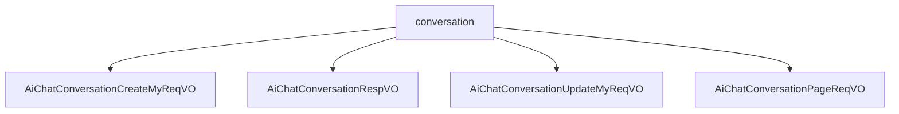

# 基础信息

|      |      |
|------|------|
| 编码语言 | .java |
| 代码路径 | yudao-module-ai/yudao-module-ai-biz/src/main/java/cn/iocoder/yudao/module/ai/controller/admin/chat/vo/conversation |
| 包名 | cn.iocoder.yudao.module.ai.controller.admin.chat.vo.conversation |
| 概述说明 | 管理后台AI聊天对话系统通过多个关键字段实现对话的创建、响应、更新和分页查询。创建请求包含聊天角色编号和知识库编号，用于标识角色和关联知识库。响应VO包括对话编号、用户编号、对话标题、角色编号、模型编号、温度参数、单条回复最大Token数量等，确保对话的准确性和可控性。更新请求允许调整对话标题、是否置顶、模型编号、知识库编号、角色设定等，满足特定需求。分页请求VO通过用户编号、对话标题和创建时间范围进行筛选，高效管理对话记录。 |

# 说明

管理后台的AI聊天对话系统通过多个关键字段和数据结构来创建、管理和更新聊天对话，确保对话的准确性和灵活性。在创建请求中，系统使用聊天角色编号（roleId）和知识库编号（knowledgeId）来标识对话中的角色及其关联的知识库，从而确保对话的相关性和准确性。响应VO则包含了对话编号、用户编号、对话标题、是否置顶标志、角色编号、模型编号、模型标志、模型名字、角色设定、温度参数、单条回复最大Token数量、上下文最大Message数量、创建时间、角色头像、角色名字和消息数量等详细信息，全面描述了对话的各个方面，便于用户管理和分析。

更新请求则通过对话编号、对话标题、是否置顶、模型编号、知识库编号、角色设定、温度参数、单条回复最大Token数量和上下文最大Message数量等字段，允许用户根据需求灵活配置和管理对话。这些字段共同确保了对话的设置和功能能够满足特定需求。

此外，管理后台还提供了分页请求VO，用于分页查询对话记录。该结构包含用户编号、对话标题和创建时间范围三个关键字段，确保查询结果仅返回与特定用户、主题或时间段相关的对话记录，从而实现对用户对话历史的高效管理和分析。通过这些设计，管理后台能够灵活地创建、管理和查询AI聊天对话，满足不同场景和需求下的对话配置要求。

### 包内部结构视图

### 描述信息：
该图展示了`conversation`文件夹下的四个Java文件之间的调用关系。`conversation`文件夹包含了四个不同的VO类，分别用于处理聊天会话的创建、响应、更新和分页请求。这些类通过`conversation`文件夹进行组织和管理。

# 文件列表 File List

| 名称   | 类型  | 说明 |
|-------|------|-------------|
| [AiChatConversationPageReqVO.java](AiChatConversationPageReqVO.md) | file | 管理后台AI聊天对话分页请求VO包含用户编号、对话标题和创建时间范围，用于分页查询相关对话记录。 |
| [AiChatConversationUpdateMyReqVO.java](AiChatConversationUpdateMyReqVO.md) | file | 管理后台AI聊天对话更新请求需包含以下必填和可选字段：对话编号（必填）、对话标题、是否置顶、模型编号、知识库编号、角色设定、温度参数、单条回复的最大Token数量、上下文的最大Message数量。 |
| [AiChatConversationRespVO.java](AiChatConversationRespVO.md) | file | 管理后台AI聊天对话响应VO包含对话编号、用户编号、对话标题、置顶状态、角色编号、模型编号、模型标志、模型名字、角色设定、温度参数、单条回复最大Token数量、上下文最大Message数量、创建时间、角色头像、角色名字及消息数量等关键信息。 |
| [AiChatConversationCreateMyReqVO.java](AiChatConversationCreateMyReqVO.md) | file | 管理后台AI聊天对话创建请求VO包含两个关键字段：聊天角色编号（roleId）和知识库编号（knowledgeId），用于标识聊天角色和相关知识库。 |

