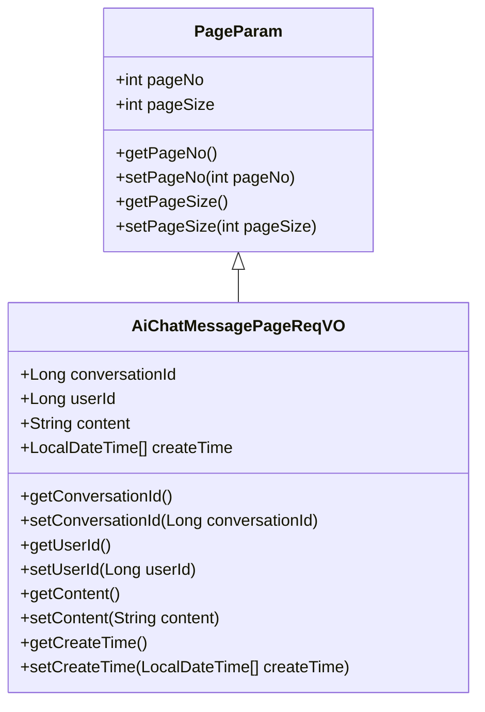
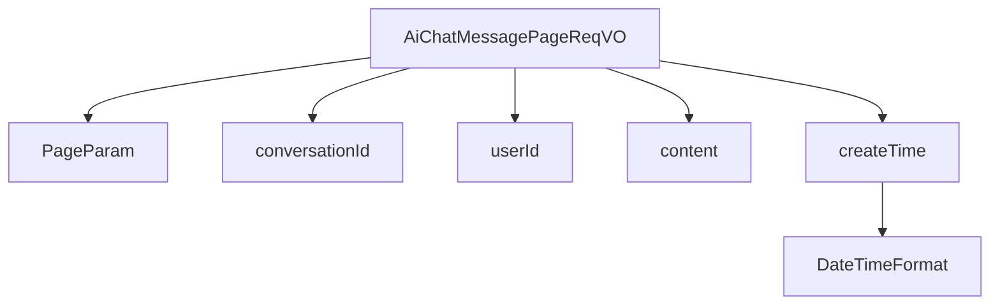

# 基础信息

|      |      |
|------|------|
| 编码语言 | .java |
| 代码路径 | yudao-module-ai/yudao-module-ai-biz/src/main/java/cn/iocoder/yudao/module/ai/controller/admin/chat/vo/message/AiChatMessagePageReqVO.java |
| 包名 | cn.iocoder.yudao.module.ai.controller.admin.chat.vo.message |
| 依赖项 | ['cn.iocoder.yudao.framework.common.pojo.PageParam', 'io.swagger.v3.oas.annotations.media.Schema', 'lombok.Data', 'org.springframework.format.annotation.DateTimeFormat', 'java.time.LocalDateTime', 'cn.iocoder.yudao.framework.common.util.date.DateUtils.FORMAT_YEAR_MONTH_DAY_HOUR_MINUTE_SECOND'] |
| 概述说明 | 管理后台AI聊天消息分页请求VO包含对话编号、用户编号、消息内容和创建时间等字段，用于分页查询AI聊天消息。 |

# 说明

管理后台AI聊天消息分页请求VO是一个用于分页查询AI聊天消息的数据结构，包含了多个关键字段以支持对聊天消息的检索和管理。该VO主要包括以下字段：对话编号、用户编号、消息内容和创建时间。对话编号用于唯一标识一次对话，便于区分不同的聊天会话；用户编号则标识了参与聊天的用户，帮助系统识别消息的来源或目标用户；消息内容字段存储了具体的聊天文本信息，是查询的核心内容之一；创建时间记录了每条消息的生成时间，便于按时间顺序进行排序和筛选。通过这些字段的组合，管理后台能够高效地实现对AI聊天消息的分页查询，支持按对话、用户、时间等条件进行灵活检索，从而满足对聊天记录的管理和分析需求。

# 类列表 Class Summary

| 名称   | 类型  | 说明 |
|-------|------|-------------|
| AiChatMessagePageReqVO | class | 管理后台AI聊天消息分页请求VO包含对话编号、用户编号、消息内容和创建时间等字段，用于分页查询AI聊天消息。 |

## 类 AiChatMessagePageReqVO

|      |      |
|------|------|
| 访问范围 | @Schema(description = "管理后台 - AI 聊天消息的分页 Request VO");@Data;public |
| 类型 | class |
| 名称 | AiChatMessagePageReqVO |
| 说明 | 管理后台AI聊天消息分页请求VO包含对话编号、用户编号、消息内容和创建时间等字段，用于分页查询AI聊天消息。 |

### UML类图

### 描述信息：
该UML类图展示了`AiChatMessagePageReqVO`类继承自`PageParam`类，并包含了`conversationId`、`userId`、`content`和`createTime`等属性。`AiChatMessagePageReqVO`类用于管理后台的AI聊天消息分页请求，继承自`PageParam`类以支持分页功能。

### 内部方法调用关系图

### 描述信息：
该图展示了 `AiChatMessagePageReqVO` 类与其父类 `PageParam` 以及其属性 `conversationId`、`userId`、`content` 和 `createTime` 之间的调用关系。`createTime` 属性进一步调用了 `DateTimeFormat` 注解来处理日期时间格式。

### 字段列表 Field List

| 名称  | 类型  | 说明 |
|-------|-------|------|
| content | String | 消息内容字段，类型为字符串，示例值为“你好”。 |
| userId | Long | 用户编号，类型为长整型，示例值为1024。 |
| conversationId | Long | 对话编号，示例为2048，类型为长整型。 |
| createTime | LocalDateTime[] | 该代码片段定义了一个名为`createTime`的私有变量，类型为`LocalDateTime[]`，用于存储创建时间。使用`@Schema`注解描述该字段为“创建时间”，并通过`@DateTimeFormat`注解指定时间格式为“年-月-日 时:分:秒”。 |

### 方法列表 Method List

| 名称  | 类型  | 说明 |
|-------|-------|------|

