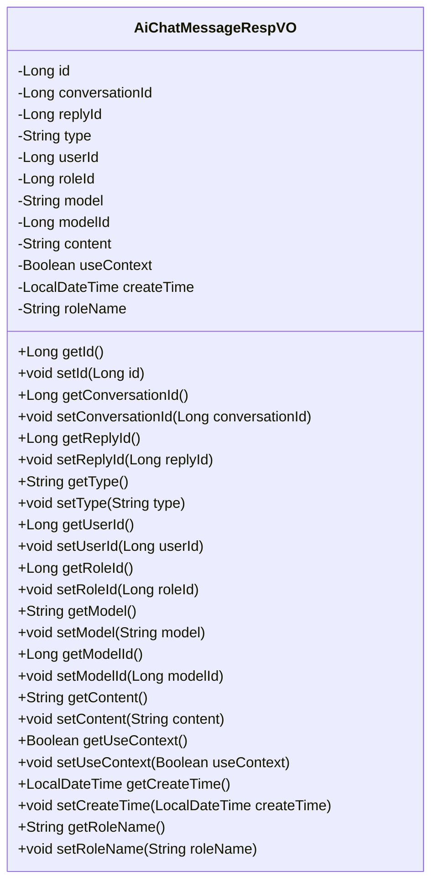
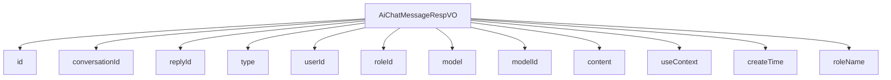

# 基础信息

|      |      |
|------|------|
| 编码语言 | .java |
| 代码路径 | yudao-module-ai/yudao-module-ai-biz/src/main/java/cn/iocoder/yudao/module/ai/controller/admin/chat/vo/message/AiChatMessageRespVO.java |
| 包名 | cn.iocoder.yudao.module.ai.controller.admin.chat.vo.message |
| 依赖项 | ['io.swagger.v3.oas.annotations.media.Schema', 'lombok.Data', 'java.time.LocalDateTime'] |
| 概述说明 | 管理后台AI聊天消息响应VO包含编号、对话编号、回复消息编号、消息类型、用户编号、角色编号、模型标志、模型编号、聊天内容、是否携带上下文、创建时间等字段，部分字段如角色名字仅在对话管理时加载。 |

# 说明

管理后台AI聊天消息响应VO是一个用于记录和管理AI聊天消息的数据结构，包含多个关键字段以全面描述每条消息的属性和上下文信息。该VO的主要字段包括编号、对话编号、回复消息编号、消息类型、用户编号、角色编号、模型标志、模型编号、聊天内容、是否携带上下文以及创建时间等。编号用于唯一标识每条消息，对话编号则关联到具体的对话会话，便于追踪和管理。回复消息编号用于标识当前消息是对哪条消息的回复，消息类型则区分消息的种类，如文本、图片或其他形式。用户编号和角色编号分别标识发送消息的用户和角色，模型标志和模型编号则用于标识生成消息的AI模型及其具体版本。聊天内容字段存储实际的消息内容，是否携带上下文字段指示该消息是否依赖于之前的对话内容以保持连贯性。创建时间记录消息生成的时间戳，便于按时间顺序管理消息。此外，部分字段仅在对话管理时加载，例如角色名字，用于在管理界面中显示更详细的角色信息。通过这些字段，管理后台能够全面监控和分析AI聊天消息的生成、交互和管理过程。

# 类列表 Class Summary

| 名称   | 类型  | 说明 |
|-------|------|-------------|
| AiChatMessageRespVO | class | 管理后台AI聊天消息响应VO包含编号、对话编号、回复消息编号、消息类型、用户编号、角色编号、模型标志、模型编号、聊天内容、是否携带上下文、创建时间等字段，部分字段仅在对话管理时加载，如角色名字。 |

## 类 AiChatMessageRespVO

|      |      |
|------|------|
| 访问范围 | @Schema(description = "管理后台 - AI 聊天消息 Response VO");@Data;public |
| 类型 | class |
| 名称 | AiChatMessageRespVO |
| 说明 | 管理后台AI聊天消息响应VO包含编号、对话编号、回复消息编号、消息类型、用户编号、角色编号、模型标志、模型编号、聊天内容、是否携带上下文、创建时间等字段，部分字段仅在对话管理时加载，如角色名字。 |

### UML类图

### 描述信息：
该UML类图展示了`AiChatMessageRespVO`类的结构，包含多个私有属性和对应的公共getter和setter方法。类用于管理AI聊天消息的响应数据，包括消息编号、对话编号、用户编号、角色编号、模型信息、聊天内容等。

### 内部方法调用关系图

### 描述信息：
该图展示了`AiChatMessageRespVO`类与其属性之间的调用关系。`AiChatMessageRespVO`类包含了多个属性，如`id`、`conversationId`、`replyId`等，这些属性通过`-->`符号与类进行关联。每个属性都代表了AI聊天消息的不同信息，如消息编号、对话编号、用户编号等。

### 字段列表 Field List

| 名称  | 类型  | 说明 |
|-------|-------|------|
| conversationId | Long | 对话编号为必填项，示例值为2048，类型为长整型。 |
| replyId | Long | 回复消息编号，示例为1024，类型为长整型。 |
| id | Long | 编号为必填项，示例值为1024，数据类型为长整型。 |
| roleId | Long | 角色编号为长整型，示例值为888。 |
| type | String | 消息类型字段为必填项，示例值为"role"，用于描述消息的具体类型。 |
| userId | Long | 用户编号字段，类型为长整型，示例值为4096。 |
| useContext | Boolean | 该字段表示是否携带上下文，是必填项，示例值为"true"。 |
| model | String | 模型标志为必填项，示例值为"gpt-3.5-turbo"。 |
| content | String | 聊天内容字段，类型为字符串，必填项，示例值为“你好，你好啊”。 |
| roleName | String | 角色名字字段，示例为“小黄”，用于存储角色名称信息。 |
| modelId | Long | 模型编号为必填项，示例值为123，数据类型为长整型。 |
| createTime | LocalDateTime | 创建时间字段为必填项，类型为LocalDateTime，示例值为"2024-05-12 12:51"。 |

### 方法列表 Method List

| 名称  | 类型  | 说明 |
|-------|-------|------|

