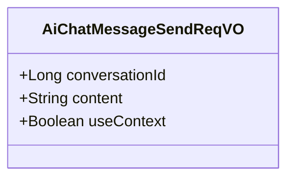
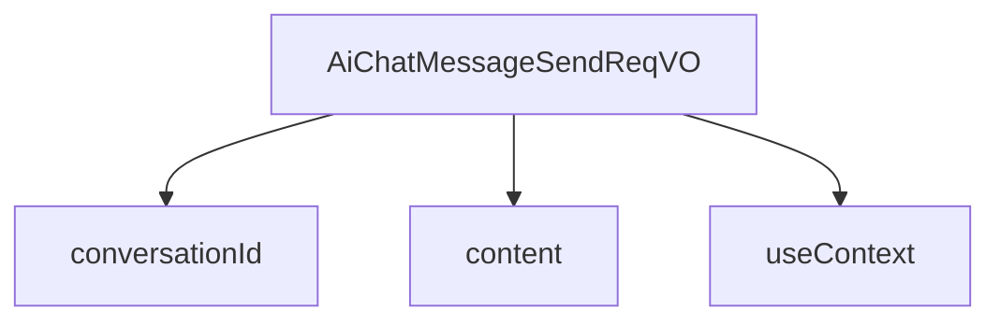

# 基础信息

|      |      |
|------|------|
| 编码语言 | .java |
| 代码路径 | yudao-module-ai/yudao-module-ai-biz/src/main/java/cn/iocoder/yudao/module/ai/controller/admin/chat/vo/message/AiChatMessageSendReqVO.java |
| 包名 | cn.iocoder.yudao.module.ai.controller.admin.chat.vo.message |
| 依赖项 | ['io.swagger.v3.oas.annotations.media.Schema', 'jakarta.validation.constraints.NotEmpty', 'jakarta.validation.constraints.NotNull', 'jakarta.validation.constraints.Size', 'lombok.Data', 'lombok.experimental.Accessors'] |
| 概述说明 | 管理后台AI聊天消息发送请求需包含三个关键字段：聊天对话编号（必填，如1024）、聊天内容（必填，如“帮我写个Java算法”）和是否携带上下文（如true）。 |

# 说明

管理后台的AI聊天消息发送请求包含三个关键字段，这些字段对于确保消息的正确发送和处理至关重要。首先，聊天对话编号是必填项，用于唯一标识一个特定的聊天对话。例如，聊天对话编号可以是1024，这样的编号有助于系统追踪和管理不同的对话。其次，聊天内容也是必填项，它包含了用户希望AI处理的具体信息或问题。例如，用户可能会输入“帮我写个Java算法”，这样的内容直接指导AI进行相应的操作或回答。最后，是否携带上下文是一个可选的字段，用于指示当前消息是否需要考虑之前的对话内容。例如，如果设置为true，AI在处理当前消息时会参考之前的对话历史，以提供更加连贯和相关的回答。这三个字段共同构成了管理后台AI聊天消息发送请求的核心内容，确保了消息的准确性和上下文的相关性。

# 类列表 Class Summary

| 名称   | 类型  | 说明 |
|-------|------|-------------|
| AiChatMessageSendReqVO | class | 管理后台AI聊天消息发送请求包含三个关键字段：聊天对话编号（必填，示例1024）、聊天内容（必填，示例“帮我写个Java算法”）和是否携带上下文（示例true）。 |

## 类 AiChatMessageSendReqVO

|      |      |
|------|------|
| 访问范围 | @Schema(description = "管理后台 - AI 聊天消息发送 Request VO");@Data;public |
| 类型 | class |
| 名称 | AiChatMessageSendReqVO |
| 说明 | 管理后台AI聊天消息发送请求包含三个关键字段：聊天对话编号（必填，示例1024）、聊天内容（必填，示例“帮我写个Java算法”）和是否携带上下文（示例true）。 |

### UML类图

### 描述信息：
该UML类图展示了一个名为`AiChatMessageSendReqVO`的类，用于管理后台AI聊天消息发送请求。类中包含三个属性：`conversationId`（聊天对话编号）、`content`（聊天内容）和`useContext`（是否携带上下文）。所有属性均为`public`可见性，确保外部可以直接访问这些数据。

### 内部方法调用关系图

### 描述信息：
`AiChatMessageSendReqVO` 类包含三个主要属性：`conversationId`、`content` 和 `useContext`。`conversationId` 用于标识聊天对话的唯一编号，`content` 存储聊天内容，`useContext` 决定是否携带上下文信息。这些属性通过 `@NotNull` 和 `@NotEmpty` 注解确保其非空性。

### 字段列表 Field List

| 名称  | 类型  | 说明 |
|-------|-------|------|
| useContext | Boolean | 该字段表示是否携带上下文，示例值为"true"。 |
| conversationId | Long | 聊天对话编号为必填项，不能为空，示例值为1024。 |
| content | String | 聊天内容字段为必填项，不能为空，示例为“帮我写个 Java 算法”。 |

### 方法列表 Method List

| 名称  | 类型  | 说明 |
|-------|-------|------|

