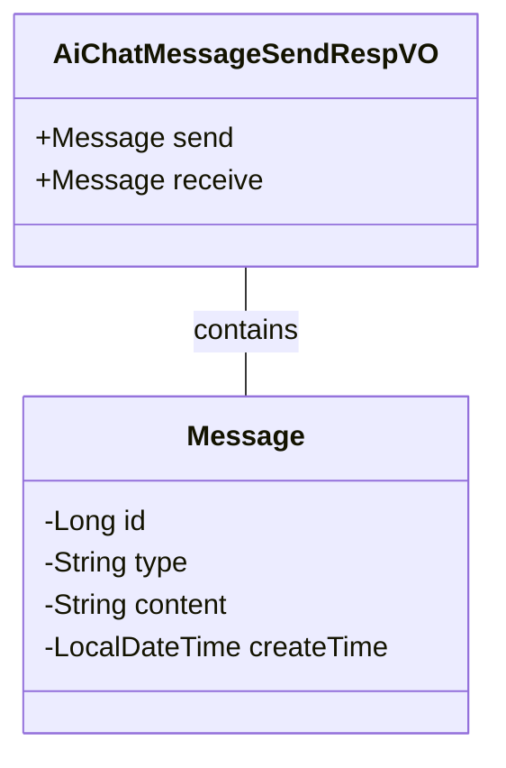
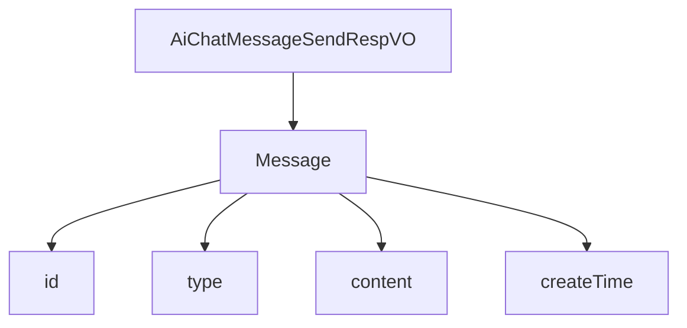

# 基础信息

|      |      |
|------|------|
| 编码语言 | .java |
| 代码路径 | yudao-module-ai/yudao-module-ai-biz/src/main/java/cn/iocoder/yudao/module/ai/controller/admin/chat/vo/message/AiChatMessageSendRespVO.java |
| 包名 | cn.iocoder.yudao.module.ai.controller.admin.chat.vo.message |
| 依赖项 | ['io.swagger.v3.oas.annotations.media.Schema', 'lombok.Data', 'java.time.LocalDateTime'] |
| 概述说明 | 管理后台AI聊天消息发送响应VO包含发送和接收消息，每个消息必须包含编号、消息类型、聊天内容和创建时间。 |

# 说明

管理后台的AI聊天消息发送响应VO（值对象）主要用于处理和记录聊天消息的发送与接收。该VO包含两个主要部分：发送消息和接收消息。每个消息都包含四个必填项：编号、消息类型、聊天内容和创建时间。编号用于唯一标识每条消息，确保消息的唯一性和可追溯性。消息类型用于区分消息的类别，例如文本、图片、音频等，以便系统能够正确处理和显示不同类型的消息。聊天内容是消息的主体部分，包含了用户或AI发送的具体信息。创建时间记录了消息生成的时间戳，用于追踪消息的时间顺序和历史记录。通过这四个必填项，系统能够全面、详尽地管理和记录聊天过程中的所有消息，确保消息的完整性和可追溯性。

# 类列表 Class Summary

| 名称   | 类型  | 说明 |
|-------|------|-------------|
| AiChatMessageSendRespVO | class | 管理后台AI聊天消息发送响应VO包含发送和接收消息，每个消息包含编号、消息类型、聊天内容和创建时间，均为必填项。 |

## 类 AiChatMessageSendRespVO

|      |      |
|------|------|
| 访问范围 | @Schema(description = "管理后台 - AI 聊天消息发送 Response VO");@Data;public |
| 类型 | class |
| 名称 | AiChatMessageSendRespVO |
| 说明 | 管理后台AI聊天消息发送响应VO包含发送和接收消息，每个消息包含编号、消息类型、聊天内容和创建时间，均为必填项。 |

### UML类图

### 描述信息：
该UML类图展示了`AiChatMessageSendRespVO`类与`Message`类之间的关系。`AiChatMessageSendRespVO`类包含两个`Message`类型的属性：`send`和`receive`，分别表示发送和接收的消息。`Message`类包含消息的编号、类型、内容以及创建时间等属性。

### 内部方法调用关系图

### 描述信息：
该图展示了`AiChatMessageSendRespVO`类与`Message`类之间的调用关系。`AiChatMessageSendRespVO`类包含两个`Message`对象：`send`和`receive`。`Message`类进一步包含四个属性：`id`、`type`、`content`和`createTime`。这些属性分别用于存储消息的唯一标识、类型、内容以及创建时间。

### 字段列表 Field List

| 名称  | 类型  | 说明 |
|-------|-------|------|
| receive | Message | 接收消息是必需的，使用Message类进行定义。 |
| send | Message | 发送消息功能描述，包含必需的Message对象。 |

### 方法列表 Method List

| 名称  | 类型  | 说明 |
|-------|-------|------|

