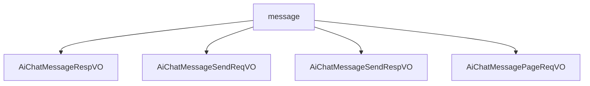

# 基础信息

|      |      |
|------|------|
| 编码语言 | .java |
| 代码路径 | yudao-module-ai/yudao-module-ai-biz/src/main/java/cn/iocoder/yudao/module/ai/controller/admin/chat/vo/message |
| 包名 | cn.iocoder.yudao.module.ai.controller.admin.chat.vo.message |
| 概述说明 | 管理后台AI聊天消息系统涉及多个数据结构，用于记录、发送、接收和查询聊天消息。主要数据结构包括消息响应VO、发送请求VO、发送响应VO和分页请求VO。这些结构包含编号、对话编号、消息类型、用户编号、角色编号、模型标志、模型编号、聊天内容、是否携带上下文和创建时间等关键字段，确保消息的唯一性、可追溯性和上下文连贯性。系统通过这些字段全面监控和管理AI聊天消息的生成、交互和查询过程。 |

# 说明

管理后台AI聊天消息响应VO是一个用于记录和管理AI聊天消息的数据结构，包含多个关键字段以全面描述每条消息的属性和上下文信息。主要字段包括编号、对话编号、回复消息编号、消息类型、用户编号、角色编号、模型标志、模型编号、聊天内容、是否携带上下文以及创建时间等。编号用于唯一标识每条消息，对话编号关联到具体的对话会话，便于追踪和管理。回复消息编号标识当前消息是对哪条消息的回复，消息类型区分消息的种类，如文本、图片等。用户编号和角色编号分别标识发送消息的用户和角色，模型标志和模型编号标识生成消息的AI模型及其版本。聊天内容字段存储实际的消息内容，是否携带上下文字段指示该消息是否依赖于之前的对话内容以保持连贯性。创建时间记录消息生成的时间戳，便于按时间顺序管理消息。部分字段仅在对话管理时加载，如角色名字，用于在管理界面中显示更详细的角色信息。通过这些字段，管理后台能够全面监控和分析AI聊天消息的生成、交互和管理过程。

管理后台的AI聊天消息发送请求包含三个关键字段：聊天对话编号、聊天内容和是否携带上下文。聊天对话编号是必填项，用于唯一标识一个特定的聊天对话。聊天内容也是必填项，包含用户希望AI处理的具体信息或问题。是否携带上下文是一个可选的字段，用于指示当前消息是否需要考虑之前的对话内容。这三个字段共同构成了管理后台AI聊天消息发送请求的核心内容，确保了消息的准确性和上下文的相关性。

管理后台的AI聊天消息发送响应VO主要用于处理和记录聊天消息的发送与接收。该VO包含两个主要部分：发送消息和接收消息。每个消息都包含四个必填项：编号、消息类型、聊天内容和创建时间。编号用于唯一标识每条消息，消息类型用于区分消息的类别，如文本、图片、音频等。聊天内容是消息的主体部分，创建时间记录了消息生成的时间戳。通过这四个必填项，系统能够全面、详尽地管理和记录聊天过程中的所有消息，确保消息的完整性和可追溯性。

管理后台AI聊天消息分页请求VO是一个用于分页查询AI聊天消息的数据结构，包含多个关键字段以支持对聊天消息的检索和管理。主要字段包括对话编号、用户编号、消息内容和创建时间。对话编号用于唯一标识一次对话，用户编号标识参与聊天的用户，消息内容字段存储具体的聊天文本信息，创建时间记录每条消息的生成时间。通过这些字段的组合，管理后台能够高效地实现对AI聊天消息的分页查询，支持按对话、用户、时间等条件进行灵活检索，从而满足对聊天记录的管理和分析需求。

### 包内部结构视图

### 描述信息：
该Mermaid图展示了`message`文件夹与其内部文件之间的层级关系。`message`文件夹包含了四个Java文件：`AiChatMessageRespVO.java`、`AiChatMessageSendReqVO.java`、`AiChatMessageSendRespVO.java`和`AiChatMessagePageReqVO.java`。这些文件可能用于处理AI聊天消息的响应、发送请求、发送响应以及分页请求。

# 文件列表 File List

| 名称   | 类型  | 说明 |
|-------|------|-------------|
| [AiChatMessagePageReqVO.java](AiChatMessagePageReqVO.md) | file | 管理后台AI聊天消息分页请求VO包含对话编号、用户编号、消息内容和创建时间等字段，用于分页查询AI聊天消息。 |
| [AiChatMessageSendRespVO.java](AiChatMessageSendRespVO.md) | file | 管理后台AI聊天消息发送响应VO包含发送和接收消息，每个消息必须包含编号、消息类型、聊天内容和创建时间。 |
| [AiChatMessageSendReqVO.java](AiChatMessageSendReqVO.md) | file | 管理后台AI聊天消息发送请求需包含三个关键字段：聊天对话编号（必填，如1024）、聊天内容（必填，如“帮我写个Java算法”）和是否携带上下文（如true）。 |
| [AiChatMessageRespVO.java](AiChatMessageRespVO.md) | file | 管理后台AI聊天消息响应VO包含编号、对话编号、回复消息编号、消息类型、用户编号、角色编号、模型标志、模型编号、聊天内容、是否携带上下文、创建时间等字段，部分字段如角色名字仅在对话管理时加载。 |

