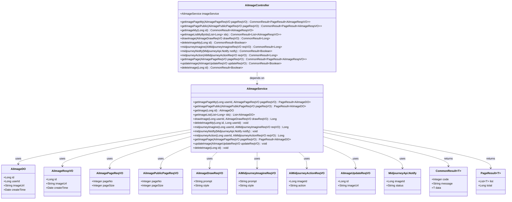

# 基础信息

|      |      |
|------|------|
| 编码语言 | .java |
| 代码路径 | yudao-module-ai/yudao-module-ai-biz/src/main/java/cn/iocoder/yudao/module/ai/controller/admin/image/AiImageController.java |
| 包名 | cn.iocoder.yudao.module.ai.controller.admin.image |
| 依赖项 | ['cn.hutool.core.util.ObjUtil', 'cn.iocoder.yudao.framework.ai.core.model.midjourney.api.MidjourneyApi', 'cn.iocoder.yudao.framework.common.pojo.CommonResult', 'cn.iocoder.yudao.framework.common.pojo.PageResult', 'cn.iocoder.yudao.framework.common.util.object.BeanUtils', 'cn.iocoder.yudao.framework.tenant.core.aop.TenantIgnore', 'cn.iocoder.yudao.module.ai.controller.admin.image.vo', 'cn.iocoder.yudao.module.ai.controller.admin.image.vo.midjourney.AiMidjourneyActionReqVO', 'cn.iocoder.yudao.module.ai.controller.admin.image.vo.midjourney.AiMidjourneyImagineReqVO', 'cn.iocoder.yudao.module.ai.dal.dataobject.image.AiImageDO', 'cn.iocoder.yudao.module.ai.service.image.AiImageService', 'io.swagger.v3.oas.annotations.Operation', 'io.swagger.v3.oas.annotations.Parameter', 'io.swagger.v3.oas.annotations.tags.Tag', 'jakarta.annotation.Resource', 'jakarta.annotation.security.PermitAll', 'jakarta.validation.Valid', 'lombok.extern.slf4j.Slf4j', 'org.springframework.security.access.prepost.PreAuthorize', 'org.springframework.validation.annotation.Validated', 'org.springframework.web.bind.annotation', 'java.util.List', 'cn.iocoder.yudao.framework.common.pojo.CommonResult.success', 'cn.iocoder.yudao.framework.security.core.util.SecurityFrameworkUtils.getLoginUserId'] |
| 概述说明 | 该代码实现了一个AI绘画控制器，具备获取个人和公开绘图分页、个人绘图记录、生成图片、删除记录等功能，支持Midjourney的图片生成、通知进展和二次生成操作，并提供绘图管理的分页查询、更新和删除功能。 |

# 说明

该代码实现了一个管理后台的AI绘画控制器，具备多种功能以满足用户对AI绘画的管理需求。首先，控制器支持获取个人和公开绘图的分页数据，用户可以通过分页查询功能浏览和管理自己的绘图记录以及公开的绘图作品。其次，用户可以通过控制器获取个人的绘图记录，方便查看和管理自己的创作历史。此外，控制器还提供了生成图片的功能，用户可以通过该功能生成新的AI绘画作品。对于不再需要的绘画记录，用户可以使用删除功能将其从个人记录中移除。

控制器还特别支持Midjourney的图片生成功能，用户可以通过该功能生成高质量的AI绘画作品。同时，控制器还提供了通知进展的功能，用户可以实时了解图片生成的进度和状态。对于已经生成的图片，用户还可以进行二次生成操作，以进一步优化或调整作品。

在绘图管理方面，控制器提供了分页查询功能，用户可以方便地浏览和管理大量的绘图作品。此外，控制器还支持更新和删除功能，用户可以对现有的绘图作品进行修改或删除操作，确保数据的管理和维护更加灵活和高效。通过这些功能，该控制器为用户提供了一个全面且便捷的AI绘画管理解决方案。

# 类列表 Class Summary

| 名称   | 类型  | 说明 |
|-------|------|-------------|
| AiImageController | class | 该代码实现了一个管理后台的AI绘画控制器，包含获取个人和公开绘图分页、获取个人绘图记录、生成图片、删除个人绘画记录等功能。同时支持Midjourney的图片生成、通知进展和二次生成操作。此外，还提供了绘图管理的分页查询、更新和删除功能。 |

## 类 AiImageController

|      |      |
|------|------|
| 访问范围 | @Tag(name = "管理后台 - AI 绘画");@RestController;@RequestMapping("/ai/image");@Slf4j;public |
| 类型 | class |
| 名称 | AiImageController |
| 说明 | 该代码实现了一个管理后台的AI绘画控制器，包含获取个人和公开绘图分页、获取个人绘图记录、生成图片、删除个人绘画记录等功能。同时支持Midjourney的图片生成、通知进展和二次生成操作。此外，还提供了绘图管理的分页查询、更新和删除功能。 |

### UML类图

### 描述信息：
该UML类图展示了`AiImageController`与`AiImageService`之间的依赖关系，以及`AiImageService`与多个数据对象（如`AiImageDO`、`AiImageRespVO`等）之间的交互。控制器通过调用服务层的方法来处理AI绘画相关的请求，并返回相应的结果。

### 内部方法调用关系图

### 描述信息：
该图展示了`AiImageController`与`AiImageService`之间的调用关系。`AiImageController`通过多个方法（如`getImagePageMy`、`drawImage`等）调用`AiImageService`来执行具体的业务逻辑，包括获取绘图分页、生成图片、删除记录等操作。每个方法都清晰地映射到`AiImageService`中的相应功能。

### 字段列表 Field List

| 名称  | 类型  | 说明 |
|-------|-------|------|
| imageService | AiImageService | 在代码中，通过@Resource注解将AiImageService实例注入到当前类中，以便使用其提供的图像处理功能。 |

### 方法列表 Method List

| 名称  | 类型  | 说明 |
|-------|-------|------|
| midjourneyImagine | CommonResult<Long> | 该接口用于通过Midjourney生成图片，接收一个有效的请求体参数，调用imageService的midjourneyImagine方法生成图片并返回图片ID。 |
| midjourneyAction | CommonResult<Long> | 该接口用于处理Midjourney的二次生成图片操作，如放大、缩小、U1、U2等。通过POST请求调用，接收请求体参数并返回生成的图片ID。 |
| drawImage | CommonResult<Long> | 该接口用于生成图片，通过POST请求访问路径"/draw"，接收一个经过验证的请求体AiImageDrawReqVO，调用imageService的drawImage方法，并返回生成的图片ID。 |
| deleteImageMy | CommonResult<Boolean> | 该API用于删除用户个人的绘画记录，通过DELETE请求访问路径"/delete-my"，需提供绘画编号作为必填参数，成功删除后返回布尔值true。 |
| getImagePage | CommonResult<PageResult<AiImageRespVO>> | 该代码定义了一个GET请求接口“/page”，用于获取绘画分页数据。接口需要用户具备“ai:image:query”权限，接收AiImagePageReqVO参数并返回分页结果，结果类型为AiImageRespVO。 |
| getImageListMyByIds | CommonResult<List<AiImageRespVO>> | 该API通过GET请求获取用户特定的绘图记录列表，需传入绘画编号数组作为参数。系统首先根据编号数组查询绘图记录，然后过滤掉不属于当前登录用户的记录，最后将结果转换为响应对象并返回。 |
| deleteImage | CommonResult<Boolean> | 该代码片段定义了一个删除绘画的API接口，使用DELETE请求方法，路径为"/delete"。接口需要传入编号（id）作为参数，且调用者需具备"ai:image:delete"权限。接口调用成功后返回布尔值true。 |
| midjourneyNotify | CommonResult<Boolean> | 该接口用于接收Midjourney Proxy回调通知图片进展，采用POST方法，路径为"/midjourney/notify"，无需权限验证和租户信息，接收并处理MidjourneyApi.Notify对象，返回操作成功结果。 |
| getImagePageMy | CommonResult<PageResult<AiImageRespVO>> | 该代码定义了一个GET请求接口，路径为"/my-page"，用于获取用户个人的绘图分页数据。接口通过调用imageService的getImagePageMy方法，传入当前登录用户ID和分页请求参数，返回分页结果。返回结果将AiImageDO对象转换为AiImageRespVO对象，并封装在CommonResult中返回。 |
| getImagePagePublic | CommonResult<PageResult<AiImageRespVO>> | 该代码定义了一个公开的API接口，用于获取公开的绘图分页数据。接口通过`@GetMapping`映射到`/public-page`路径，使用`AiImagePublicPageReqVO`作为请求参数，调用`imageService.getImagePagePublic`方法获取分页结果，并将`AiImageDO`转换为`AiImageRespVO`后返回。 |
| getImageMy | CommonResult<AiImageRespVO> | 该代码定义了一个GET请求接口，路径为"/get-my"，用于获取用户的绘图记录。接口接收一个必需的参数"id"（绘画编号），并返回对应的绘图记录。如果记录不存在或不属于当前登录用户，则返回空结果；否则返回转换后的绘图记录数据。 |
| updateImage | CommonResult<Boolean> | 该代码片段定义了一个用于更新绘画的API接口，路径为"/update"，使用PUT方法。接口需要用户具备"ai:image:update"权限，接收一个有效的AiImageUpdateReqVO请求体，调用imageService的updateImage方法进行更新操作，并返回一个表示操作成功的CommonResult对象。 |

