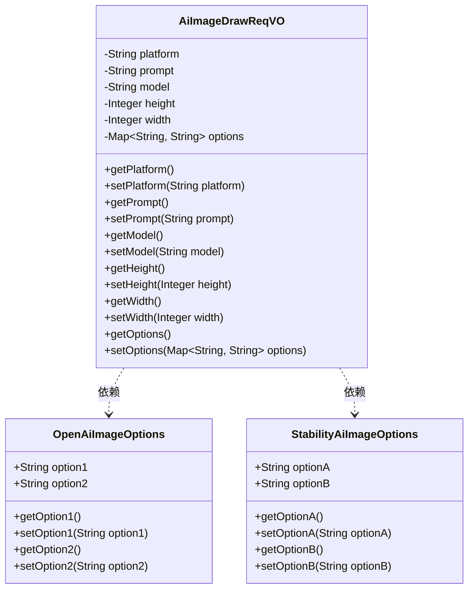
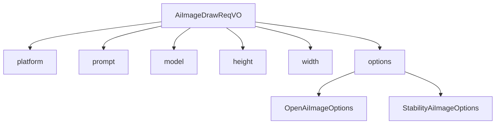

# 基础信息

|      |      |
|------|------|
| 编码语言 | .java |
| 代码路径 | yudao-module-ai/yudao-module-ai-biz/src/main/java/cn/iocoder/yudao/module/ai/controller/admin/image/vo/AiImageDrawReqVO.java |
| 包名 | cn.iocoder.yudao.module.ai.controller.admin.image.vo |
| 依赖项 | ['io.swagger.v3.oas.annotations.media.Schema', 'jakarta.validation.constraints.NotEmpty', 'jakarta.validation.constraints.NotNull', 'jakarta.validation.constraints.Size', 'lombok.Data', 'org.springframework.ai.openai.OpenAiImageOptions', 'org.springframework.ai.stabilityai.api.StabilityAiImageOptions', 'java.util.Map'] |
| 概述说明 | 管理后台AI绘画请求类需填写平台、提示词（最多1200字符）、模型、图片高度和宽度等必填信息，并可选择添加各平台特定的绘制参数。 |

# 说明

管理后台AI绘画请求类包含多个关键信息，这些信息是生成AI绘画所必需的。首先，平台是必填项，用于指定所使用的AI绘画服务提供商，例如OpenAI。其次，提示词也是必填项，用于描述绘画的主题或内容，最大长度为1200个字符。模型同样是必填项，用于指定所使用的AI模型，例如stable-diffusion-v1-6。此外，图片的高度和宽度也是必填项，用于确定生成图片的尺寸。除了这些必填项外，各平台还提供了一些特定的绘制参数，这些参数是可选的，可以根据需要进行设置，以进一步定制生成的图片。这些参数可能包括风格、颜色、细节等方面的设置，具体取决于所使用的平台和模型。通过这些关键信息的组合，管理后台可以有效地生成符合用户需求的AI绘画作品。

# 类列表 Class Summary

| 名称   | 类型  | 说明 |
|-------|------|-------------|
| AiImageDrawReqVO | class | 管理后台AI绘画请求类包含以下关键信息：平台（必填，如OpenAI）、提示词（必填，最大1200字符）、模型（必填，如stable-diffusion-v1-6）、图片高度和宽度（必填），以及各平台特定的绘制参数（可选）。 |

## 类 AiImageDrawReqVO

|      |      |
|------|------|
| 访问范围 | @Schema(description = "管理后台 - AI 绘画 Request VO");@Data;public |
| 类型 | class |
| 名称 | AiImageDrawReqVO |
| 说明 | 管理后台AI绘画请求类包含以下关键信息：平台（必填，如OpenAI）、提示词（必填，最大1200字符）、模型（必填，如stable-diffusion-v1-6）、图片高度和宽度（必填），以及各平台特定的绘制参数（可选）。 |

### UML类图

### 描述信息：
该UML类图展示了`AiImageDrawReqVO`类及其依赖的`OpenAiImageOptions`和`StabilityAiImageOptions`类。`AiImageDrawReqVO`类包含多个属性，如`platform`、`prompt`、`model`等，并提供了相应的getter和setter方法。该类依赖于`OpenAiImageOptions`和`StabilityAiImageOptions`类，用于处理不同平台的绘画参数。

### 内部方法调用关系图

### 描述信息：
该图展示了 `AiImageDrawReqVO` 类中各属性之间的调用关系。`AiImageDrawReqVO` 类包含了 `platform`、`prompt`、`model`、`height`、`width` 和 `options` 等属性。其中，`options` 属性进一步调用了 `OpenAiImageOptions` 和 `StabilityAiImageOptions` 类，用于处理不同平台的绘画参数。

### 字段列表 Field List

| 名称  | 类型  | 说明 |
|-------|-------|------|
| platform | String | 模型平台为必填项，示例为OpenAI。 |
| height | Integer | 图片高度属性为必填项，不能为空，数据类型为整数。 |
| width | Integer | 图片宽度字段为必填项，不能为空，数据类型为整数。 |
| model | String | 模型字段为必填项，不能为空，示例值为"stable-diffusion-v1-6"。 |
| options | Map<String, String> | 绘制参数使用一个键值对映射（Map<String, String>）来存储和传递相关配置选项。 |
| prompt | String | 提示词字段为必填项，不能为空，最大长度为1200个字符，示例为“画一个长城”。 |

### 方法列表 Method List

| 名称  | 类型  | 说明 |
|-------|-------|------|

