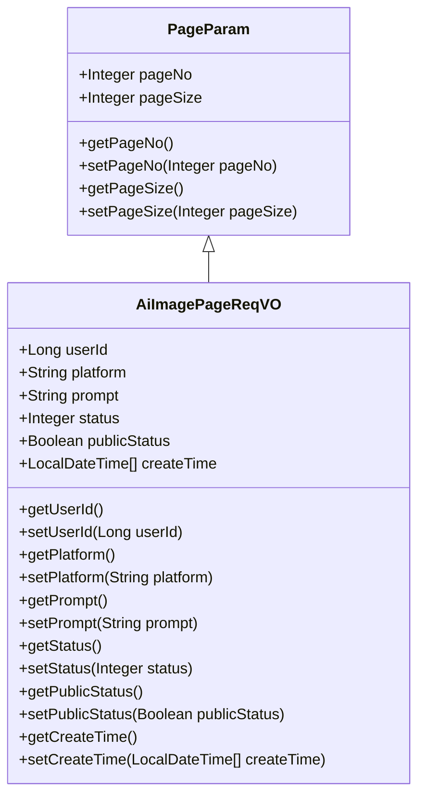
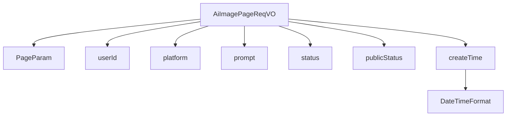

# 基础信息

|      |      |
|------|------|
| 编码语言 | .java |
| 代码路径 | yudao-module-ai/yudao-module-ai-biz/src/main/java/cn/iocoder/yudao/module/ai/controller/admin/image/vo/AiImagePageReqVO.java |
| 包名 | cn.iocoder.yudao.module.ai.controller.admin.image.vo |
| 依赖项 | ['cn.iocoder.yudao.framework.common.pojo.PageParam', 'io.swagger.v3.oas.annotations.media.Schema', 'lombok.Data', 'org.springframework.format.annotation.DateTimeFormat', 'java.time.LocalDateTime', 'cn.iocoder.yudao.framework.common.util.date.DateUtils.FORMAT_YEAR_MONTH_DAY_HOUR_MINUTE_SECOND'] |
| 概述说明 | 管理后台AI绘画分页请求VO包含用户编号、平台、提示词、绘画状态、是否发布及创建时间等关键字段，用于分页查询AI绘画记录。 |

# 说明

管理后台的AI绘画分页请求VO（值对象）设计用于支持分页查询AI绘画记录的功能。该VO包含多个关键字段，以确保查询的灵活性和准确性。首先，用户编号字段用于标识发起绘画请求的具体用户，便于按用户进行记录筛选。平台字段则用于区分不同的绘画平台或来源，帮助管理员根据平台类型进行查询。提示词字段记录了用户在生成绘画时输入的提示信息，便于后续根据内容进行检索。绘画状态字段用于标识当前绘画任务的进展状态，如“进行中”、“已完成”或“失败”等，方便管理员跟踪任务进度。是否发布字段用于标记该绘画记录是否已公开发布，便于区分已发布和未发布的内容。最后，创建时间字段记录了绘画任务的生成时间，支持按时间范围进行查询和排序。通过这些字段的组合，管理后台能够高效地分页查询和管理AI绘画记录，满足多样化的管理需求。

# 类列表 Class Summary

| 名称   | 类型  | 说明 |
|-------|------|-------------|
| AiImagePageReqVO | class | 管理后台AI绘画分页请求VO包含用户编号、平台、提示词、绘画状态、是否发布及创建时间等关键字段，用于分页查询AI绘画记录。 |

## 类 AiImagePageReqVO

|      |      |
|------|------|
| 访问范围 | @Schema(description = "管理后台 - AI 绘画分页 Request VO");@Data;public |
| 类型 | class |
| 名称 | AiImagePageReqVO |
| 说明 | 管理后台AI绘画分页请求VO包含用户编号、平台、提示词、绘画状态、是否发布及创建时间等关键字段，用于分页查询AI绘画记录。 |

### UML类图

### 描述信息：
该UML类图展示了`AiImagePageReqVO`类继承自`PageParam`类的关系。`AiImagePageReqVO`类包含了多个属性，如`userId`、`platform`、`prompt`等，并提供了相应的getter和setter方法。`PageParam`类则包含了分页相关的属性`pageNo`和`pageSize`。

### 内部方法调用关系图

### 描述信息：
该图展示了 `AiImagePageReqVO` 类与其属性之间的调用关系。`AiImagePageReqVO` 继承自 `PageParam`，并包含多个属性如 `userId`、`platform`、`prompt` 等。其中 `createTime` 属性使用了 `DateTimeFormat` 注解来格式化日期时间。

### 字段列表 Field List

| 名称  | 类型  | 说明 |
|-------|-------|------|
| status | Integer | 绘画状态字段，类型为整数，示例值为1。 |
| userId | Long | 用户编号字段，类型为长整型，示例值为28987。 |
| platform | String | 平台信息包括描述和示例，描述为“平台”，示例为“OpenAI”。 |
| publicStatus | Boolean | 该字段表示是否发布，数据类型为布尔型，示例值为1。 |
| prompt | String | 提示词字段，类型为字符串，示例值为"1"。 |
| createTime | LocalDateTime[] | 该代码片段定义了一个名为`createTime`的私有变量，类型为`LocalDateTime`数组，用于存储创建时间。通过`@Schema`注解描述其用途为“创建时间”，并使用`@DateTimeFormat`注解指定时间格式为“年-月-日 时:分:秒”。 |

### 方法列表 Method List

| 名称  | 类型  | 说明 |
|-------|-------|------|

