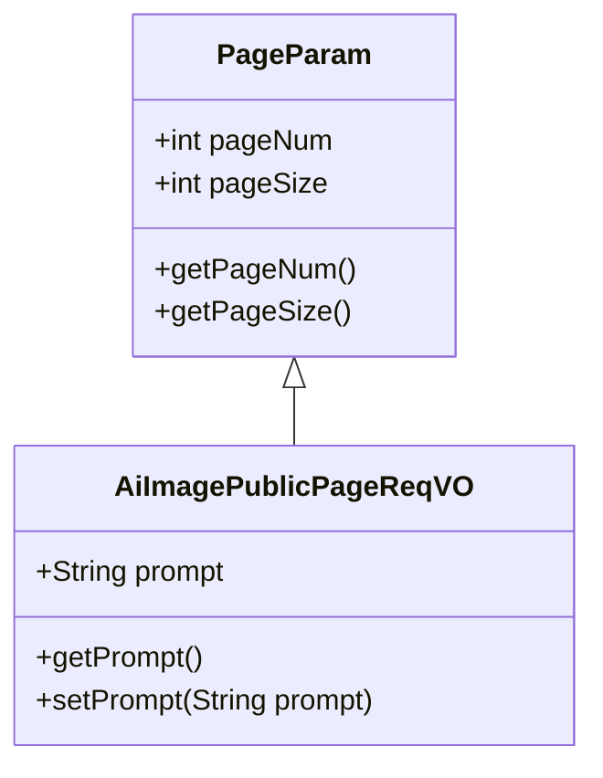
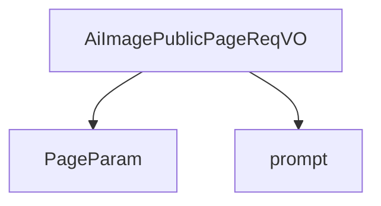

# 基础信息

|      |      |
|------|------|
| 编码语言 | .java |
| 代码路径 | yudao-module-ai/yudao-module-ai-biz/src/main/java/cn/iocoder/yudao/module/ai/controller/admin/image/vo/AiImagePublicPageReqVO.java |
| 包名 | cn.iocoder.yudao.module.ai.controller.admin.image.vo |
| 依赖项 | ['cn.iocoder.yudao.framework.common.pojo.PageParam', 'io.swagger.v3.oas.annotations.media.Schema', 'lombok.Data'] |
| 概述说明 | 管理后台的AI绘画公开分页请求类继承自分页参数类，包含提示词字段。 |

# 说明

管理后台的AI绘画公开分页请求类是一个专门用于处理AI绘画相关数据分页请求的类。该类继承自分页参数类，这意味着它具备了分页功能的基本属性和方法，能够有效地管理和控制数据的展示数量与顺序。在这个类中，特别包含了一个提示词字段，这个字段用于存储或传递与AI绘画相关的关键词或提示信息。这些提示词可能是用户输入的搜索关键词，也可能是系统根据用户行为自动生成的推荐词汇。通过这个字段，系统能够更精准地筛选和展示与用户需求相匹配的AI绘画作品，从而提升用户体验和搜索效率。这个类的设计充分考虑了AI绘画数据的特点和用户的需求，通过继承和扩展分页参数类，实现了对AI绘画数据的高效管理和展示。

# 类列表 Class Summary

| 名称   | 类型  | 说明 |
|-------|------|-------------|
| AiImagePublicPageReqVO | class | 管理后台的AI绘画公开分页请求类，继承自分页参数类，包含提示词字段。 |

## 类 AiImagePublicPageReqVO

|      |      |
|------|------|
| 访问范围 | @Schema(description = "管理后台 - AI 绘画公开的分页 Request VO");@Data;public |
| 类型 | class |
| 名称 | AiImagePublicPageReqVO |
| 说明 | 管理后台的AI绘画公开分页请求类，继承自分页参数类，包含提示词字段。 |

### UML类图

### 描述信息：
该UML类图展示了`AiImagePublicPageReqVO`类继承自`PageParam`类的关系。`AiImagePublicPageReqVO`类包含一个私有属性`prompt`，并提供了相应的getter和setter方法。`PageParam`类包含分页相关的属性`pageNum`和`pageSize`，并提供了相应的getter方法。

### 内部方法调用关系图

### 描述信息：
`AiImagePublicPageReqVO` 类继承自 `PageParam` 类，并包含一个名为 `prompt` 的字段。该类用于管理后台的 AI 绘画公开分页请求，`prompt` 字段用于存储提示词信息。

### 字段列表 Field List

| 名称  | 类型  | 说明 |
|-------|-------|------|
| prompt | String | 提示词字段用于存储或描述特定的提示信息，通常用于指导用户输入或系统处理。 |

### 方法列表 Method List

| 名称  | 类型  | 说明 |
|-------|-------|------|

