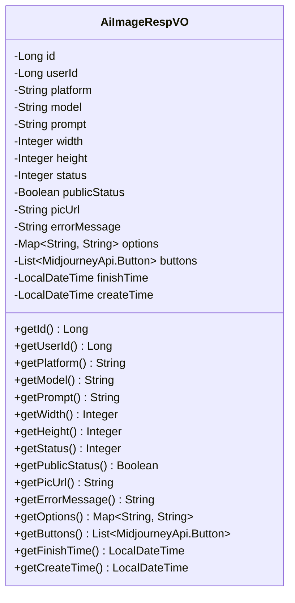
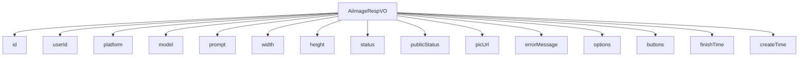

# 基础信息

|      |      |
|------|------|
| 编码语言 | .java |
| 代码路径 | yudao-module-ai/yudao-module-ai-biz/src/main/java/cn/iocoder/yudao/module/ai/controller/admin/image/vo/AiImageRespVO.java |
| 包名 | cn.iocoder.yudao.module.ai.controller.admin.image.vo |
| 依赖项 | ['cn.iocoder.yudao.framework.ai.core.model.midjourney.api.MidjourneyApi', 'io.swagger.v3.oas.annotations.media.Schema', 'lombok.Data', 'java.time.LocalDateTime', 'java.util.List', 'java.util.Map'] |
| 概述说明 | AiImageRespVO类用于管理后台AI绘画响应，包含编号、用户编号、平台、模型、提示词、图片尺寸、状态、发布状态、图片地址、错误信息、绘制参数、MJ按钮、完成时间和创建时间等关键信息。 |

# 说明

AiImageRespVO类是一个用于管理后台AI绘画响应的数据结构，包含了多个关键信息和细节。该类的主要属性包括编号，用于唯一标识每个绘画响应；用户编号，标识发起绘画请求的用户；平台，指明使用的绘画平台；模型，表示所使用的AI模型；提示词，即用户输入的绘画提示内容；图片宽度和高度，定义生成图片的尺寸；绘画状态，记录当前绘画的进度或状态；是否发布，标识该绘画是否已对外公开；图片地址，存储生成图片的链接或路径；错误信息，记录绘画过程中出现的错误或异常；绘制参数，包含生成图片时使用的具体参数设置；MJ按钮，可能是指与绘画相关的操作按钮或功能；完成时间，记录绘画任务完成的时间点；创建时间，表示该绘画响应的创建时间。通过这些属性，AiImageRespVO类能够全面管理和跟踪AI绘画的各个阶段和相关信息，确保绘画过程的透明性和可追溯性。

# 类列表 Class Summary

| 名称   | 类型  | 说明 |
|-------|------|-------------|
| AiImageRespVO | class | AiImageRespVO类用于管理后台的AI绘画响应，包含编号、用户编号、平台、模型、提示词、图片宽度和高度、绘画状态、是否发布、图片地址、错误信息、绘制参数、MJ按钮、完成时间和创建时间等关键信息。 |

## 类 AiImageRespVO

|      |      |
|------|------|
| 访问范围 | @Schema(description = "管理后台 - AI 绘画 Response VO");@Data;public |
| 类型 | class |
| 名称 | AiImageRespVO |
| 说明 | AiImageRespVO类用于管理后台的AI绘画响应，包含编号、用户编号、平台、模型、提示词、图片宽度和高度、绘画状态、是否发布、图片地址、错误信息、绘制参数、MJ按钮、完成时间和创建时间等关键信息。 |

### UML类图

### 描述信息
该UML类图展示了`AiImageRespVO`类的结构，包含了多个私有属性和对应的公有getter方法。类中的属性包括绘画的编号、用户编号、平台、模型、提示词、图片尺寸、状态、是否发布、图片地址、错误信息、绘制参数、按钮列表以及完成时间和创建时间。

### 内部方法调用关系图

### 描述信息：
该图展示了 `AiImageRespVO` 类与其属性之间的调用关系。`AiImageRespVO` 类包含了多个属性，如 `id`、`userId`、`platform` 等，这些属性通过 `-->` 符号与类进行关联。每个属性都代表了 AI 绘画响应对象的不同方面，如用户信息、绘画状态、图片地址等。

### 字段列表 Field List

| 名称  | 类型  | 说明 |
|-------|-------|------|
| width | Integer | 图片宽度为必填项，示例值为1024。 |
| platform | String | 平台为必填项，示例为OpenAI。 |
| height | Integer | 图片高度为必填项，示例值为1024。 |
| createTime | LocalDateTime | 创建时间是必填项，类型为LocalDateTime。 |
| status | Integer | 绘画状态为必填项，示例值为10，数据类型为整数。 |
| id | Long | 编号为必填项，类型为长整型，示例值为1。 |
| prompt | String | 提示词为必填项，示例为“南极的小企鹅”。 |
| userId | Long | 用户编号为必填项，类型为长整型，示例值为1。 |
| buttons | List<MidjourneyApi.Button> | mj buttons 按钮包含一个私有的按钮列表，类型为MidjourneyApi.Button。 |
| errorMessage | String | 绘画错误信息，包含错误信息字段，示例为图片错误信息。 |
| model | String | 模型字段为必填项，示例值为"stable-diffusion-v1-6"。 |
| publicStatus | Boolean | 该字段表示是否发布，类型为布尔值，必填项，示例值为“public”。 |
| picUrl | String | 图片地址字段，示例为"https://www.iocoder.cn/1.png"，用于存储图片的URL链接。 |
| finishTime | LocalDateTime | 该代码片段定义了一个私有变量`finishTime`，类型为`LocalDateTime`，用于表示任务的完成时间。 |
| options | Map<String, String> | 该代码定义了一个名为`options`的私有变量，类型为`Map<String, String>`，用于存储绘制参数。`@Schema`注解描述该变量为“绘制参数”。 |

### 方法列表 Method List

| 名称  | 类型  | 说明 |
|-------|-------|------|

