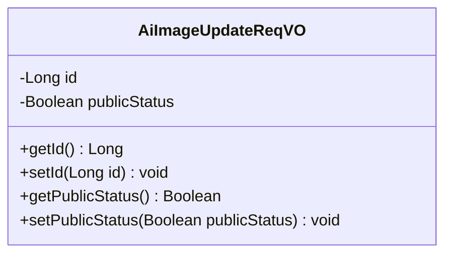
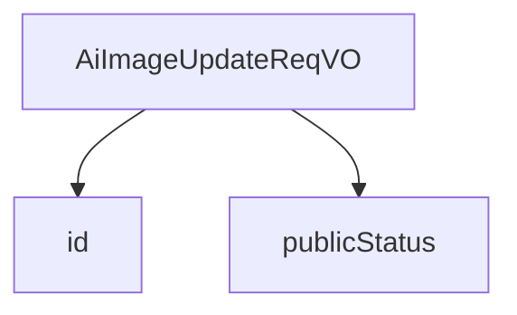

# 基础信息

|      |      |
|------|------|
| 编码语言 | .java |
| 代码路径 | yudao-module-ai/yudao-module-ai-biz/src/main/java/cn/iocoder/yudao/module/ai/controller/admin/image/vo/AiImageUpdateReqVO.java |
| 包名 | cn.iocoder.yudao.module.ai.controller.admin.image.vo |
| 依赖项 | ['io.swagger.v3.oas.annotations.media.Schema', 'jakarta.validation.constraints.NotNull', 'lombok.Data'] |
| 概述说明 | 管理后台AI绘画修改请求VO包含两个关键字段：编号（必填，示例值15583）和是否发布（示例值true），其中编号字段不能为空。 |

# 说明

管理后台AI绘画修改请求VO包含两个关键字段，分别是编号和是否发布。编号字段是必填项，不能为空，示例值为15583。是否发布字段用于指示该绘画是否被发布，示例值为true。这两个字段共同构成了AI绘画修改请求的基本信息，确保了每项请求都有唯一的标识和明确的发布状态。

# 类列表 Class Summary

| 名称   | 类型  | 说明 |
|-------|------|-------------|
| AiImageUpdateReqVO | class | 管理后台AI绘画修改请求VO包含两个关键字段：编号（必填，示例值15583）和是否发布（示例值true）。编号字段不能为空。 |

## 类 AiImageUpdateReqVO

|      |      |
|------|------|
| 访问范围 | @Schema(description = "管理后台 - AI 绘画修改 Request VO");@Data;public |
| 类型 | class |
| 名称 | AiImageUpdateReqVO |
| 说明 | 管理后台AI绘画修改请求VO包含两个关键字段：编号（必填，示例值15583）和是否发布（示例值true）。编号字段不能为空。 |

### UML类图

### 描述信息
该UML类图展示了一个名为`AiImageUpdateReqVO`的类，用于管理后台AI绘画修改请求。类中包含两个私有属性：`id`（编号）和`publicStatus`（是否发布），并提供了相应的getter和setter方法。

### 内部方法调用关系图

### 描述信息：
该图展示了`AiImageUpdateReqVO`类中的两个字段`id`和`publicStatus`之间的调用关系。`AiImageUpdateReqVO`类通过`id`和`publicStatus`字段来管理AI绘画的修改请求，其中`id`是必填字段，而`publicStatus`用于标识是否发布。

### 字段列表 Field List

| 名称  | 类型  | 说明 |
|-------|-------|------|
| id | Long | 编号为必填项，不能为空，示例值为15583，类型为长整型。 |
| publicStatus | Boolean | 该字段表示是否发布，数据类型为布尔型，示例值为"true"。 |

### 方法列表 Method List

| 名称  | 类型  | 说明 |
|-------|-------|------|

