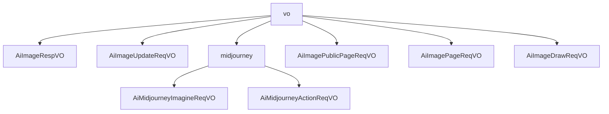

# 基础信息

|      |      |
|------|------|
| 编码语言 | .java |
| 代码路径 | yudao-module-ai/yudao-module-ai-biz/src/main/java/cn/iocoder/yudao/module/ai/controller/admin/image/vo |
| 包名 | cn.iocoder.yudao.module.ai.controller.admin.image.vo |
| 概述说明 | AiImageRespVO类用于管理后台AI绘画响应，包含编号、用户编号、平台、模型、提示词、图片尺寸、绘画状态、是否发布、图片地址、错误信息、绘制参数、MJ按钮、完成时间和创建时间等属性，确保绘画过程的透明性和可追溯性。管理后台的AI绘画生成功能基于Midjourney技术，用户提交请求时需提供提示词、模型、图片尺寸和版本号等必填参数，可选参考图URL。修改请求包含编号和是否发布字段。分页请求类继承自参数类，包含提示词字段，支持高效管理和展示AI绘画数据。请求类包含图片编号和操作按钮编号，确保操作请求的准确性。 |

# 说明

AiImageRespVO类是一个用于管理后台AI绘画响应的数据结构，包含多个关键属性以全面管理和跟踪AI绘画的各个阶段和相关信息。这些属性包括编号（唯一标识每个绘画响应）、用户编号（标识发起请求的用户）、平台（指明使用的绘画平台）、模型（表示所使用的AI模型）、提示词（用户输入的绘画提示内容）、图片宽度和高度（定义生成图片的尺寸）、绘画状态（记录当前绘画的进度或状态）、是否发布（标识该绘画是否已对外公开）、图片地址（存储生成图片的链接或路径）、错误信息（记录绘画过程中出现的错误或异常）、绘制参数（包含生成图片时使用的具体参数设置）、MJ按钮（可能是指与绘画相关的操作按钮或功能）、完成时间（记录绘画任务完成的时间点）和创建时间（表示该绘画响应的创建时间）。通过这些属性，AiImageRespVO类确保了绘画过程的透明性和可追溯性。

管理后台AI绘画修改请求VO包含两个关键字段：编号和是否发布。编号是必填项，不能为空，示例值为15583；是否发布字段用于指示该绘画是否被发布，示例值为true。这两个字段共同构成了AI绘画修改请求的基本信息，确保了每项请求都有唯一的标识和明确的发布状态。

管理后台的AI绘画生成功能基于Midjourney技术，允许用户提交绘画请求。每个请求包含多个关键参数，其中提示词、模型、图片宽度、图片高度和版本号是必填项。提示词是用户输入的描述性文本，用于指导AI生成符合预期的图像内容。模型参数指定了所使用的AI模型版本，确保生成结果符合特定模型的能力和风格。图片宽度和高度参数定义了生成图像的尺寸，用户可以根据需求调整图像的分辨率。版本号用于标识所使用的AI绘画生成系统的版本，确保兼容性和功能的正确性。此外，用户还可以选择性地提供参考图URL，通过提供参考图像的URL来进一步引导AI生成与参考图风格或内容相似的图像。这些参数共同确保了生成图像的准确性和用户需求的满足。

在管理后台的AI绘图操作中，定义了一个请求类，用于处理用户的操作请求。这个请求类包含两个必填字段：图片编号（id）和操作按钮编号（customId）。图片编号用于标识特定的图片，而操作按钮编号则用于标识用户选择的操作按钮。这两个字段在请求中都是必需的，且不能为空。通过这两个字段，系统能够准确地识别和处理用户对特定图片的操作请求。这种设计确保了请求的完整性和准确性，使得后台能够有效地管理和执行AI绘图操作。

管理后台的AI绘画公开分页请求类是一个专门用于处理AI绘画相关数据分页请求的类。该类继承自分页参数类，具备分页功能的基本属性和方法，能够有效地管理和控制数据的展示数量与顺序。在这个类中，特别包含了一个提示词字段，用于存储或传递与AI绘画相关的关键词或提示信息。这些提示词可能是用户输入的搜索关键词，也可能是系统根据用户行为自动生成的推荐词汇。通过这个字段，系统能够更精准地筛选和展示与用户需求相匹配的AI绘画作品，从而提升用户体验和搜索效率。

管理后台的AI绘画分页请求VO（值对象）设计用于支持分页查询AI绘画记录的功能。该VO包含多个关键字段，包括用户编号、平台、提示词、绘画状态、是否发布和创建时间。用户编号字段用于标识发起绘画请求的具体用户，平台字段用于区分不同的绘画平台或来源，提示词字段记录了用户在生成绘画时输入的提示信息，绘画状态字段用于标识当前绘画任务的进展状态，是否发布字段用于标记该绘画记录是否已公开发布，创建时间字段记录了绘画任务的生成时间。通过这些字段的组合，管理后台能够高效地分页查询和管理AI绘画记录，满足多样化的管理需求。

管理后台AI绘画请求类包含多个关键信息，这些信息是生成AI绘画所必需的。平台是必填项，用于指定所使用的AI绘画服务提供商；提示词也是必填项，用于描述绘画的主题或内容，最大长度为1200个字符；模型同样是必填项，用于指定所使用的AI模型；图片的高度和宽度也是必填项，用于确定生成图片的尺寸。此外，各平台还提供了一些特定的绘制参数，这些参数是可选的，可以根据需要进行设置，以进一步定制生成的图片。这些参数可能包括风格、颜色、细节等方面的设置，具体取决于所使用的平台和模型。通过这些关键信息的组合，管理后台可以有效地生成符合用户需求的AI绘画作品。

### 包内部结构视图

### 描述信息：
该Mermaid图展示了`vo`文件夹下的文件及其子文件夹`midjourney`中的文件之间的调用关系。`vo`文件夹包含了多个请求和响应类文件，而`midjourney`子文件夹则包含了与Midjourney相关的请求类文件。图中清晰地展示了这些文件之间的层级关系和调用关系。

# 文件列表 File List

| 名称   | 类型  | 说明 |
|-------|------|-------------|
| [AiImageDrawReqVO.java](AiImageDrawReqVO.md) | file | 管理后台AI绘画请求类需填写平台、提示词（最多1200字符）、模型、图片高度和宽度等必填信息，并可选择添加各平台特定的绘制参数。 |
| [AiImagePageReqVO.java](AiImagePageReqVO.md) | file | 管理后台AI绘画分页请求VO包含用户编号、平台、提示词、绘画状态、是否发布及创建时间等关键字段，用于分页查询AI绘画记录。 |
| [AiImagePublicPageReqVO.java](AiImagePublicPageReqVO.md) | file | 管理后台的AI绘画公开分页请求类继承自分页参数类，包含提示词字段。 |
| [AiImageUpdateReqVO.java](AiImageUpdateReqVO.md) | file | 管理后台AI绘画修改请求VO包含两个关键字段：编号（必填，示例值15583）和是否发布（示例值true），其中编号字段不能为空。 |
| [AiImageRespVO.java](AiImageRespVO.md) | file | AiImageRespVO类用于管理后台AI绘画响应，包含编号、用户编号、平台、模型、提示词、图片尺寸、状态、发布状态、图片地址、错误信息、绘制参数、MJ按钮、完成时间和创建时间等关键信息。 |
| [midjourney](midjourney/_package.md) | folder | 管理后台的AI绘画生成功能基于Midjourney，允许用户提交包含提示词、模型、图片宽度、高度、版本号等必填参数的请求，可选参考图URL以引导生成结果。请求类包含图片编号和操作按钮编号两个必填字段，确保准确处理用户操作。 |

