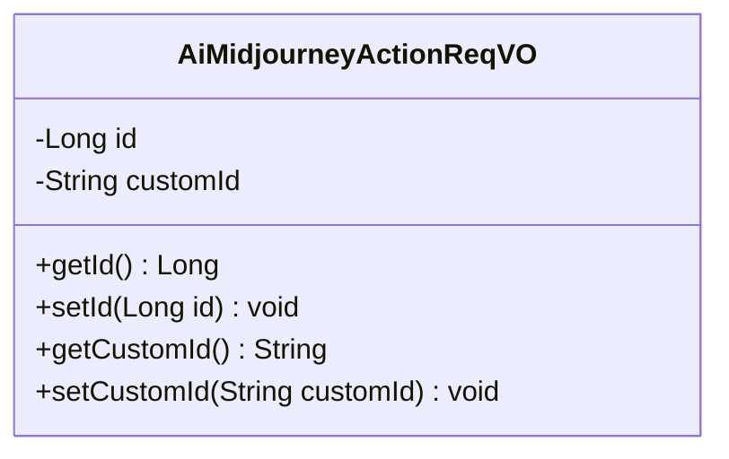
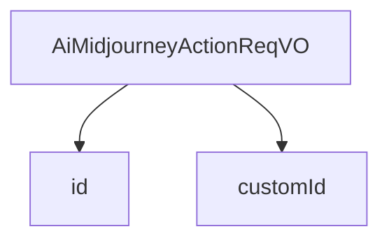

# 基础信息

|      |      |
|------|------|
| 编码语言 | .java |
| 代码路径 | yudao-module-ai/yudao-module-ai-biz/src/main/java/cn/iocoder/yudao/module/ai/controller/admin/image/vo/midjourney/AiMidjourneyActionReqVO.java |
| 包名 | cn.iocoder.yudao.module.ai.controller.admin.image.vo.midjourney |
| 依赖项 | ['io.swagger.v3.oas.annotations.media.Schema', 'jakarta.validation.constraints.NotEmpty', 'jakarta.validation.constraints.NotNull', 'lombok.Data'] |
| 概述说明 | 该代码定义了一个管理后台AI绘图操作（Midjourney）的请求类，包含两个必填字段：图片编号（id）和操作按钮编号（customId），两者均不能为空。 |

# 说明

该代码定义了一个用于管理后台AI绘图操作（Midjourney）的请求类。这个请求类包含两个必填字段：图片编号（id）和操作按钮编号（customId）。这两个字段在请求中都是必需的，且不能为空。图片编号（id）用于标识特定的图片，而操作按钮编号（customId）则用于标识用户选择的操作按钮。通过这两个字段，系统能够准确地识别和处理用户对特定图片的操作请求。这种设计确保了请求的完整性和准确性，使得后台能够有效地管理和执行AI绘图操作。

# 类列表 Class Summary

| 名称   | 类型  | 说明 |
|-------|------|-------------|
| AiMidjourneyActionReqVO | class | 该代码定义了一个用于管理后台AI绘图操作（Midjourney）的请求类，包含两个必填字段：图片编号（id）和操作按钮编号（customId），且两者均不能为空。 |

## 类 AiMidjourneyActionReqVO

|      |      |
|------|------|
| 访问范围 | @Schema(description = "管理后台 - AI 绘图操作（Midjourney） Request VO");@Data;public |
| 类型 | class |
| 名称 | AiMidjourneyActionReqVO |
| 说明 | 该代码定义了一个用于管理后台AI绘图操作（Midjourney）的请求类，包含两个必填字段：图片编号（id）和操作按钮编号（customId），且两者均不能为空。 |

### UML类图

### 描述信息：
该UML类图展示了一个名为`AiMidjourneyActionReqVO`的类，用于管理后台的AI绘图操作请求。类中包含两个私有属性`id`和`customId`，分别表示图片编号和操作按钮编号。类提供了对应的getter和setter方法用于访问和修改这些属性。

### 内部方法调用关系图

### 描述信息：
该图展示了 `AiMidjourneyActionReqVO` 类与其两个属性 `id` 和 `customId` 之间的调用关系。`AiMidjourneyActionReqVO` 类通过 `id` 和 `customId` 属性来管理 AI 绘图操作的相关信息，确保图片编号和操作按钮编号的有效性。

### 字段列表 Field List

| 名称  | 类型  | 说明 |
|-------|-------|------|
| id | Long | 图片编号为必填项，不能为空，示例值为1，类型为长整型。 |
| customId | String | 操作按钮编号为必填项，不能为空，示例为"MJ::JOB::variation::4::06aa3e66-0e97-49cc-8201-e0295d883de4"。 |

### 方法列表 Method List

| 名称  | 类型  | 说明 |
|-------|-------|------|

