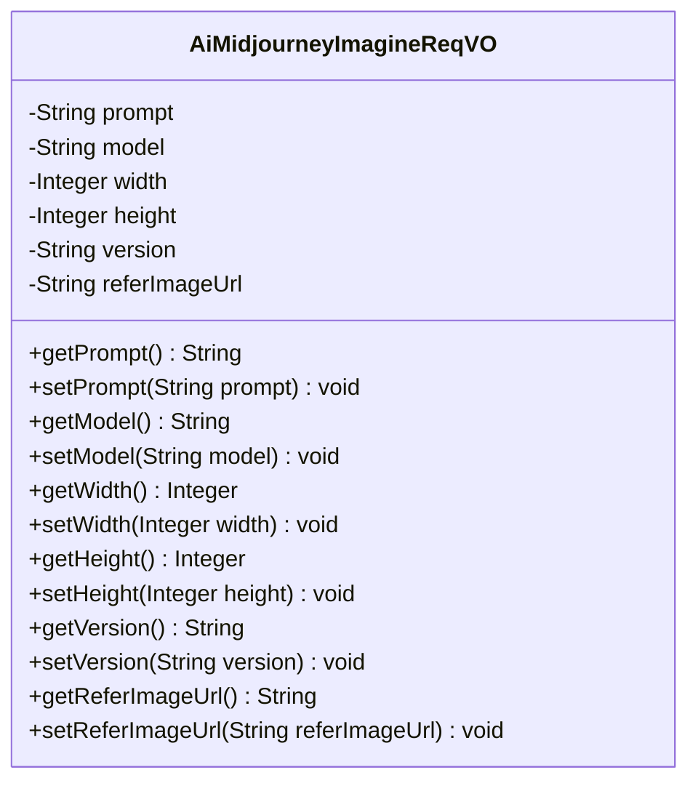
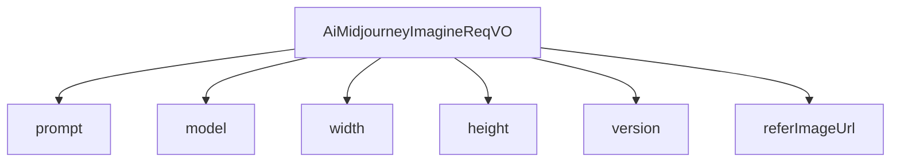

# 基础信息

|      |      |
|------|------|
| 编码语言 | .java |
| 代码路径 | yudao-module-ai/yudao-module-ai-biz/src/main/java/cn/iocoder/yudao/module/ai/controller/admin/image/vo/midjourney/AiMidjourneyImagineReqVO.java |
| 包名 | cn.iocoder.yudao.module.ai.controller.admin.image.vo.midjourney |
| 依赖项 | ['io.swagger.v3.oas.annotations.media.Schema', 'jakarta.validation.constraints.NotEmpty', 'jakarta.validation.constraints.NotNull', 'lombok.Data'] |
| 概述说明 | 管理后台AI绘画生成（Midjourney）请求VO需包含必填项：提示词、模型、图片宽度、图片高度和版本号；参考图URL为可选项。 |

# 说明

管理后台的AI绘画生成功能（基于Midjourney）允许用户提交绘画请求，请求中包含多个关键参数。这些参数包括提示词、模型、图片宽度、图片高度、版本号以及可选的参考图URL。提示词是用户输入的描述性文本，用于指导AI生成符合预期的图像内容。模型参数指定了所使用的AI模型版本，确保生成结果符合特定模型的能力和风格。图片宽度和高度参数定义了生成图像的尺寸，用户可以根据需求调整图像的分辨率。版本号用于标识所使用的AI绘画生成系统的版本，确保兼容性和功能的正确性。参考图URL是一个可选参数，用户可以通过提供参考图像的URL来进一步引导AI生成与参考图风格或内容相似的图像。这些参数中，提示词、模型、宽度、高度和版本号是必填项，确保每个请求都具备生成图像所需的基本信息，而参考图URL则为用户提供了额外的灵活性，以便更精确地控制生成结果。

# 类列表 Class Summary

| 名称   | 类型  | 说明 |
|-------|------|-------------|
| AiMidjourneyImagineReqVO | class | 管理后台AI绘画生成（Midjourney）请求VO包含提示词、模型、图片宽度、图片高度、版本号和参考图URL。提示词、模型、宽度、高度和版本号为必填项，参考图URL为可选项。 |

## 类 AiMidjourneyImagineReqVO

|      |      |
|------|------|
| 访问范围 | @Schema(description = "管理后台 - AI 绘画生成（Midjourney） Request VO");@Data;public |
| 类型 | class |
| 名称 | AiMidjourneyImagineReqVO |
| 说明 | 管理后台AI绘画生成（Midjourney）请求VO包含提示词、模型、图片宽度、图片高度、版本号和参考图URL。提示词、模型、宽度、高度和版本号为必填项，参考图URL为可选项。 |

### UML类图

### 描述信息：
该UML类图展示了一个名为`AiMidjourneyImagineReqVO`的类，用于管理AI绘画生成请求。类中包含多个私有属性，如`prompt`、`model`、`width`、`height`、`version`和`referImageUrl`，并提供了相应的getter和setter方法。这些属性用于存储生成AI绘画所需的参数，如提示词、模型、图片尺寸等。

### 内部方法调用关系图

### 描述信息：
该图展示了 `AiMidjourneyImagineReqVO` 类与其属性之间的调用关系。`AiMidjourneyImagineReqVO` 类包含了多个属性，如 `prompt`、`model`、`width`、`height`、`version` 和 `referImageUrl`，这些属性用于管理后台的 AI 绘画生成请求。每个属性都与 `AiMidjourneyImagineReqVO` 类直接关联，表示它们是该类的组成部分。

### 字段列表 Field List

| 名称  | 类型  | 说明 |
|-------|-------|------|
| height | Integer | 图片高度为必填项，不能为空，示例值为1。 |
| model | String | 模型字段为必填项，不能为空，示例值为"midjourney"。 |
| referImageUrl | String | 参考图的URL地址，示例为https://www.iocoder.cn/x.png。 |
| width | Integer | 图片宽度为必填项，不能为空，示例值为1。 |
| prompt | String | 提示词字段为必填项，不能为空，示例值为“中国神龙”。 |
| version | String | 版本号字段为必填项，不能为空，示例值为"6.0"。 |

### 方法列表 Method List

| 名称  | 类型  | 说明 |
|-------|-------|------|

