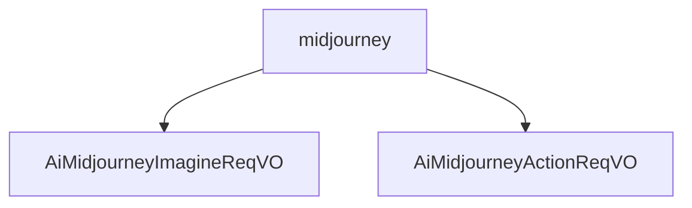

# 基础信息

|      |      |
|------|------|
| 编码语言 | .java |
| 代码路径 | yudao-module-ai/yudao-module-ai-biz/src/main/java/cn/iocoder/yudao/module/ai/controller/admin/image/vo/midjourney |
| 包名 | cn.iocoder.yudao.module.ai.controller.admin.image.vo.midjourney |
| 概述说明 | 管理后台的AI绘画生成功能基于Midjourney，允许用户提交包含提示词、模型、图片宽度、高度、版本号等必填参数的请求，可选参考图URL以引导生成结果。请求类包含图片编号和操作按钮编号两个必填字段，确保准确处理用户操作。 |

# 说明

管理后台的AI绘画生成功能基于Midjourney技术，允许用户提交绘画请求。每个请求包含多个关键参数，其中提示词、模型、图片宽度、图片高度和版本号是必填项。提示词是用户输入的描述性文本，用于指导AI生成符合预期的图像内容。模型参数指定了所使用的AI模型版本，确保生成结果符合特定模型的能力和风格。图片宽度和高度参数定义了生成图像的尺寸，用户可以根据需求调整图像的分辨率。版本号用于标识所使用的AI绘画生成系统的版本，确保兼容性和功能的正确性。此外，用户还可以选择性地提供参考图URL，通过提供参考图像的URL来进一步引导AI生成与参考图风格或内容相似的图像。这些参数共同确保了生成图像的准确性和用户需求的满足。

在管理后台的AI绘图操作中，定义了一个请求类，用于处理用户的操作请求。这个请求类包含两个必填字段：图片编号（id）和操作按钮编号（customId）。图片编号用于标识特定的图片，而操作按钮编号则用于标识用户选择的操作按钮。这两个字段在请求中都是必需的，且不能为空。通过这两个字段，系统能够准确地识别和处理用户对特定图片的操作请求。这种设计确保了请求的完整性和准确性，使得后台能够有效地管理和执行AI绘图操作。

### 包内部结构视图

### 描述信息：
该Mermaid图展示了`midjourney`文件夹下的两个Java文件`AiMidjourneyImagineReqVO.java`和`AiMidjourneyActionReqVO.java`之间的调用关系。`midjourney`文件夹作为父节点，包含了这两个文件，表示它们属于同一个模块或功能组。

# 文件列表 File List

| 名称   | 类型  | 说明 |
|-------|------|-------------|
| [AiMidjourneyActionReqVO.java](AiMidjourneyActionReqVO.md) | file | 该代码定义了一个管理后台AI绘图操作（Midjourney）的请求类，包含两个必填字段：图片编号（id）和操作按钮编号（customId），两者均不能为空。 |
| [AiMidjourneyImagineReqVO.java](AiMidjourneyImagineReqVO.md) | file | 管理后台AI绘画生成（Midjourney）请求VO需包含必填项：提示词、模型、图片宽度、图片高度和版本号；参考图URL为可选项。 |

