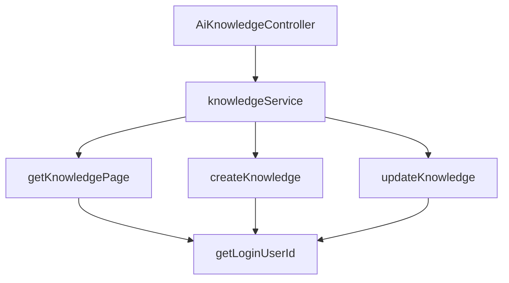

# 基础信息

|      |      |
|------|------|
| 编码语言 | .java |
| 代码路径 | yudao-module-ai/yudao-module-ai-biz/src/main/java/cn/iocoder/yudao/module/ai/controller/admin/knowledge/AiKnowledgeController.java |
| 包名 | cn.iocoder.yudao.module.ai.controller.admin.knowledge |
| 依赖项 | ['cn.iocoder.yudao.framework.common.pojo.CommonResult', 'cn.iocoder.yudao.framework.common.pojo.PageResult', 'cn.iocoder.yudao.framework.common.util.object.BeanUtils', 'cn.iocoder.yudao.module.ai.controller.admin.knowledge.vo.knowledge.AiKnowledgeCreateReqVO', 'cn.iocoder.yudao.module.ai.controller.admin.knowledge.vo.knowledge.AiKnowledgePageReqVO', 'cn.iocoder.yudao.module.ai.controller.admin.knowledge.vo.knowledge.AiKnowledgeRespVO', 'cn.iocoder.yudao.module.ai.controller.admin.knowledge.vo.knowledge.AiKnowledgeUpdateReqVO', 'cn.iocoder.yudao.module.ai.dal.dataobject.knowledge.AiKnowledgeDO', 'cn.iocoder.yudao.module.ai.service.knowledge.AiKnowledgeService', 'io.swagger.v3.oas.annotations.Operation', 'io.swagger.v3.oas.annotations.tags.Tag', 'jakarta.annotation.Resource', 'jakarta.validation.Valid', 'org.springframework.validation.annotation.Validated', 'org.springframework.web.bind.annotation', 'cn.iocoder.yudao.framework.common.pojo.CommonResult.success', 'cn.iocoder.yudao.framework.security.core.util.SecurityFrameworkUtils.getLoginUserId'] |
| 概述说明 | AiKnowledgeController 是管理后台的 AI 知识库控制器，提供分页查询、创建和更新功能。通过 `/ai/knowledge/page` 获取分页数据，`/ai/knowledge/create` 创建知识库，`/ai/knowledge/update` 更新知识库，所有操作需验证用户身份。 |

# 说明

AiKnowledgeController 是一个用于管理后台 AI 知识库的控制器，主要负责处理与知识库相关的操作。它提供了分页查询、创建和更新知识库的功能。用户可以通过 `/ai/knowledge/page` 接口获取分页数据，该接口支持按需查询知识库中的内容，并以分页形式返回结果。此外，用户还可以通过 `/ai/knowledge/create` 接口创建新的知识库条目，以及通过 `/ai/knowledge/update` 接口对现有的知识库内容进行更新。所有操作都需要进行用户身份验证，以确保只有授权用户才能执行这些操作。通过这些功能，AiKnowledgeController 实现了对 AI 知识库的有效管理和维护。

# 类列表 Class Summary

| 名称   | 类型  | 说明 |
|-------|------|-------------|
| AiKnowledgeController | class | AiKnowledgeController 是一个管理后台的 AI 知识库控制器，提供分页查询、创建和更新知识库的功能。通过 `/ai/knowledge/page` 获取分页数据，`/ai/knowledge/create` 创建知识库，`/ai/knowledge/update` 更新知识库，所有操作均需验证用户身份。 |


## 类 AiKnowledgeController

|      |      |
|------|------|
| 访问范围 | @Tag(name = "管理后台 - AI 知识库");@RestController;@RequestMapping("/ai/knowledge");@Validated;public |
| 类型 | class |
| 名称 | AiKnowledgeController |
| 说明 | AiKnowledgeController 是一个管理后台的 AI 知识库控制器，提供分页查询、创建和更新知识库的功能。通过 `/ai/knowledge/page` 获取分页数据，`/ai/knowledge/create` 创建知识库，`/ai/knowledge/update` 更新知识库，所有操作均需验证用户身份。 |


### UML类图

```mermaid
classDiagram
    class AiKnowledgeController {
        +AiKnowledgeService knowledgeService
        +getKnowledgePage(AiKnowledgePageReqVO pageReqVO) CommonResult~PageResult~AiKnowledgeRespVO~~
        +createKnowledge(AiKnowledgeCreateReqVO createReqVO) CommonResult~Long~
        +updateKnowledge(AiKnowledgeUpdateReqVO updateReqVO) CommonResult~Boolean~
    }

    class AiKnowledgeService {
        +getKnowledgePage(Long userId, AiKnowledgePageReqVO pageReqVO) PageResult~AiKnowledgeDO~
        +createKnowledge(AiKnowledgeCreateReqVO createReqVO, Long userId) Long
        +updateKnowledge(AiKnowledgeUpdateReqVO updateReqVO, Long userId) void
    }

    class AiKnowledgePageReqVO {
        +Integer pageNo
        +Integer pageSize
        +String keyword
    }

    class AiKnowledgeCreateReqVO {
        +String title
        +String content
    }

    class AiKnowledgeUpdateReqVO {
        +Long id
        +String title
        +String content
    }

    class AiKnowledgeDO {
        +Long id
        +String title
        +String content
        +Long userId
    }

    class AiKnowledgeRespVO {
        +Long id
        +String title
        +String content
    }

    class CommonResult~T~ {
        +Integer code
        +String message
        +T data
    }

    class PageResult~T~ {
        +List~T~ list
        +Long total
    }

    AiKnowledgeController --> AiKnowledgeService : depends on
    AiKnowledgeService --> AiKnowledgeDO : uses
    AiKnowledgeController --> AiKnowledgePageReqVO : uses
    AiKnowledgeController --> AiKnowledgeCreateReqVO : uses
    AiKnowledgeController --> AiKnowledgeUpdateReqVO : uses
    AiKnowledgeController --> AiKnowledgeRespVO : uses
    AiKnowledgeController --> CommonResult~PageResult~AiKnowledgeRespVO~~ : returns
    AiKnowledgeController --> CommonResult~Long~ : returns
    AiKnowledgeController --> CommonResult~Boolean~ : returns
    AiKnowledgeService --> PageResult~AiKnowledgeDO~ : returns
```

### 描述信息：
该UML类图展示了`AiKnowledgeController`类与`AiKnowledgeService`类之间的依赖关系，以及它们与多个请求和响应类（如`AiKnowledgePageReqVO`、`AiKnowledgeCreateReqVO`、`AiKnowledgeRespVO`等）的交互。`AiKnowledgeController`通过调用`AiKnowledgeService`的方法来处理知识库的分页查询、创建和更新操作，并返回相应的结果。


### 内部方法调用关系图



### 描述信息：
该图展示了`AiKnowledgeController`类中方法之间的调用关系。`AiKnowledgeController`依赖于`knowledgeService`来执行具体的业务逻辑，如分页查询、创建和更新知识库。每个方法都调用了`getLoginUserId`来获取当前登录用户的ID，确保操作的安全性。

### 字段列表 Field List

| 名称  | 类型  | 说明 |
|-------|-------|------|
| knowledgeService | AiKnowledgeService | 在代码中，通过@Resource注解将AiKnowledgeService实例注入到当前类中，以便调用其相关功能。 |

### 方法列表 Method List

| 名称  | 类型  | 说明 |
|-------|-------|------|
| updateKnowledge | CommonResult<Boolean> | 该代码片段描述了一个用于更新知识库的API接口。通过PUT请求调用"/update"路径，接收并验证请求体中的AiKnowledgeUpdateReqVO对象，调用knowledgeService的updateKnowledge方法进行更新操作，并返回操作成功的布尔值。 |
| getKnowledgePage | CommonResult<PageResult<AiKnowledgeRespVO>> | 该代码定义了一个GET请求接口“/page”，用于获取知识库的分页数据。接口接收一个有效的AiKnowledgePageReqVO对象作为请求参数，调用knowledgeService的getKnowledgePage方法获取分页结果，并将结果转换为AiKnowledgeRespVO类型后返回。 |
| createKnowledge | CommonResult<Long> | 该代码片段描述了一个使用Spring框架的REST API接口，通过POST请求路径"/create"来创建知识库。方法`createKnowledge`接收一个经过验证的请求体`AiKnowledgeCreateReqVO`，并调用`knowledgeService.createKnowledge`方法处理请求，最终返回一个包含知识库ID的`CommonResult<Long>`对象。 |


