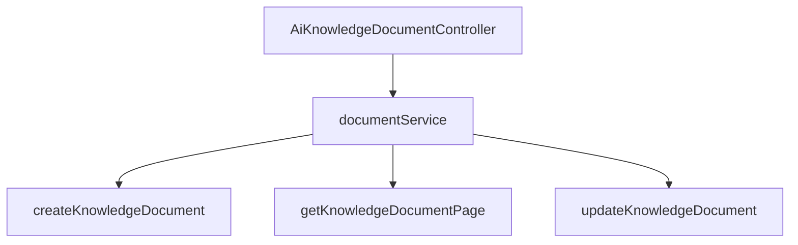

# 基础信息

|      |      |
|------|------|
| 编码语言 | .java |
| 代码路径 | yudao-module-ai/yudao-module-ai-biz/src/main/java/cn/iocoder/yudao/module/ai/controller/admin/knowledge/AiKnowledgeDocumentController.java |
| 包名 | cn.iocoder.yudao.module.ai.controller.admin.knowledge |
| 依赖项 | ['cn.iocoder.yudao.framework.common.pojo.CommonResult', 'cn.iocoder.yudao.framework.common.pojo.PageResult', 'cn.iocoder.yudao.framework.common.util.object.BeanUtils', 'cn.iocoder.yudao.module.ai.controller.admin.knowledge.vo.document.AiKnowledgeDocumentPageReqVO', 'cn.iocoder.yudao.module.ai.controller.admin.knowledge.vo.document.AiKnowledgeDocumentRespVO', 'cn.iocoder.yudao.module.ai.controller.admin.knowledge.vo.document.AiKnowledgeDocumentUpdateReqVO', 'cn.iocoder.yudao.module.ai.controller.admin.knowledge.vo.knowledge.AiKnowledgeDocumentCreateReqVO', 'cn.iocoder.yudao.module.ai.dal.dataobject.knowledge.AiKnowledgeDocumentDO', 'cn.iocoder.yudao.module.ai.service.knowledge.AiKnowledgeDocumentService', 'io.swagger.v3.oas.annotations.Operation', 'io.swagger.v3.oas.annotations.tags.Tag', 'jakarta.annotation.Resource', 'jakarta.validation.Valid', 'org.springframework.validation.annotation.Validated', 'org.springframework.web.bind.annotation', 'cn.iocoder.yudao.framework.common.pojo.CommonResult.success'] |
| 概述说明 | 该代码是管理后台的AI知识库文档控制器，提供创建、分页获取和更新文档的功能。通过POST请求创建文档，GET请求获取分页文档，PUT请求更新文档。所有操作由AiKnowledgeDocumentService处理并返回结果。 |

# 说明

该代码实现了一个管理后台的AI知识库文档控制器，主要用于处理与AI知识库文档相关的操作。控制器提供了三种主要功能：创建文档、分页获取文档和更新文档。具体来说，通过POST请求可以创建新的文档，GET请求用于获取文档的分页列表，而PUT请求则用于更新已有的文档内容。所有的操作都通过AiKnowledgeDocumentService进行处理，该服务负责具体的业务逻辑和数据操作。每次请求完成后，控制器会返回相应的结果，确保操作的响应性和数据的准确性。整体设计旨在提供一个高效、可靠的方式来管理和维护AI知识库中的文档内容。

# 类列表 Class Summary

| 名称   | 类型  | 说明 |
|-------|------|-------------|
| AiKnowledgeDocumentController | class | 该代码为管理后台的AI知识库文档控制器，包含创建、分页获取和更新文档的功能。通过POST请求创建文档，GET请求获取文档分页，PUT请求更新文档。所有操作均通过AiKnowledgeDocumentService处理，并返回相应的结果。 |


## 类 AiKnowledgeDocumentController

|      |      |
|------|------|
| 访问范围 | @Tag(name = "管理后台 - AI 知识库文档");@RestController;@RequestMapping("/ai/knowledge/document");@Validated;public |
| 类型 | class |
| 名称 | AiKnowledgeDocumentController |
| 说明 | 该代码为管理后台的AI知识库文档控制器，包含创建、分页获取和更新文档的功能。通过POST请求创建文档，GET请求获取文档分页，PUT请求更新文档。所有操作均通过AiKnowledgeDocumentService处理，并返回相应的结果。 |


### UML类图

```mermaid
classDiagram
    class AiKnowledgeDocumentController {
        +AiKnowledgeDocumentService documentService
        +createKnowledgeDocument(AiKnowledgeDocumentCreateReqVO reqVO) CommonResult~Long~
        +getKnowledgeDocumentPage(AiKnowledgeDocumentPageReqVO pageReqVO) CommonResult~PageResult~AiKnowledgeDocumentRespVO~~
        +updateKnowledgeDocument(AiKnowledgeDocumentUpdateReqVO reqVO) CommonResult~Boolean~
    }

    class AiKnowledgeDocumentService {
        +createKnowledgeDocument(AiKnowledgeDocumentCreateReqVO reqVO) Long
        +getKnowledgeDocumentPage(AiKnowledgeDocumentPageReqVO pageReqVO) PageResult~AiKnowledgeDocumentDO~
        +updateKnowledgeDocument(AiKnowledgeDocumentUpdateReqVO reqVO) void
    }

    class AiKnowledgeDocumentCreateReqVO {
        // 属性省略
    }

    class AiKnowledgeDocumentPageReqVO {
        // 属性省略
    }

    class AiKnowledgeDocumentUpdateReqVO {
        // 属性省略
    }

    class AiKnowledgeDocumentRespVO {
        // 属性省略
    }

    class AiKnowledgeDocumentDO {
        // 属性省略
    }

    class CommonResult~T~ {
        // 属性省略
    }

    class PageResult~T~ {
        // 属性省略
    }

    AiKnowledgeDocumentController --> AiKnowledgeDocumentService : 依赖
    AiKnowledgeDocumentService --> AiKnowledgeDocumentDO : 依赖
    AiKnowledgeDocumentController --> AiKnowledgeDocumentCreateReqVO : 依赖
    AiKnowledgeDocumentController --> AiKnowledgeDocumentPageReqVO : 依赖
    AiKnowledgeDocumentController --> AiKnowledgeDocumentUpdateReqVO : 依赖
    AiKnowledgeDocumentController --> AiKnowledgeDocumentRespVO : 依赖
    AiKnowledgeDocumentController --> CommonResult~Long~ : 依赖
    AiKnowledgeDocumentController --> CommonResult~PageResult~AiKnowledgeDocumentRespVO~~ : 依赖
    AiKnowledgeDocumentController --> CommonResult~Boolean~ : 依赖
    AiKnowledgeDocumentService --> PageResult~AiKnowledgeDocumentDO~ : 依赖
```

### 描述信息：
该UML类图展示了`AiKnowledgeDocumentController`类与`AiKnowledgeDocumentService`类之间的关系，以及它们与多个请求和响应VO类的依赖关系。`AiKnowledgeDocumentController`通过调用`AiKnowledgeDocumentService`的方法来处理文档的创建、分页查询和更新操作。


### 内部方法调用关系图



### 描述信息：
该图展示了`AiKnowledgeDocumentController`类与其依赖的`documentService`之间的调用关系。`documentService`负责处理文档的创建、分页获取和更新操作。控制器通过调用`documentService`中的方法来执行具体的业务逻辑，并将结果返回给客户端。

### 字段列表 Field List

| 名称  | 类型  | 说明 |
|-------|-------|------|
| documentService | AiKnowledgeDocumentService | 在代码中，通过@Resource注解将AiKnowledgeDocumentService注入到当前类中，以便使用其提供的文档服务功能。 |

### 方法列表 Method List

| 名称  | 类型  | 说明 |
|-------|-------|------|
| createKnowledgeDocument | CommonResult<Long> | 该代码片段定义了一个POST请求接口，路径为"/create"，用于新建文档。方法接收一个经过验证的请求对象AiKnowledgeDocumentCreateReqVO，调用documentService的createKnowledgeDocument方法创建文档，并返回生成的文档ID。 |
| updateKnowledgeDocument | CommonResult<Boolean> | 该代码片段定义了一个用于更新文档的API接口，使用PUT请求方法，路径为"/update"。接口接收一个经过验证的请求体AiKnowledgeDocumentUpdateReqVO，调用documentService的updateKnowledgeDocument方法进行文档更新，并返回一个表示操作成功的CommonResult对象。 |
| getKnowledgeDocumentPage | CommonResult<PageResult<AiKnowledgeDocumentRespVO>> | 该代码定义了一个GET请求接口，路径为"/page"，用于获取文档分页数据。接口接收一个有效的AiKnowledgeDocumentPageReqVO对象作为请求参数，调用documentService的getKnowledgeDocumentPage方法获取分页结果，并将结果转换为AiKnowledgeDocumentRespVO类型后返回。 |


