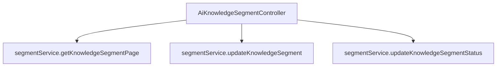

# 基础信息

|      |      |
|------|------|
| 编码语言 | .java |
| 代码路径 | yudao-module-ai/yudao-module-ai-biz/src/main/java/cn/iocoder/yudao/module/ai/controller/admin/knowledge/AiKnowledgeSegmentController.java |
| 包名 | cn.iocoder.yudao.module.ai.controller.admin.knowledge |
| 依赖项 | ['cn.iocoder.yudao.framework.common.pojo.CommonResult', 'cn.iocoder.yudao.framework.common.pojo.PageResult', 'cn.iocoder.yudao.framework.common.util.object.BeanUtils', 'cn.iocoder.yudao.module.ai.controller.admin.knowledge.vo.segment.AiKnowledgeSegmentPageReqVO', 'cn.iocoder.yudao.module.ai.controller.admin.knowledge.vo.segment.AiKnowledgeSegmentRespVO', 'cn.iocoder.yudao.module.ai.controller.admin.knowledge.vo.segment.AiKnowledgeSegmentUpdateReqVO', 'cn.iocoder.yudao.module.ai.controller.admin.knowledge.vo.segment.AiKnowledgeSegmentUpdateStatusReqVO', 'cn.iocoder.yudao.module.ai.dal.dataobject.knowledge.AiKnowledgeSegmentDO', 'cn.iocoder.yudao.module.ai.service.knowledge.AiKnowledgeSegmentService', 'io.swagger.v3.oas.annotations.Operation', 'io.swagger.v3.oas.annotations.tags.Tag', 'jakarta.annotation.Resource', 'jakarta.validation.Valid', 'org.springframework.validation.annotation.Validated', 'org.springframework.web.bind.annotation', 'cn.iocoder.yudao.framework.common.pojo.CommonResult.success'] |
| 概述说明 | 管理后台的AI知识库段落控制器具备三个核心功能：获取段落分页、更新段落内容及启禁用段落内容。通过GET请求获取分页数据，通过PUT请求更新段落内容或状态，所有操作由AiKnowledgeSegmentService处理并返回结果。 |

# 说明

管理后台的AI知识库段落控制器提供了三个核心功能，分别是获取段落分页、更新段落内容以及启禁用段落内容。这些功能通过不同的HTTP请求方式实现。首先，通过GET请求可以获取段落的分页数据，便于用户查看和管理大量段落内容。其次，通过PUT请求可以更新段落的具体内容或状态，确保知识库的信息能够及时更新和调整。所有操作均由AiKnowledgeSegmentService进行处理，并返回相应的操作结果，确保操作的准确性和高效性。这些功能共同支持了AI知识库段落内容的管理和维护，提升了系统的灵活性和可操作性。

# 类列表 Class Summary

| 名称   | 类型  | 说明 |
|-------|------|-------------|
| AiKnowledgeSegmentController | class | 管理后台的AI知识库段落控制器提供三个主要功能：获取段落分页、更新段落内容和启禁用段落内容。通过GET请求获取分页数据，通过PUT请求更新段落内容或状态，所有操作均通过AiKnowledgeSegmentService处理并返回相应结果。 |


## 类 AiKnowledgeSegmentController

|      |      |
|------|------|
| 访问范围 | @Tag(name = "管理后台 - AI 知识库段落");@RestController;@RequestMapping("/ai/knowledge/segment");@Validated;public |
| 类型 | class |
| 名称 | AiKnowledgeSegmentController |
| 说明 | 管理后台的AI知识库段落控制器提供三个主要功能：获取段落分页、更新段落内容和启禁用段落内容。通过GET请求获取分页数据，通过PUT请求更新段落内容或状态，所有操作均通过AiKnowledgeSegmentService处理并返回相应结果。 |


### UML类图

```mermaid
classDiagram
    class AiKnowledgeSegmentController {
        +AiKnowledgeSegmentService segmentService
        +getKnowledgeSegmentPage(AiKnowledgeSegmentPageReqVO pageReqVO) CommonResult~PageResult~AiKnowledgeSegmentRespVO~~
        +updateKnowledgeSegment(AiKnowledgeSegmentUpdateReqVO reqVO) CommonResult~Boolean~
        +updateKnowledgeSegmentStatus(AiKnowledgeSegmentUpdateStatusReqVO reqVO) CommonResult~Boolean~
    }

    class AiKnowledgeSegmentService {
        +getKnowledgeSegmentPage(AiKnowledgeSegmentPageReqVO pageReqVO) PageResult~AiKnowledgeSegmentDO~
        +updateKnowledgeSegment(AiKnowledgeSegmentUpdateReqVO reqVO) void
        +updateKnowledgeSegmentStatus(AiKnowledgeSegmentUpdateStatusReqVO reqVO) void
    }

    class AiKnowledgeSegmentPageReqVO {
        +String name
        +Integer page
        +Integer size
    }

    class AiKnowledgeSegmentRespVO {
        +String id
        +String content
        +String status
    }

    class AiKnowledgeSegmentDO {
        +String id
        +String content
        +String status
    }

    class AiKnowledgeSegmentUpdateReqVO {
        +String id
        +String content
    }

    class AiKnowledgeSegmentUpdateStatusReqVO {
        +String id
        +String status
    }

    class CommonResult~T~ {
        +Integer code
        +String message
        +T data
    }

    class PageResult~T~ {
        +List~T~ list
        +Long total
    }

    AiKnowledgeSegmentController --> AiKnowledgeSegmentService : uses
    AiKnowledgeSegmentService ..> AiKnowledgeSegmentDO : returns
    AiKnowledgeSegmentController ..> AiKnowledgeSegmentPageReqVO : uses
    AiKnowledgeSegmentController ..> AiKnowledgeSegmentRespVO : returns
    AiKnowledgeSegmentController ..> AiKnowledgeSegmentUpdateReqVO : uses
    AiKnowledgeSegmentController ..> AiKnowledgeSegmentUpdateStatusReqVO : uses
    AiKnowledgeSegmentController ..> CommonResult~PageResult~AiKnowledgeSegmentRespVO~~ : returns
    AiKnowledgeSegmentController ..> CommonResult~Boolean~ : returns
    AiKnowledgeSegmentService ..> PageResult~AiKnowledgeSegmentDO~ : returns
```

### 描述信息：
该UML类图展示了`AiKnowledgeSegmentController`类与`AiKnowledgeSegmentService`类之间的依赖关系，以及它们与多个请求和响应VO类的交互。`AiKnowledgeSegmentController`通过调用`AiKnowledgeSegmentService`的方法来处理分页查询、更新段落内容和状态等操作，并返回相应的结果。


### 内部方法调用关系图



### 描述信息：
该图展示了`AiKnowledgeSegmentController`类中三个方法对`segmentService`的调用关系。`getKnowledgeSegmentPage`用于获取段落分页数据，`updateKnowledgeSegment`用于更新段落内容，`updateKnowledgeSegmentStatus`用于启禁用段落内容。所有方法均通过`segmentService`实现具体业务逻辑。

### 字段列表 Field List

| 名称  | 类型  | 说明 |
|-------|-------|------|
| segmentService | AiKnowledgeSegmentService | 在代码中，通过@Resource注解将AiKnowledgeSegmentService注入到当前类中，以便使用其提供的功能。 |

### 方法列表 Method List

| 名称  | 类型  | 说明 |
|-------|-------|------|
| updateKnowledgeSegment | CommonResult<Boolean> | 该代码片段描述了一个用于更新段落内容的API接口。通过PUT请求调用"/update"路径，接收并验证请求体中的更新数据，调用服务层方法更新段落内容，最后返回操作成功的布尔结果。 |
| updateKnowledgeSegmentStatus | CommonResult<Boolean> | 该代码片段描述了一个用于更新知识段落状态的API接口。通过PUT请求调用"/update-status"路径，接收一个包含更新状态请求的JSON对象，调用segmentService的updateKnowledgeSegmentStatus方法处理请求，并返回操作成功的布尔值结果。 |
| getKnowledgeSegmentPage | CommonResult<PageResult<AiKnowledgeSegmentRespVO>> | 该代码定义了一个GET请求接口，路径为"/page"，用于获取段落分页数据。接口接收一个有效的AiKnowledgeSegmentPageReqVO对象作为请求参数，调用segmentService的getKnowledgeSegmentPage方法获取分页结果，并将结果转换为AiKnowledgeSegmentRespVO类型后返回。 |


