# 基础信息

|      |      |
|------|------|
| 编码语言 | .java |
| 代码路径 | yudao-module-ai/yudao-module-ai-biz/src/main/java/cn/iocoder/yudao/module/ai/controller/admin/knowledge |
| 包名 | cn.iocoder.yudao.module.ai.controller.admin.knowledge |
| 概述说明 | AiKnowledgeController 是管理后台 AI 知识库的核心控制器，提供分页查询、创建和更新知识库的功能。用户可通过 `/ai/knowledge/page` 获取分页数据，通过 `/ai/knowledge/create` 创建新条目，通过 `/ai/knowledge/update` 更新内容，所有操作需身份验证。系统通过多个请求和响应VO类管理知识库信息，确保完整性、权限控制和高效检索。控制器还支持文档和段落的管理，包括创建、分页获取、更新和启禁用功能，所有操作通过相应服务处理并返回结果，确保高效、可靠的知识库管理。 |

# 说明

AiKnowledgeController 是一个用于管理后台 AI 知识库的控制器，主要负责处理与知识库相关的操作，包括分页查询、创建和更新知识库条目。用户可以通过 `/ai/knowledge/page` 接口获取分页数据，支持按需查询知识库内容并以分页形式返回结果。此外，用户还可以通过 `/ai/knowledge/create` 和 `/ai/knowledge/update` 接口分别创建和更新知识库条目。所有操作都需要用户身份验证，确保只有授权用户才能执行这些操作。

AI知识库系统涉及多个关键功能和数据结构，主要用于知识库的创建、更新、查询和管理。系统通过多个请求和响应VO类来确保知识库信息的完整性、权限控制和高效检索。AI知识库更新请求VO包含五个必填字段：知识库编号、知识库名称、知识库描述、可见权限列表和嵌入模型编号。AI知识库分页请求VO类用于按名称查询知识库信息，包含分页参数和知识库名称两个关键字段。AI知识库响应VO包含五个主要字段：编号、知识库名称、知识库描述、模型编号和模型标识。

创建AI知识库的请求VO包含多个必填字段，如知识库名称、知识库描述、可见权限、嵌入模型编号、相似性阈值和topK字段。创建AI知识库文档的请求涉及多个必填字段，如知识库编号、文档名称、文档URL、段落目标token数、段落最小字符数、丢弃阈值、最大段落数和是否保留分隔符的选项。管理后台AI知识库文档响应VO包含多个必填字段，如编号、知识库编号、名称、内容、文档URL、token数量、字符数、切片状态和文档状态。

管理后台AI知识库文档更新请求VO包含三个主要字段：编号、启用状态和名称。AI知识库文档分页请求VO用于处理文档分页请求，包含一个文档名称字段。AI知识库段落召回请求包含两个必填字段：知识库编号和内容。AI知识库段落更新状态请求包含两个必填字段：编号和是否启用。AI更新知识库段落请求包含两个必填字段：编号和切片内容。AI知识库文档响应VO用于描述文档的详细信息，包含多个必填字段，如编号、文档编号、知识库编号、向量库编号、切片内容、token数量、字符数和文档状态。

AI知识库分段分页请求VO用于分页查询和筛选知识库中的分段信息，包含三个主要参数：分段状态、文档编号和分段内容关键字。管理后台的AI知识库段落控制器提供了三个核心功能：获取段落分页、更新段落内容以及启禁用段落内容。这些功能通过不同的HTTP请求方式实现，所有操作均由AiKnowledgeSegmentService进行处理，并返回相应的操作结果。

管理后台的AI知识库文档控制器提供了三种主要功能：创建文档、分页获取文档和更新文档。通过POST请求可以创建新的文档，GET请求用于获取文档的分页列表，PUT请求则用于更新已有的文档内容。所有的操作都通过AiKnowledgeDocumentService进行处理，确保操作的响应性和数据的准确性。整体设计旨在提供一个高效、可靠的方式来管理和维护AI知识库中的文档内容。

### 包内部结构视图

```mermaid
graph TD
    knowledge --> AiKnowledgeController
    knowledge --> AiKnowledgeSegmentController
    knowledge --> AiKnowledgeDocumentController
    vo --> knowledge
    vo --> document
    vo --> segment
    knowledge --> AiKnowledgeUpdateReqVO
    knowledge --> AiKnowledgePageReqVO
    knowledge --> AiKnowledgeRespVO
    knowledge --> AiKnowledgeCreateReqVO
    knowledge --> AiKnowledgeDocumentCreateReqVO
    document --> AiKnowledgeDocumentRespVO
    document --> AiKnowledgeDocumentUpdateReqVO
    document --> AiKnowledgeDocumentPageReqVO
    segment --> AiKnowledgeSegmentSearchReqVO
    segment --> AiKnowledgeSegmentUpdateStatusReqVO
    segment --> AiKnowledgeSegmentUpdateReqVO
    segment --> AiKnowledgeSegmentRespVO
    segment --> AiKnowledgeSegmentPageReqVO
```

### 描述信息：
该图展示了`yudao-module-ai`项目中`knowledge`模块的控制器与VO（值对象）之间的调用关系。`AiKnowledgeController`、`AiKnowledgeSegmentController`和`AiKnowledgeDocumentController`是主要的控制器类，它们与`knowledge`、`document`和`segment`文件夹中的VO类进行交互，处理请求和响应。

# 文件列表 File List

| 名称   | 类型  | 说明 |
|-------|------|-------------|
| [AiKnowledgeDocumentController.java](AiKnowledgeDocumentController.md) | file | 该代码是管理后台的AI知识库文档控制器，提供创建、分页获取和更新文档的功能。通过POST请求创建文档，GET请求获取分页文档，PUT请求更新文档。所有操作由AiKnowledgeDocumentService处理并返回结果。 |
| [AiKnowledgeSegmentController.java](AiKnowledgeSegmentController.md) | file | 管理后台的AI知识库段落控制器具备三个核心功能：获取段落分页、更新段落内容及启禁用段落内容。通过GET请求获取分页数据，通过PUT请求更新段落内容或状态，所有操作由AiKnowledgeSegmentService处理并返回结果。 |
| [vo](vo/_package.md) | folder | 管理后台的AI知识库系统涉及多个关键功能和数据结构，主要用于知识库及其文档的创建、更新、查询和管理。系统包含多个必填字段，如知识库编号、名称、描述、可见权限、嵌入模型编号等，确保知识库信息的完整性和权限控制。文档管理涉及编号、名称、内容、URL、token数量等字段，支持文档的分页查询和状态管理。段落管理包括召回、更新和状态控制，涉及编号、内容、启用状态等字段。这些功能共同确保知识库系统的高效管理和信息准确性。 |
| [AiKnowledgeController.java](AiKnowledgeController.md) | file | AiKnowledgeController 是管理后台的 AI 知识库控制器，提供分页查询、创建和更新功能。通过 `/ai/knowledge/page` 获取分页数据，`/ai/knowledge/create` 创建知识库，`/ai/knowledge/update` 更新知识库，所有操作需验证用户身份。 |

