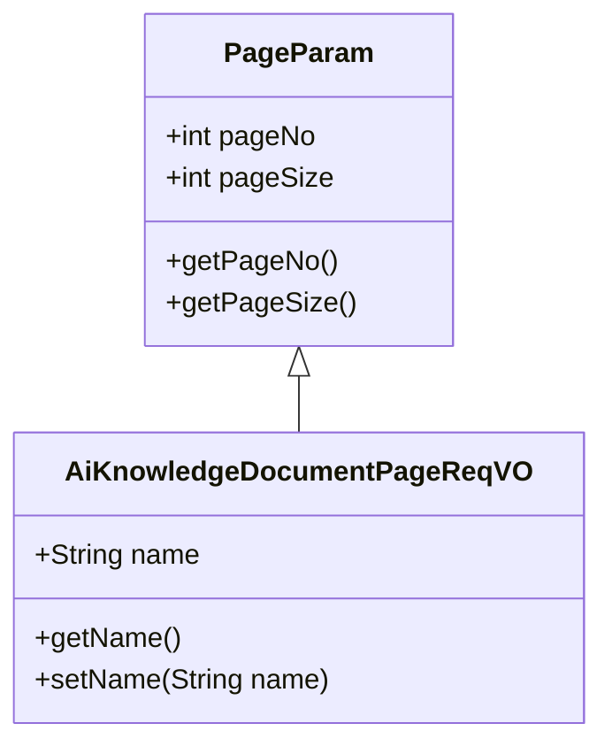
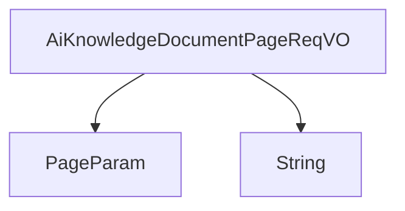

# 基础信息

|      |      |
|------|------|
| 编码语言 | .java |
| 代码路径 | yudao-module-ai/yudao-module-ai-biz/src/main/java/cn/iocoder/yudao/module/ai/controller/admin/knowledge/vo/document/AiKnowledgeDocumentPageReqVO.java |
| 包名 | cn.iocoder.yudao.module.ai.controller.admin.knowledge.vo.document |
| 依赖项 | ['cn.iocoder.yudao.framework.common.pojo.PageParam', 'io.swagger.v3.oas.annotations.media.Schema', 'lombok.Data'] |
| 概述说明 | 管理后台AI知识库文档分页请求VO继承分页参数，包含文档名称字段，示例为"Java 开发手册"。 |

# 说明

管理后台AI知识库文档分页请求VO是一个用于处理文档分页请求的数据结构，它继承自分页参数，具备分页功能的基本属性。该数据结构包含一个文档名称字段，用于指定或筛选特定的文档。例如，文档名称字段可以设置为"Java 开发手册"，以便在分页请求中针对该特定文档进行查询或操作。通过这种方式，用户可以在管理后台中对AI知识库中的文档进行高效的分页浏览和管理，确保能够快速定位和访问所需的文档内容。

# 类列表 Class Summary

| 名称   | 类型  | 说明 |
|-------|------|-------------|
| AiKnowledgeDocumentPageReqVO | class | 管理后台AI知识库文档分页请求VO，继承分页参数，包含文档名称字段，示例为"Java 开发手册"。 |

## 类 AiKnowledgeDocumentPageReqVO

|      |      |
|------|------|
| 访问范围 | @Schema(description = "管理后台 - AI 知识库文档的分页 Request VO");@Data;public |
| 类型 | class |
| 名称 | AiKnowledgeDocumentPageReqVO |
| 说明 | 管理后台AI知识库文档分页请求VO，继承分页参数，包含文档名称字段，示例为"Java 开发手册"。 |

### UML类图

### 描述信息：
该UML类图展示了`AiKnowledgeDocumentPageReqVO`类继承自`PageParam`类的关系。`AiKnowledgeDocumentPageReqVO`类包含一个`name`属性，并提供了相应的getter和setter方法。`PageParam`类包含分页相关的属性`pageNo`和`pageSize`，并提供了获取这些属性的方法。

### 内部方法调用关系图

### 描述信息：
`AiKnowledgeDocumentPageReqVO` 类继承自 `PageParam`，并包含一个 `String` 类型的 `name` 属性。该类用于管理后台的 AI 知识库文档分页请求，`name` 属性用于存储文档名称。

### 字段列表 Field List

| 名称  | 类型  | 说明 |
|-------|-------|------|
| name | String | 文档名称字段，示例为“Java 开发手册”，用于标识文档的名称信息。 |

### 方法列表 Method List

| 名称  | 类型  | 说明 |
|-------|-------|------|

