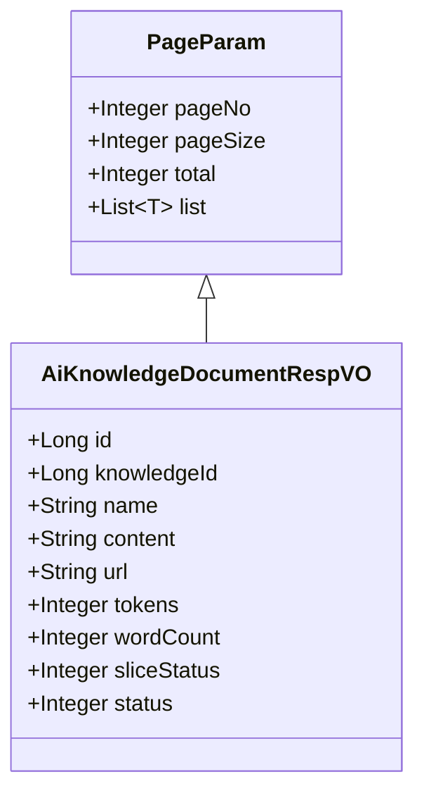
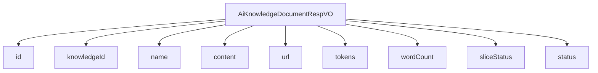

# 基础信息

|      |      |
|------|------|
| 编码语言 | .java |
| 代码路径 | yudao-module-ai/yudao-module-ai-biz/src/main/java/cn/iocoder/yudao/module/ai/controller/admin/knowledge/vo/document/AiKnowledgeDocumentRespVO.java |
| 包名 | cn.iocoder.yudao.module.ai.controller.admin.knowledge.vo.document |
| 依赖项 | ['cn.iocoder.yudao.framework.common.pojo.PageParam', 'io.swagger.v3.oas.annotations.media.Schema', 'lombok.Data'] |
| 概述说明 | 管理后台AI知识库文档响应VO包含编号、知识库编号、名称、内容、文档URL、token数量、字符数、切片状态和文档状态等必填字段，涵盖文档的全面信息。 |

# 说明

管理后台AI知识库文档响应VO是一个包含多个关键信息的数据结构，用于描述和管理知识库中的文档。该结构包含以下必填字段：编号，用于唯一标识每个文档；知识库编号，标识文档所属的知识库；名称，表示文档的标题或名称；内容，存储文档的具体信息或文本；文档URL，提供文档的访问链接；token数量，表示文档内容的token计数，通常用于衡量内容的长度或复杂度；字符数，记录文档中的字符总数；切片状态，指示文档是否已被分割或处理；文档状态，描述文档的当前状态，如是否已发布或待审核。这些字段共同构成了一个全面的文档描述，便于在管理后台中对知识库文档进行有效的管理和操作。

# 类列表 Class Summary

| 名称   | 类型  | 说明 |
|-------|------|-------------|
| AiKnowledgeDocumentRespVO | class | 管理后台AI知识库文档响应VO包含编号、知识库编号、名称、内容、文档URL、token数量、字符数、切片状态和文档状态等关键信息，所有字段均为必填项。 |

## 类 AiKnowledgeDocumentRespVO

|      |      |
|------|------|
| 访问范围 | @Schema(description = "管理后台 - AI 知识库-文档 Response VO");@Data;public |
| 类型 | class |
| 名称 | AiKnowledgeDocumentRespVO |
| 说明 | 管理后台AI知识库文档响应VO包含编号、知识库编号、名称、内容、文档URL、token数量、字符数、切片状态和文档状态等关键信息，所有字段均为必填项。 |

### UML类图

### 描述信息：
该UML类图展示了`AiKnowledgeDocumentRespVO`类继承自`PageParam`类。`AiKnowledgeDocumentRespVO`类包含了多个属性，如`id`、`knowledgeId`、`name`等，用于管理AI知识库文档的响应数据。`PageParam`类提供了分页相关的属性，如`pageNo`、`pageSize`等。

### 内部方法调用关系图

### 描述信息：
该图展示了 `AiKnowledgeDocumentRespVO` 类与其属性之间的调用关系。`AiKnowledgeDocumentRespVO` 类包含了多个属性，如 `id`、`knowledgeId`、`name`、`content` 等，每个属性都通过 `-->` 与类进行连接，表示这些属性属于该类。该图清晰地展示了类与属性之间的依赖关系。

### 字段列表 Field List

| 名称  | 类型  | 说明 |
|-------|-------|------|
| wordCount | Integer | 字符数为必填项，示例值为1008。 |
| tokens | Integer | token数量为必填项，示例值为1024。 |
| id | Long | 编号为必填项，示例值为24790，数据类型为长整型。 |
| name | String | 名称字段为必填项，示例为“Java 开发手册”。 |
| sliceStatus | Integer | 切片状态为必填项，数据类型为整数，示例值为1。 |
| status | Integer | 文档状态为必填项，示例值为1，表示文档的当前状态。 |
| knowledgeId | Long | 知识库编号为必填项，示例值为24790，类型为长整型。 |
| url | String | 文档URL为必填项，示例为https://doc.iocoder.cn。 |
| content | String | 内容字段为必填项，描述信息为“内容”，示例为“Java 是一门面向对象的语言..... |

### 方法列表 Method List

| 名称  | 类型  | 说明 |
|-------|-------|------|

