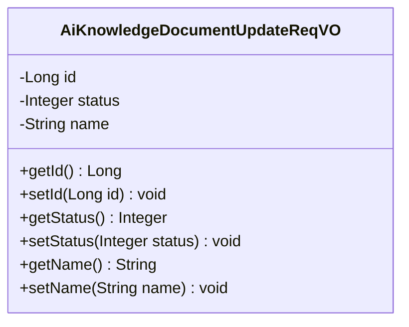
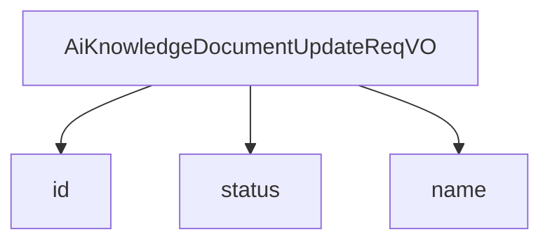

# 基础信息

|      |      |
|------|------|
| 编码语言 | .java |
| 代码路径 | yudao-module-ai/yudao-module-ai-biz/src/main/java/cn/iocoder/yudao/module/ai/controller/admin/knowledge/vo/document/AiKnowledgeDocumentUpdateReqVO.java |
| 包名 | cn.iocoder.yudao.module.ai.controller.admin.knowledge.vo.document |
| 依赖项 | ['cn.iocoder.yudao.framework.common.enums.CommonStatusEnum', 'cn.iocoder.yudao.framework.common.validation.InEnum', 'io.swagger.v3.oas.annotations.media.Schema', 'jakarta.validation.constraints.NotNull', 'lombok.Data'] |
| 概述说明 | 管理后台AI知识库文档更新请求VO包含编号、启用状态和名称三个字段。编号为必填项，不能为空；启用状态需符合枚举值；名称为可选字段。 |

# 说明

管理后台AI知识库文档更新请求VO包含三个主要字段：编号、启用状态和名称。其中，编号是必填项，不能为空，确保每个请求都有唯一的标识。启用状态字段需要符合特定的枚举值，这意味着它只能接受预定义的值，以保证数据的一致性和有效性。名称字段是可选的，允许用户在更新请求时根据需要填写或留空。这些字段的设计旨在确保更新请求的完整性和规范性，同时提供一定的灵活性，以适应不同的使用场景。

# 类列表 Class Summary

| 名称   | 类型  | 说明 |
|-------|------|-------------|
| AiKnowledgeDocumentUpdateReqVO | class | 管理后台AI知识库文档更新请求VO包含编号、启用状态和名称三个字段。编号为必填项，不能为空；启用状态需符合枚举值；名称为可选字段。 |

## 类 AiKnowledgeDocumentUpdateReqVO

|      |      |
|------|------|
| 访问范围 | @Schema(description = "管理后台 - AI 更新 知识库-文档 Request VO");@Data;public |
| 类型 | class |
| 名称 | AiKnowledgeDocumentUpdateReqVO |
| 说明 | 管理后台AI知识库文档更新请求VO包含编号、启用状态和名称三个字段。编号为必填项，不能为空；启用状态需符合枚举值；名称为可选字段。 |

### UML类图

### 描述信息
该UML类图展示了一个名为`AiKnowledgeDocumentUpdateReqVO`的类，用于管理后台AI知识库文档的更新请求。类中包含三个私有属性：`id`、`status`和`name`，并提供了相应的getter和setter方法。`id`属性为必填项，`status`和`name`为可选属性。

### 内部方法调用关系图

### 描述信息：
该图展示了 `AiKnowledgeDocumentUpdateReqVO` 类与其属性之间的调用关系。`AiKnowledgeDocumentUpdateReqVO` 类包含了三个主要属性：`id`、`status` 和 `name`。这些属性分别用于存储文档的编号、启用状态和名称信息。通过该图可以清晰地看到类与属性之间的依赖关系。

### 字段列表 Field List

| 名称  | 类型  | 说明 |
|-------|-------|------|
| id | Long | 编号为必填项，不能为空，示例值为15583。 |
| name | String | 名称字段，示例为"Java 开发手册"。 |
| status | Integer | 该代码片段定义了一个私有整型变量status，用于表示是否启用，示例值为1，并通过注解@InEnum限制其值必须在CommonStatusEnum枚举类中。 |

### 方法列表 Method List

| 名称  | 类型  | 说明 |
|-------|-------|------|

