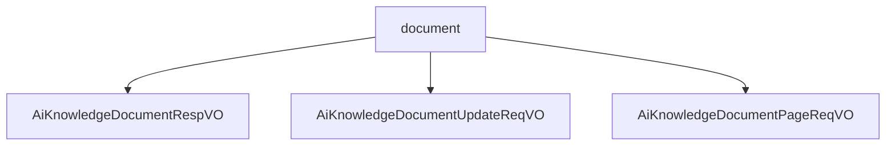

# 基础信息

|      |      |
|------|------|
| 编码语言 | .java |
| 代码路径 | yudao-module-ai/yudao-module-ai-biz/src/main/java/cn/iocoder/yudao/module/ai/controller/admin/knowledge/vo/document |
| 包名 | cn.iocoder.yudao.module.ai.controller.admin.knowledge.vo.document |
| 概述说明 | 管理后台AI知识库文档响应VO包含编号、知识库编号、名称、内容、文档URL、token数量、字符数、切片状态和文档状态等字段，用于全面描述和管理文档。更新请求VO包含必填的编号、启用状态和可选的名称字段，确保更新请求的完整性和规范性。分页请求VO继承分页参数，包含文档名称字段，支持对特定文档的分页查询和管理。这些数据结构共同支持知识库文档的高效管理和操作。 |

# 说明

管理后台AI知识库文档响应VO是一个用于描述和管理知识库中文档的全面数据结构，包含多个必填字段。这些字段包括编号，用于唯一标识每个文档；知识库编号，标识文档所属的知识库；名称，表示文档的标题或名称；内容，存储文档的具体信息或文本；文档URL，提供文档的访问链接；token数量，表示文档内容的token计数，通常用于衡量内容的长度或复杂度；字符数，记录文档中的字符总数；切片状态，指示文档是否已被分割或处理；文档状态，描述文档的当前状态，如是否已发布或待审核。这些字段共同构成了一个全面的文档描述，便于在管理后台中对知识库文档进行有效的管理和操作。

管理后台AI知识库文档更新请求VO包含三个主要字段：编号、启用状态和名称。其中，编号是必填项，不能为空，确保每个请求都有唯一的标识。启用状态字段需要符合特定的枚举值，这意味着它只能接受预定义的值，以保证数据的一致性和有效性。名称字段是可选的，允许用户在更新请求时根据需要填写或留空。这些字段的设计旨在确保更新请求的完整性和规范性，同时提供一定的灵活性，以适应不同的使用场景。

管理后台AI知识库文档分页请求VO是一个用于处理文档分页请求的数据结构，它继承自分页参数，具备分页功能的基本属性。该数据结构包含一个文档名称字段，用于指定或筛选特定的文档。例如，文档名称字段可以设置为"Java 开发手册"，以便在分页请求中针对该特定文档进行查询或操作。通过这种方式，用户可以在管理后台中对AI知识库中的文档进行高效的分页浏览和管理，确保能够快速定位和访问所需的文档内容。

### 包内部结构视图

### 描述信息：
该Mermaid图展示了`document`文件夹下的三个Java文件之间的调用关系。`document`作为父节点，分别调用了`AiKnowledgeDocumentRespVO`、`AiKnowledgeDocumentUpdateReqVO`和`AiKnowledgeDocumentPageReqVO`三个子节点，清晰地反映了文件之间的层级关系。

# 文件列表 File List

| 名称   | 类型  | 说明 |
|-------|------|-------------|
| [AiKnowledgeDocumentPageReqVO.java](AiKnowledgeDocumentPageReqVO.md) | file | 管理后台AI知识库文档分页请求VO继承分页参数，包含文档名称字段，示例为"Java 开发手册"。 |
| [AiKnowledgeDocumentUpdateReqVO.java](AiKnowledgeDocumentUpdateReqVO.md) | file | 管理后台AI知识库文档更新请求VO包含编号、启用状态和名称三个字段。编号为必填项，不能为空；启用状态需符合枚举值；名称为可选字段。 |
| [AiKnowledgeDocumentRespVO.java](AiKnowledgeDocumentRespVO.md) | file | 管理后台AI知识库文档响应VO包含编号、知识库编号、名称、内容、文档URL、token数量、字符数、切片状态和文档状态等必填字段，涵盖文档的全面信息。 |

