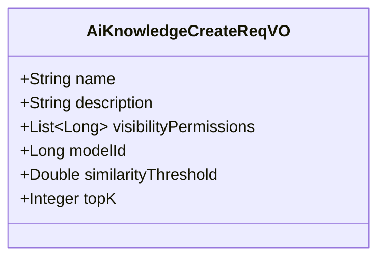
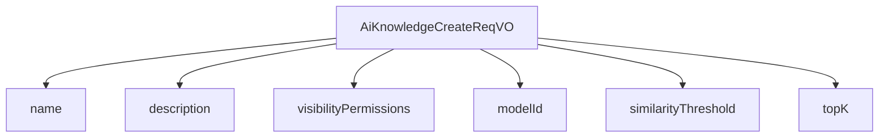

# 基础信息

|      |      |
|------|------|
| 编码语言 | .java |
| 代码路径 | yudao-module-ai/yudao-module-ai-biz/src/main/java/cn/iocoder/yudao/module/ai/controller/admin/knowledge/vo/knowledge/AiKnowledgeCreateReqVO.java |
| 包名 | cn.iocoder.yudao.module.ai.controller.admin.knowledge.vo.knowledge |
| 依赖项 | ['io.swagger.v3.oas.annotations.media.Schema', 'jakarta.validation.constraints.NotBlank', 'jakarta.validation.constraints.NotNull', 'lombok.Data', 'java.util.List'] |
| 概述说明 | 该请求用于创建AI知识库，需填写知识库名称、描述、可见权限、嵌入模型编号、相似性阈值和topK等必填字段，所有字段均不能为空，以确保知识库创建时信息完整。 |

# 说明

该请求VO用于创建AI知识库，旨在确保知识库的创建过程信息完整且规范。请求中包含了多个必填字段，所有字段均不能为空。首先，知识库名称是必须提供的，用于标识该知识库的唯一性。其次，知识库描述字段用于详细说明该知识库的用途或内容，帮助用户更好地理解其功能。可见权限字段用于设置知识库的访问权限，决定哪些用户或角色可以查看或使用该知识库。嵌入模型编号字段用于指定知识库所采用的嵌入模型，确保知识库在处理文本时使用正确的模型。相似性阈值字段用于设定知识库在进行文本匹配时的相似度标准，以控制匹配结果的精确度。最后，topK字段用于指定在检索时返回的最相关结果数量，确保用户能够获取到最符合需求的信息。通过这些必填字段的设置，确保了知识库在创建时具备完整的信息，从而能够有效地支持后续的知识管理和检索操作。

# 类列表 Class Summary

| 名称   | 类型  | 说明 |
|-------|------|-------------|
| AiKnowledgeCreateReqVO | class | 该请求VO用于创建AI知识库，包含知识库名称、描述、可见权限、嵌入模型编号、相似性阈值和topK等必填字段。所有字段均不能为空，确保知识库创建时信息完整。 |

## 类 AiKnowledgeCreateReqVO

|      |      |
|------|------|
| 访问范围 | @Schema(description = "管理后台 - AI 知识库创建 Request VO");@Data;public |
| 类型 | class |
| 名称 | AiKnowledgeCreateReqVO |
| 说明 | 该请求VO用于创建AI知识库，包含知识库名称、描述、可见权限、嵌入模型编号、相似性阈值和topK等必填字段。所有字段均不能为空，确保知识库创建时信息完整。 |

### UML类图

### 描述信息
该UML类图展示了一个名为`AiKnowledgeCreateReqVO`的类，用于管理后台创建AI知识库的请求。类中包含多个属性，如知识库名称、描述、可见权限、嵌入模型编号、相似性阈值和topK值。所有属性均为`public`可见性，确保外部可以直接访问和修改这些属性。

### 内部方法调用关系图

### 描述信息：
该图展示了 `AiKnowledgeCreateReqVO` 类与其属性之间的调用关系。`AiKnowledgeCreateReqVO` 类包含了多个属性，如 `name`、`description`、`visibilityPermissions`、`modelId`、`similarityThreshold` 和 `topK`，这些属性在类中被调用并用于构建请求对象。

### 字段列表 Field List

| 名称  | 类型  | 说明 |
|-------|-------|------|
| similarityThreshold | Double | 相似性阈值为必填项，不能为空，示例值为0.5。 |
| description | String | 知识库描述为必填项，用于存储ruoyi-vue-pro操作文档。 |
| name | String | 知识库名称为必填项，不能为空，示例为“ruoyi-vue-pro 用户指南”。 |
| topK | Integer | topK参数为必填项，不能为空，示例值为3，用于指定返回结果的数量。 |
| visibilityPermissions | List<Long> | 可见权限字段为必填项，用于指定哪些人可以查看内容，示例值为[1,2,3]，表示用户ID为1、2、3的人可见。 |
| modelId | Long | 嵌入模型编号为必填项，不能为空，示例值为1。 |

### 方法列表 Method List

| 名称  | 类型  | 说明 |
|-------|-------|------|

