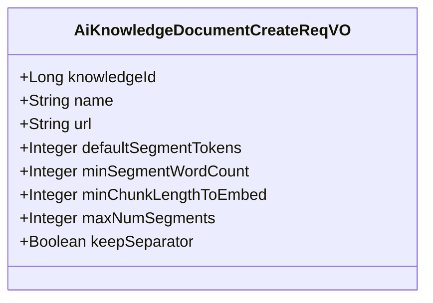
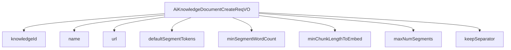

# 基础信息

|      |      |
|------|------|
| 编码语言 | .java |
| 代码路径 | yudao-module-ai/yudao-module-ai-biz/src/main/java/cn/iocoder/yudao/module/ai/controller/admin/knowledge/vo/knowledge/AiKnowledgeDocumentCreateReqVO.java |
| 包名 | cn.iocoder.yudao.module.ai.controller.admin.knowledge.vo.knowledge |
| 依赖项 | ['io.swagger.v3.oas.annotations.media.Schema', 'jakarta.validation.constraints.NotBlank', 'jakarta.validation.constraints.NotNull', 'lombok.Data', 'org.hibernate.validator.constraints.URL'] |
| 概述说明 | 该请求用于创建AI知识库文档，必填字段包括知识库编号、文档名称、文档URL、段落目标token数、段落最小字符数、丢弃阈值、最大段落数及是否保留分隔符。所有字段不能为空，文档URL需符合格式要求。 |

# 说明

该请求用于创建AI知识库文档，涉及多个必填字段，所有字段均不能为空。首先，需要提供知识库编号，用于标识该文档所属的知识库。其次，文档名称是必须填写的字段，用于描述文档的内容或主题。文档URL也是一个关键字段，必须符合特定的格式要求，以确保链接的有效性和可访问性。此外，段落目标token数用于设定每个段落的token数量目标，帮助控制文档的分段和内容长度。段落最小字符数则规定了每个段落至少应包含的字符数，以确保段落内容的完整性。丢弃阈值用于设定在生成段落时，若内容长度低于该阈值，则丢弃该段落，避免生成过短或无意义的段落。最大段落数限制了文档中段落的总数，防止文档过长或内容冗余。最后，是否保留分隔符的选项决定了在生成文档时是否保留原有的分隔符，以保持文档的结构和格式。这些字段共同确保了AI知识库文档的创建过程规范且高效，生成的文档内容符合预期要求。

# 类列表 Class Summary

| 名称   | 类型  | 说明 |
|-------|------|-------------|
| AiKnowledgeDocumentCreateReqVO | class | 该请求VO用于创建AI知识库文档，包含必填字段：知识库编号、文档名称、文档URL、段落目标token数、段落最小字符数、丢弃阈值、最大段落数及是否保留分隔符。所有字段均不能为空，且文档URL需符合格式要求。 |

## 类 AiKnowledgeDocumentCreateReqVO

|      |      |
|------|------|
| 访问范围 | @Schema(description = "管理后台 - AI 知识库文档的创建 Request VO");@Data;public |
| 类型 | class |
| 名称 | AiKnowledgeDocumentCreateReqVO |
| 说明 | 该请求VO用于创建AI知识库文档，包含必填字段：知识库编号、文档名称、文档URL、段落目标token数、段落最小字符数、丢弃阈值、最大段落数及是否保留分隔符。所有字段均不能为空，且文档URL需符合格式要求。 |

### UML类图

### 描述信息：
该UML类图展示了一个用于管理后台的AI知识库文档创建请求类`AiKnowledgeDocumentCreateReqVO`，包含了多个属性，如知识库编号、文档名称、文档URL等。每个属性都有相应的数据类型和可见性修饰符，确保类的完整性和正确性。

### 内部方法调用关系图

### 描述信息：
该图展示了 `AiKnowledgeDocumentCreateReqVO` 类与其属性之间的调用关系。`AiKnowledgeDocumentCreateReqVO` 类包含了多个属性，如 `knowledgeId`、`name`、`url` 等，这些属性用于管理后台创建 AI 知识库文档时的请求数据。每个属性都通过 `-->` 与 `AiKnowledgeDocumentCreateReqVO` 类关联，表示类与属性之间的依赖关系。

### 字段列表 Field List

| 名称  | 类型  | 说明 |
|-------|-------|------|
| name | String | 文档名称为必填项，不能为空，示例为“三方登陆”。 |
| maxNumSegments | Integer | 最大段落数必须为非空整数，示例值为10000，且为必填项。 |
| knowledgeId | Long | 知识库编号为必填项，不能为空，示例值为1204，类型为长整型。 |
| minSegmentWordCount | Integer | 每个段落的最小字符数必须指定且不能为空，示例值为350。 |
| minChunkLengthToEmbed | Integer | 丢弃阈值用于过滤段落，低于此值的段落将被丢弃。该参数为必填项，不能为空，示例值为5。 |
| keepSeparator | Boolean | 分块操作中是否保留分隔符的配置项，该配置为必填项，不能为空，示例值为true。 |
| defaultSegmentTokens | Integer | 每个段落的目标token数为必填项，不能为空，示例值为800。 |
| url | String | 文档URL为必填项，需符合URL格式，示例为https://doc.iocoder.cn。 |

### 方法列表 Method List

| 名称  | 类型  | 说明 |
|-------|-------|------|

