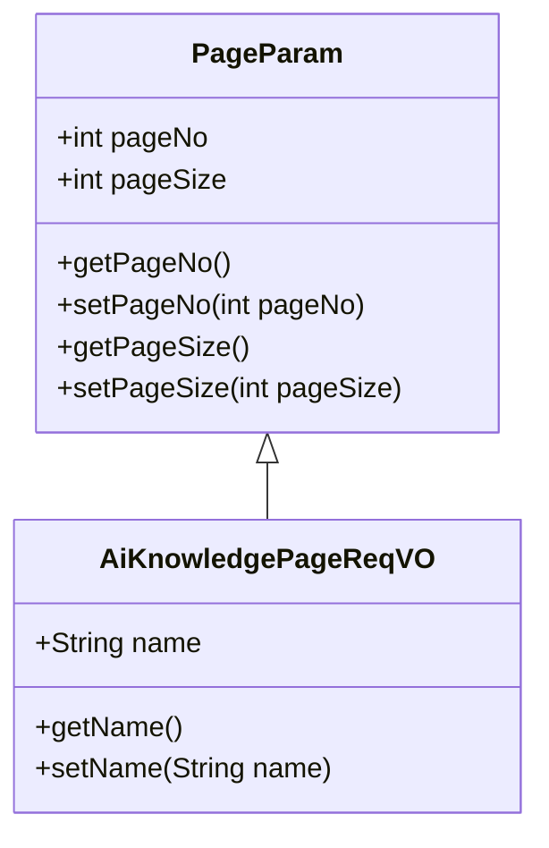
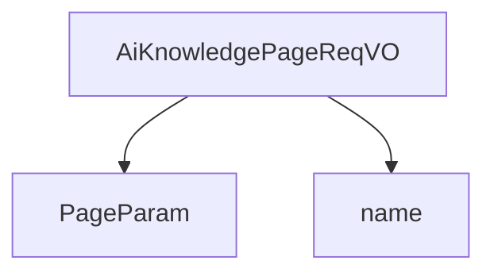

# 基础信息

|      |      |
|------|------|
| 编码语言 | .java |
| 代码路径 | yudao-module-ai/yudao-module-ai-biz/src/main/java/cn/iocoder/yudao/module/ai/controller/admin/knowledge/vo/knowledge/AiKnowledgePageReqVO.java |
| 包名 | cn.iocoder.yudao.module.ai.controller.admin.knowledge.vo.knowledge |
| 依赖项 | ['cn.iocoder.yudao.framework.common.pojo.PageParam', 'io.swagger.v3.oas.annotations.media.Schema', 'lombok.Data'] |
| 概述说明 | 管理后台的AI知识库分页请求VO类包含分页参数和知识库名称字段，用于按名称查询知识库信息。 |

# 说明

管理后台的AI知识库分页请求VO类主要用于按名称查询知识库信息。该VO类包含两个关键字段：分页参数和知识库名称。分页参数用于控制查询结果的显示方式，通常包括当前页码、每页显示的记录数等信息，以便实现数据的分页展示。知识库名称字段则用于指定查询条件，用户可以通过输入知识库的名称来筛选出符合条件的信息。通过这两个字段的结合，系统能够高效地检索并展示用户所需的知识库数据，提升查询的准确性和用户体验。

# 类列表 Class Summary

| 名称   | 类型  | 说明 |
|-------|------|-------------|
| AiKnowledgePageReqVO | class | 管理后台的AI知识库分页请求VO类包含分页参数和知识库名称字段，用于按名称查询知识库信息。 |

## 类 AiKnowledgePageReqVO

|      |      |
|------|------|
| 访问范围 | @Schema(description = "管理后台 - AI 知识库的分页 Request VO");@Data;public |
| 类型 | class |
| 名称 | AiKnowledgePageReqVO |
| 说明 | 管理后台的AI知识库分页请求VO类包含分页参数和知识库名称字段，用于按名称查询知识库信息。 |

### UML类图

### 描述信息：
该UML类图展示了一个管理后台的AI知识库分页请求类`AiKnowledgePageReqVO`，它继承自`PageParam`类。`AiKnowledgePageReqVO`类包含一个`name`属性，用于存储知识库名称。`PageParam`类提供了分页参数的基本功能，包括页码和每页大小。

### 内部方法调用关系图

### 描述信息：
`AiKnowledgePageReqVO` 类继承自 `PageParam` 类，并包含一个名为 `name` 的属性。该类用于管理后台的 AI 知识库分页请求，`name` 属性用于存储知识库的名称。

### 字段列表 Field List

| 名称  | 类型  | 说明 |
|-------|-------|------|
| name | String | 知识库名称字段，示例为“Java 开发手册”。 |

### 方法列表 Method List

| 名称  | 类型  | 说明 |
|-------|-------|------|

