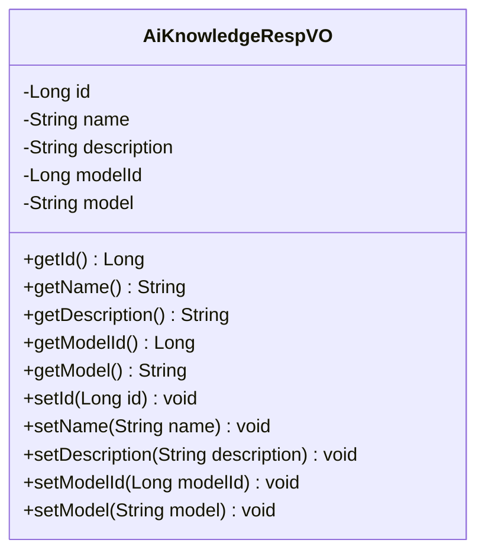
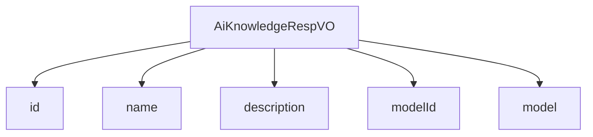

# 基础信息

|      |      |
|------|------|
| 编码语言 | .java |
| 代码路径 | yudao-module-ai/yudao-module-ai-biz/src/main/java/cn/iocoder/yudao/module/ai/controller/admin/knowledge/vo/knowledge/AiKnowledgeRespVO.java |
| 包名 | cn.iocoder.yudao.module.ai.controller.admin.knowledge.vo.knowledge |
| 依赖项 | ['io.swagger.v3.oas.annotations.media.Schema', 'lombok.Data'] |
| 概述说明 | 管理后台AI知识库响应VO包含编号、知识库名称、知识库描述、模型编号和模型标识等关键信息，其中编号、知识库名称、模型编号和模型标识为必填项。 |

# 说明

管理后台AI知识库响应VO是一个包含多个关键信息的数据结构，主要用于描述和管理AI知识库的相关信息。该数据结构包含五个主要字段：编号、知识库名称、知识库描述、模型编号和模型标识。其中，编号、知识库名称、模型编号和模型标识是必填项，意味着这些字段在创建或更新知识库时必须提供，而知识库描述则是可选的，可以根据需要填写。

编号是知识库的唯一标识符，用于区分不同的知识库。知识库名称是对知识库的简要命名，通常用于快速识别和引用。知识库描述则提供了对知识库的详细说明，帮助用户更好地理解其内容和用途。模型编号是与该知识库关联的模型的唯一标识符，用于指定知识库所使用的具体模型。模型标识则是对模型的进一步描述，通常用于标识模型的类型或版本。

这些信息共同构成了管理后台AI知识库响应VO的核心内容，确保用户能够全面了解和管理AI知识库的相关信息。通过这种方式，用户可以有效地组织和维护多个知识库，确保其与相应的模型正确关联，从而提高AI系统的整体性能和效率。

# 类列表 Class Summary

| 名称   | 类型  | 说明 |
|-------|------|-------------|
| AiKnowledgeRespVO | class | 管理后台AI知识库响应VO包含编号、知识库名称、知识库描述、模型编号和模型标识等关键信息，其中编号、知识库名称、模型编号和模型标识为必填项。 |

## 类 AiKnowledgeRespVO

|      |      |
|------|------|
| 访问范围 | @Schema(description = "管理后台 - AI 知识库 Response VO");@Data;public |
| 类型 | class |
| 名称 | AiKnowledgeRespVO |
| 说明 | 管理后台AI知识库响应VO包含编号、知识库名称、知识库描述、模型编号和模型标识等关键信息，其中编号、知识库名称、模型编号和模型标识为必填项。 |

### UML类图

### 描述信息
该UML类图展示了一个名为`AiKnowledgeRespVO`的类，用于管理后台的AI知识库响应数据。类中包含五个私有属性：`id`、`name`、`description`、`modelId`和`model`，并提供了相应的getter和setter方法。

### 内部方法调用关系图

### 描述信息：
该图展示了 `AiKnowledgeRespVO` 类与其属性之间的调用关系。`AiKnowledgeRespVO` 类包含了五个属性：`id`、`name`、`description`、`modelId` 和 `model`。每个属性都与 `AiKnowledgeRespVO` 类直接关联，表示这些属性是类的组成部分。

### 字段列表 Field List

| 名称  | 类型  | 说明 |
|-------|-------|------|
| modelId | Long | 模型编号为必填项，数据类型为长整型，示例值为14。 |
| description | String | 知识库描述用于帮助用户快速构建系统，提供相关信息和指导。 |
| model | String | 模型标识为必填项，示例为"qwen-72b-chat"。 |
| name | String | 知识库名称为必填项，示例为“ruoyi-vue-pro 用户指南”。 |
| id | Long | 编号为必填项，示例值为24790，类型为长整型。 |

### 方法列表 Method List

| 名称  | 类型  | 说明 |
|-------|-------|------|

