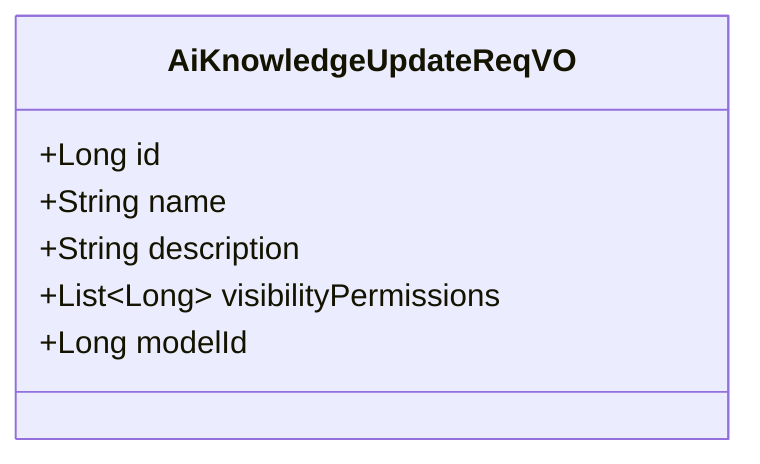
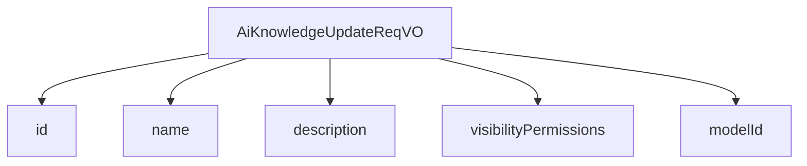

# 基础信息

|      |      |
|------|------|
| 编码语言 | .java |
| 代码路径 | yudao-module-ai/yudao-module-ai-biz/src/main/java/cn/iocoder/yudao/module/ai/controller/admin/knowledge/vo/knowledge/AiKnowledgeUpdateReqVO.java |
| 包名 | cn.iocoder.yudao.module.ai.controller.admin.knowledge.vo.knowledge |
| 依赖项 | ['io.swagger.v3.oas.annotations.media.Schema', 'jakarta.validation.constraints.NotBlank', 'jakarta.validation.constraints.NotNull', 'lombok.Data', 'java.util.List'] |
| 概述说明 | 管理后台AI知识库更新请求VO需包含知识库编号、名称、描述、可见权限列表和嵌入模型编号，所有字段均为必填，以确保信息完整性和权限控制。 |

# 说明

管理后台AI知识库更新请求VO包含五个必填字段，分别是知识库编号、知识库名称、知识库描述、可见权限列表和嵌入模型编号。这些字段均为必填项，确保知识库信息的完整性和权限控制。知识库编号用于唯一标识每个知识库，知识库名称用于描述知识库的主题或内容，知识库描述则提供更详细的说明，帮助用户理解知识库的用途和内容。可见权限列表用于控制哪些用户或用户组可以访问该知识库，确保知识库的访问权限得到有效管理。嵌入模型编号则指定了与该知识库关联的嵌入模型，确保知识库的内容能够与相应的模型进行有效匹配和应用。通过这五个必填字段，管理后台能够全面、详尽地更新和维护AI知识库的信息，确保其准确性和安全性。

# 类列表 Class Summary

| 名称   | 类型  | 说明 |
|-------|------|-------------|
| AiKnowledgeUpdateReqVO | class | 管理后台AI知识库更新请求VO包含以下必填字段：知识库编号、知识库名称、知识库描述、可见权限列表和嵌入模型编号。所有字段均为必填项，确保知识库信息的完整性和权限控制。 |

## 类 AiKnowledgeUpdateReqVO

|      |      |
|------|------|
| 访问范围 | @Schema(description = "管理后台 - AI 知识库更新【我的】 Request VO");@Data;public |
| 类型 | class |
| 名称 | AiKnowledgeUpdateReqVO |
| 说明 | 管理后台AI知识库更新请求VO包含以下必填字段：知识库编号、知识库名称、知识库描述、可见权限列表和嵌入模型编号。所有字段均为必填项，确保知识库信息的完整性和权限控制。 |

### UML类图

### 描述信息：
该UML类图展示了一个名为`AiKnowledgeUpdateReqVO`的类，用于管理后台AI知识库的更新请求。类中包含五个属性：`id`（对话编号）、`name`（知识库名称）、`description`（知识库描述）、`visibilityPermissions`（可见权限列表）和`modelId`（嵌入模型编号）。所有属性均为`public`可见性，确保外部可以直接访问这些数据。

### 内部方法调用关系图

### 描述信息：
该图展示了 `AiKnowledgeUpdateReqVO` 类与其内部属性之间的调用关系。`AiKnowledgeUpdateReqVO` 类包含了多个属性，如 `id`、`name`、`description`、`visibilityPermissions` 和 `modelId`，这些属性通过 `-->` 符号与类进行关联，表示类对这些属性的依赖关系。

### 字段列表 Field List

| 名称  | 类型  | 说明 |
|-------|-------|------|
| name | String | 知识库名称字段为必填项，不能为空，需提供有效值。 |
| modelId | Long | 嵌入模型编号为必填项，不能为空，示例值为1。 |
| description | String | 知识库描述字段为必填项，类型为字符串，用于存储知识库的详细说明信息。 |
| id | Long | 对话编号为必填项，不能为空，示例值为1204，知识库编号同样不能为空。 |
| visibilityPermissions | List<Long> | 可见权限字段为必填项，用于指定哪些人可见，示例值为"1,2,3"，表示可见权限的ID列表。 |

### 方法列表 Method List

| 名称  | 类型  | 说明 |
|-------|-------|------|

