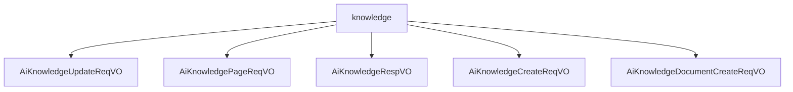

# 基础信息

|      |      |
|------|------|
| 编码语言 | .java |
| 代码路径 | yudao-module-ai/yudao-module-ai-biz/src/main/java/cn/iocoder/yudao/module/ai/controller/admin/knowledge/vo/knowledge |
| 包名 | cn.iocoder.yudao.module.ai.controller.admin.knowledge.vo.knowledge |
| 概述说明 | 管理后台AI知识库更新请求VO包含五个必填字段：知识库编号、名称、描述、可见权限列表和嵌入模型编号，确保信息完整性和权限控制。分页请求VO类包含分页参数和知识库名称，用于按名称查询知识库信息。响应VO包含编号、名称、描述、模型编号和模型标识，用于描述和管理知识库信息。创建知识库请求VO包含名称、描述、可见权限、嵌入模型编号、相似性阈值和topK字段，确保创建过程信息完整。创建知识库文档请求涉及知识库编号、文档名称、URL、段落目标token数、最小字符数、丢弃阈值、最大段落数和是否保留分隔符，确保文档创建规范高效。 |

# 说明

管理后台的AI知识库更新请求VO包含五个必填字段，分别是知识库编号、知识库名称、知识库描述、可见权限列表和嵌入模型编号。这些字段确保了知识库信息的完整性和权限控制。知识库编号用于唯一标识每个知识库，知识库名称描述知识库的主题或内容，知识库描述提供详细说明，可见权限列表控制访问权限，嵌入模型编号指定关联的嵌入模型。通过这些字段，管理后台能够全面更新和维护AI知识库的信息，确保其准确性和安全性。

管理后台的AI知识库分页请求VO类用于按名称查询知识库信息，包含分页参数和知识库名称两个关键字段。分页参数控制查询结果的显示方式，知识库名称用于指定查询条件，系统能够高效检索并展示用户所需的知识库数据，提升查询准确性和用户体验。

管理后台AI知识库响应VO是一个包含多个关键信息的数据结构，主要用于描述和管理AI知识库的相关信息。该数据结构包含五个主要字段：编号、知识库名称、知识库描述、模型编号和模型标识。其中，编号、知识库名称、模型编号和模型标识是必填项，知识库描述是可选的。这些信息共同构成了管理后台AI知识库响应VO的核心内容，确保用户能够全面了解和管理AI知识库的相关信息。

创建AI知识库的请求VO包含多个必填字段，所有字段均不能为空。知识库名称用于标识知识库的唯一性，知识库描述详细说明其用途或内容，可见权限字段设置访问权限，嵌入模型编号指定知识库所采用的嵌入模型，相似性阈值设定文本匹配的相似度标准，topK字段指定检索时返回的最相关结果数量。这些字段确保了知识库在创建时具备完整的信息，支持后续的知识管理和检索操作。

创建AI知识库文档的请求涉及多个必填字段，所有字段均不能为空。知识库编号标识文档所属的知识库，文档名称描述文档的内容或主题，文档URL确保链接的有效性和可访问性，段落目标token数控制文档的分段和内容长度，段落最小字符数确保段落内容的完整性，丢弃阈值避免生成过短或无意义的段落，最大段落数防止文档过长或内容冗余，是否保留分隔符的选项保持文档的结构和格式。这些字段共同确保了AI知识库文档的创建过程规范且高效，生成的文档内容符合预期要求。

### 包内部结构视图

### 描述信息：
该Mermaid图展示了`knowledge`文件夹与其内部文件之间的调用关系。`knowledge`文件夹包含了多个VO（Value Object）类文件，如`AiKnowledgeUpdateReqVO`、`AiKnowledgePageReqVO`等。这些文件可能用于处理知识库的更新、分页查询、响应和创建等操作。

# 文件列表 File List

| 名称   | 类型  | 说明 |
|-------|------|-------------|
| [AiKnowledgePageReqVO.java](AiKnowledgePageReqVO.md) | file | 管理后台的AI知识库分页请求VO类包含分页参数和知识库名称字段，用于按名称查询知识库信息。 |
| [AiKnowledgeDocumentCreateReqVO.java](AiKnowledgeDocumentCreateReqVO.md) | file | 该请求用于创建AI知识库文档，必填字段包括知识库编号、文档名称、文档URL、段落目标token数、段落最小字符数、丢弃阈值、最大段落数及是否保留分隔符。所有字段不能为空，文档URL需符合格式要求。 |
| [AiKnowledgeCreateReqVO.java](AiKnowledgeCreateReqVO.md) | file | 该请求用于创建AI知识库，需填写知识库名称、描述、可见权限、嵌入模型编号、相似性阈值和topK等必填字段，所有字段均不能为空，以确保知识库创建时信息完整。 |
| [AiKnowledgeRespVO.java](AiKnowledgeRespVO.md) | file | 管理后台AI知识库响应VO包含编号、知识库名称、知识库描述、模型编号和模型标识等关键信息，其中编号、知识库名称、模型编号和模型标识为必填项。 |
| [AiKnowledgeUpdateReqVO.java](AiKnowledgeUpdateReqVO.md) | file | 管理后台AI知识库更新请求VO需包含知识库编号、名称、描述、可见权限列表和嵌入模型编号，所有字段均为必填，以确保信息完整性和权限控制。 |

