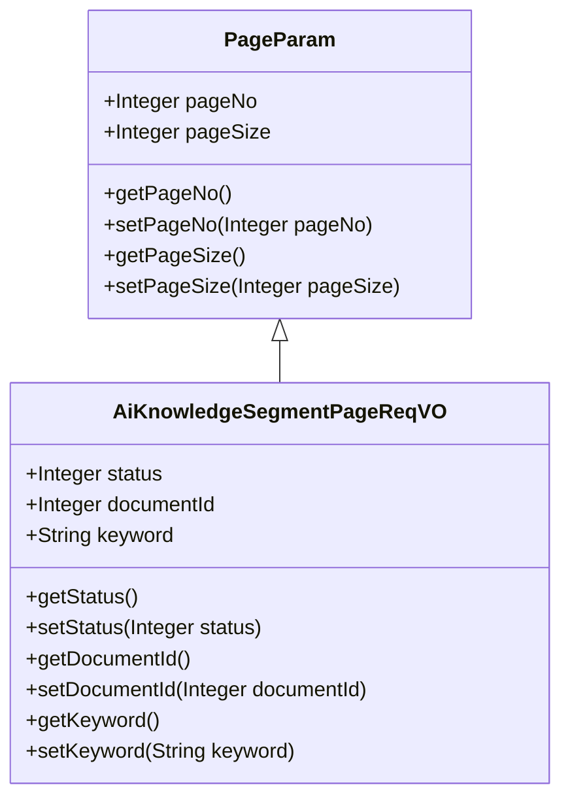
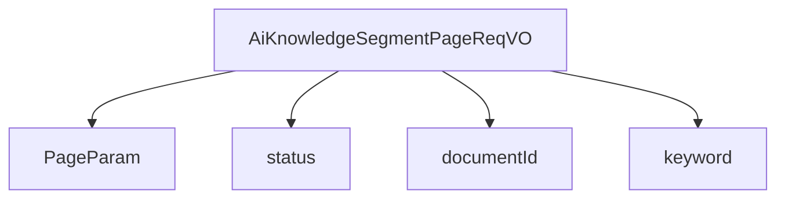

# 基础信息

|      |      |
|------|------|
| 编码语言 | .java |
| 代码路径 | yudao-module-ai/yudao-module-ai-biz/src/main/java/cn/iocoder/yudao/module/ai/controller/admin/knowledge/vo/segment/AiKnowledgeSegmentPageReqVO.java |
| 包名 | cn.iocoder.yudao.module.ai.controller.admin.knowledge.vo.segment |
| 依赖项 | ['cn.iocoder.yudao.framework.common.pojo.PageParam', 'io.swagger.v3.oas.annotations.media.Schema', 'lombok.Data'] |
| 概述说明 | 管理后台AI知识库分段分页请求VO包含分段状态、文档编号和分段内容关键字三个主要参数，用于分页查询和筛选知识库分段信息。 |

# 说明

管理后台AI知识库分段分页请求VO主要用于分页查询和筛选知识库中的分段信息。该请求包含三个主要参数：分段状态、文档编号和分段内容关键字。分段状态用于标识当前分段的处理状态，如是否已审核、是否已发布等；文档编号用于唯一标识特定的文档，以便在知识库中准确定位；分段内容关键字则用于筛选包含特定关键词的分段内容，帮助用户快速找到相关信息。通过这些参数的组合，用户可以实现对知识库分段信息的精确查询和分页展示，从而提高信息检索的效率和准确性。

# 类列表 Class Summary

| 名称   | 类型  | 说明 |
|-------|------|-------------|
| AiKnowledgeSegmentPageReqVO | class | 管理后台AI知识库分段分页请求VO包含分段状态、文档编号和分段内容关键字三个主要参数，用于分页查询和筛选知识库分段信息。 |

## 类 AiKnowledgeSegmentPageReqVO

|      |      |
|------|------|
| 访问范围 | @Schema(description = "管理后台 - AI 知识库分段的分页 Request VO");@Data;public |
| 类型 | class |
| 名称 | AiKnowledgeSegmentPageReqVO |
| 说明 | 管理后台AI知识库分段分页请求VO包含分段状态、文档编号和分段内容关键字三个主要参数，用于分页查询和筛选知识库分段信息。 |

### UML类图

### 描述信息：
该UML类图展示了`AiKnowledgeSegmentPageReqVO`类继承自`PageParam`类的关系。`AiKnowledgeSegmentPageReqVO`类包含三个属性：`status`、`documentId`和`keyword`，分别表示分段状态、文档编号和分段内容关键字。每个属性都有对应的getter和setter方法。

### 内部方法调用关系图

### 描述信息：
该图展示了 `AiKnowledgeSegmentPageReqVO` 类与其父类 `PageParam` 以及类中的字段 `status`、`documentId` 和 `keyword` 之间的调用关系。`AiKnowledgeSegmentPageReqVO` 继承自 `PageParam`，并包含三个字段用于管理AI知识库分段的分页请求。

### 字段列表 Field List

| 名称  | 类型  | 说明 |
|-------|-------|------|
| documentId | Integer | 文档编号为整数类型，示例值为1。 |
| status | Integer | 分段状态字段，类型为整数，示例值为1。 |
| keyword | String | 分段内容关键字用于描述特定主题或领域，例如Java开发，便于分类和检索相关信息。 |

### 方法列表 Method List

| 名称  | 类型  | 说明 |
|-------|-------|------|

