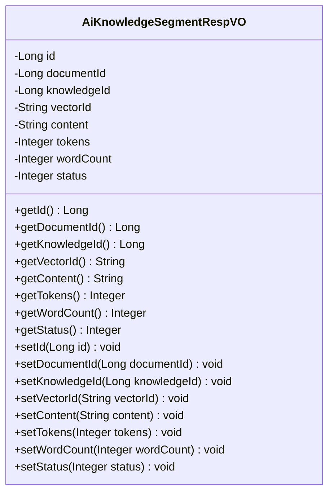
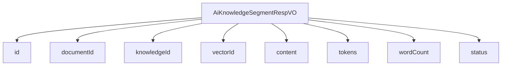

# 基础信息

|      |      |
|------|------|
| 编码语言 | .java |
| 代码路径 | yudao-module-ai/yudao-module-ai-biz/src/main/java/cn/iocoder/yudao/module/ai/controller/admin/knowledge/vo/segment/AiKnowledgeSegmentRespVO.java |
| 包名 | cn.iocoder.yudao.module.ai.controller.admin.knowledge.vo.segment |
| 依赖项 | ['io.swagger.v3.oas.annotations.media.Schema', 'lombok.Data'] |
| 概述说明 | 管理后台AI知识库文档响应VO包含编号、文档编号、知识库编号、向量库编号、切片内容、token数量、字符数和文档状态等必填字段，用于描述文档的详细信息。 |

# 说明

管理后台AI知识库文档响应VO是一个用于描述文档详细信息的结构，包含多个必填字段。其中，编号用于唯一标识该文档响应记录；文档编号用于标识具体的文档；知识库编号表示该文档所属的知识库；向量库编号则关联到文档的向量化存储位置。切片内容字段存储了文档的具体内容片段，通常是经过处理后的文本数据。token数量字段记录了该文档内容在自然语言处理中的token数量，反映了文档的复杂度和长度。字符数字段则记录了文档内容的字符总数，进一步量化了文档的大小。文档状态字段用于标识文档的当前状态，如是否已处理、是否有效等。这些字段共同构成了一个全面的文档描述，便于管理和查询文档的详细信息。

# 类列表 Class Summary

| 名称   | 类型  | 说明 |
|-------|------|-------------|
| AiKnowledgeSegmentRespVO | class | 管理后台AI知识库文档响应VO包含编号、文档编号、知识库编号、向量库编号、切片内容、token数量、字符数和文档状态等必填字段，用于描述文档的详细信息。 |

## 类 AiKnowledgeSegmentRespVO

|      |      |
|------|------|
| 访问范围 | @Schema(description = "管理后台 - AI 知识库-文档 Response VO");@Data;public |
| 类型 | class |
| 名称 | AiKnowledgeSegmentRespVO |
| 说明 | 管理后台AI知识库文档响应VO包含编号、文档编号、知识库编号、向量库编号、切片内容、token数量、字符数和文档状态等必填字段，用于描述文档的详细信息。 |

### UML类图

### 描述信息
该UML类图展示了`AiKnowledgeSegmentRespVO`类的结构，包含多个私有属性和对应的公共getter和setter方法。该类用于管理AI知识库文档的响应数据，涵盖了文档编号、知识库编号、向量库编号、切片内容、token数量、字符数和文档状态等信息。

### 内部方法调用关系图

### 描述信息：
该图展示了 `AiKnowledgeSegmentRespVO` 类与其属性之间的调用关系。`AiKnowledgeSegmentRespVO` 类包含了多个属性，如 `id`、`documentId`、`knowledgeId` 等，这些属性通过 `-->` 符号与类进行关联，表示类对这些属性的依赖关系。

### 字段列表 Field List

| 名称  | 类型  | 说明 |
|-------|-------|------|
| id | Long | 编号为必填项，示例值为24790，数据类型为长整型。 |
| wordCount | Integer | 字符数为必填项，示例值为1008。 |
| documentId | Long | 文档编号为必填项，示例值为24790，类型为长整型。 |
| status | Integer | 文档状态为必填项，示例值为1，表示状态的具体数值。 |
| tokens | Integer | 该字段描述了一个必需的整数类型属性，表示token的数量，示例值为1024。 |
| content | String | 切片内容为必填项，示例为“Java 开发手册”。 |
| knowledgeId | Long | 知识库编号为必填项，示例值为24790，数据类型为长整型。 |
| vectorId | String | 向量库编号为必填项，示例值为1858496a-1dde-4edf-a43e-0aed08f37f8c。 |

### 方法列表 Method List

| 名称  | 类型  | 说明 |
|-------|-------|------|

