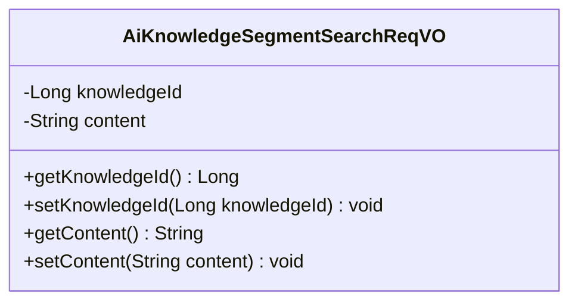
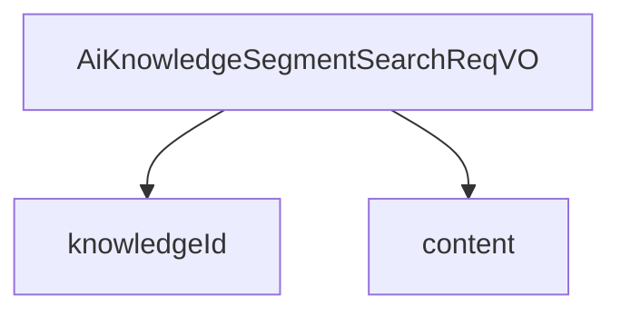

# 基础信息

|      |      |
|------|------|
| 编码语言 | .java |
| 代码路径 | yudao-module-ai/yudao-module-ai-biz/src/main/java/cn/iocoder/yudao/module/ai/controller/admin/knowledge/vo/segment/AiKnowledgeSegmentSearchReqVO.java |
| 包名 | cn.iocoder.yudao.module.ai.controller.admin.knowledge.vo.segment |
| 依赖项 | ['io.swagger.v3.oas.annotations.media.Schema', 'lombok.Data'] |
| 概述说明 | 管理后台AI知识库段落召回请求VO需包含两个必填字段：知识库编号（如24790）和内容（如Java学习路线）。 |

# 说明

管理后台AI知识库段落召回请求VO包含两个必填字段：知识库编号和内容。知识库编号是一个唯一标识符，用于指定特定的知识库，例如示例中的编号24790。内容字段则用于描述用户希望召回的具体信息或主题，例如示例中的“Java学习路线”。这两个字段是请求中不可或缺的部分，确保了系统能够准确地定位并召回相关的知识库段落。通过提供知识库编号和具体内容，用户可以高效地获取所需的信息，从而提升知识库的使用效率和用户体验。

# 类列表 Class Summary

| 名称   | 类型  | 说明 |
|-------|------|-------------|
| AiKnowledgeSegmentSearchReqVO | class | 管理后台AI知识库段落召回请求VO包含两个必填字段：知识库编号（示例：24790）和内容（示例：Java学习路线）。 |

## 类 AiKnowledgeSegmentSearchReqVO

|      |      |
|------|------|
| 访问范围 | @Schema(description = "管理后台 - AI 知识库段落召回 Request VO");@Data;public |
| 类型 | class |
| 名称 | AiKnowledgeSegmentSearchReqVO |
| 说明 | 管理后台AI知识库段落召回请求VO包含两个必填字段：知识库编号（示例：24790）和内容（示例：Java学习路线）。 |

### UML类图

### 描述信息
该UML类图展示了一个名为`AiKnowledgeSegmentSearchReqVO`的类，用于管理后台的AI知识库段落召回请求。类中包含两个私有属性：`knowledgeId`（知识库编号）和`content`（内容），并提供了相应的getter和setter方法。

### 内部方法调用关系图

### 描述信息：
该图展示了 `AiKnowledgeSegmentSearchReqVO` 类与其两个属性 `knowledgeId` 和 `content` 之间的调用关系。`AiKnowledgeSegmentSearchReqVO` 类通过这两个属性来管理 AI 知识库段落的召回请求，其中 `knowledgeId` 表示知识库编号，`content` 表示内容。

### 字段列表 Field List

| 名称  | 类型  | 说明 |
|-------|-------|------|
| knowledgeId | Long | 知识库编号为必填项，示例值为24790，数据类型为长整型。 |
| content | String | 内容字段为必填项，用于描述Java学习路线，示例值为"Java 学习路线"。 |

### 方法列表 Method List

| 名称  | 类型  | 说明 |
|-------|-------|------|

