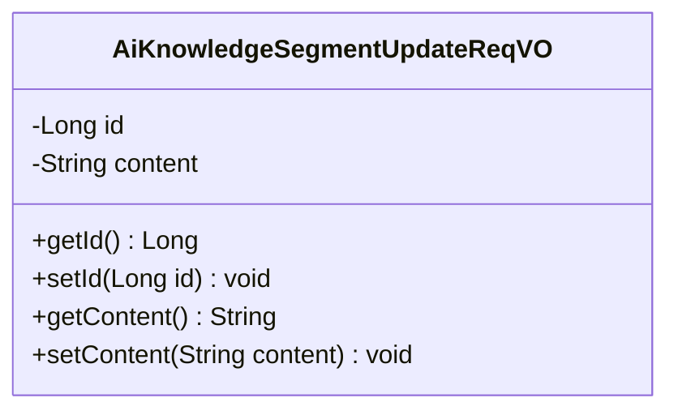
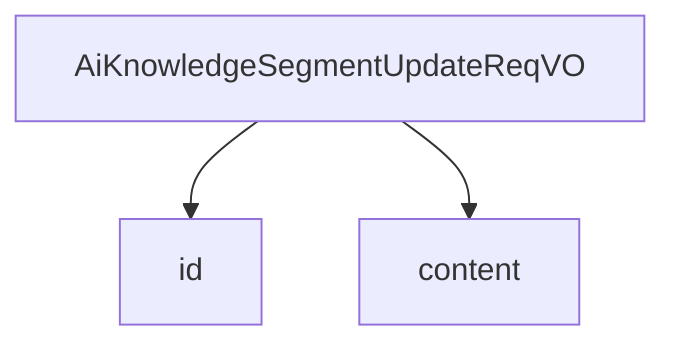

# 基础信息

|      |      |
|------|------|
| 编码语言 | .java |
| 代码路径 | yudao-module-ai/yudao-module-ai-biz/src/main/java/cn/iocoder/yudao/module/ai/controller/admin/knowledge/vo/segment/AiKnowledgeSegmentUpdateReqVO.java |
| 包名 | cn.iocoder.yudao.module.ai.controller.admin.knowledge.vo.segment |
| 依赖项 | ['io.swagger.v3.oas.annotations.media.Schema', 'lombok.Data'] |
| 概述说明 | 管理后台AI更新知识库的请求VO需包含两个必填字段：编号（长整型）和切片内容（字符串类型）。 |

# 说明

管理后台AI更新知识库段落请求VO包含两个必填字段：编号和切片内容。编号字段为长整型，用于唯一标识每个段落请求。切片内容字段为字符串类型，用于存储具体的段落内容。这两个字段共同构成了更新知识库段落请求的基本数据结构，确保每个段落请求都有唯一的标识和具体的内容信息。

# 类列表 Class Summary

| 名称   | 类型  | 说明 |
|-------|------|-------------|
| AiKnowledgeSegmentUpdateReqVO | class | 管理后台AI更新知识库段落请求VO包含编号和切片内容两个必填字段，编号为长整型，切片内容为字符串类型。 |

## 类 AiKnowledgeSegmentUpdateReqVO

|      |      |
|------|------|
| 访问范围 | @Schema(description = "管理后台 - AI 更新 知识库-段落 request VO");@Data;public |
| 类型 | class |
| 名称 | AiKnowledgeSegmentUpdateReqVO |
| 说明 | 管理后台AI更新知识库段落请求VO包含编号和切片内容两个必填字段，编号为长整型，切片内容为字符串类型。 |

### UML类图

### 描述信息：
该UML类图展示了一个名为`AiKnowledgeSegmentUpdateReqVO`的类，用于管理后台AI知识库段落的更新请求。类中包含两个私有属性`id`和`content`，分别表示段落的编号和内容，并提供了相应的getter和setter方法。

### 内部方法调用关系图

### 描述信息：
该图展示了 `AiKnowledgeSegmentUpdateReqVO` 类与其属性 `id` 和 `content` 之间的调用关系。`AiKnowledgeSegmentUpdateReqVO` 类通过 `id` 和 `content` 两个属性来管理知识库段落的更新请求。

### 字段列表 Field List

| 名称  | 类型  | 说明 |
|-------|-------|------|
| id | Long | 编号为必填项，示例值为24790，类型为长整型。 |
| content | String | 切片内容为必填项，示例为“Java 开发手册”。 |

### 方法列表 Method List

| 名称  | 类型  | 说明 |
|-------|-------|------|

