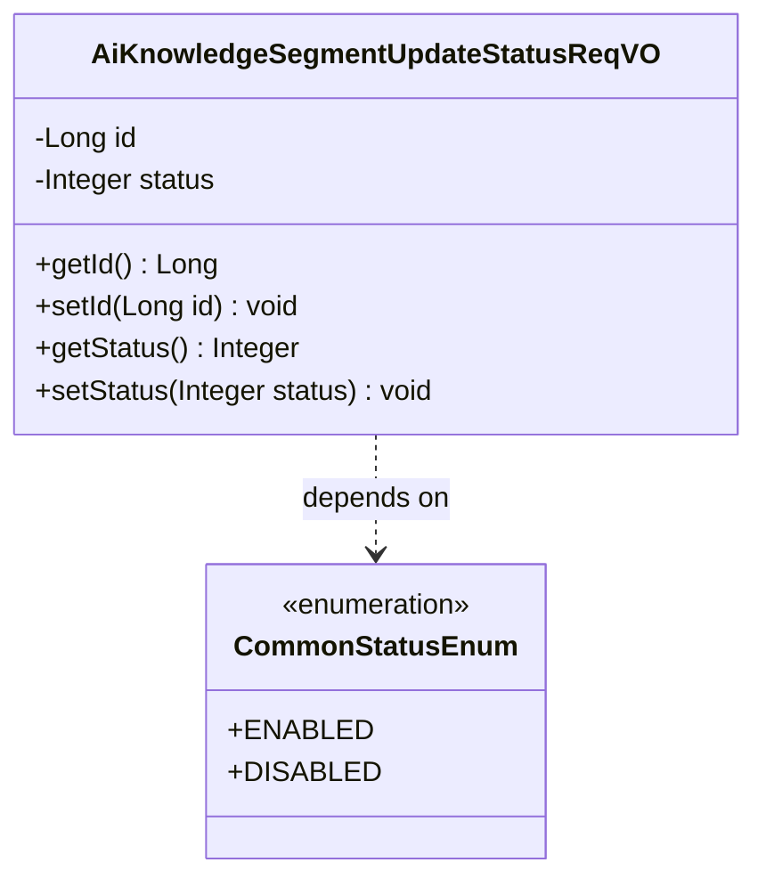
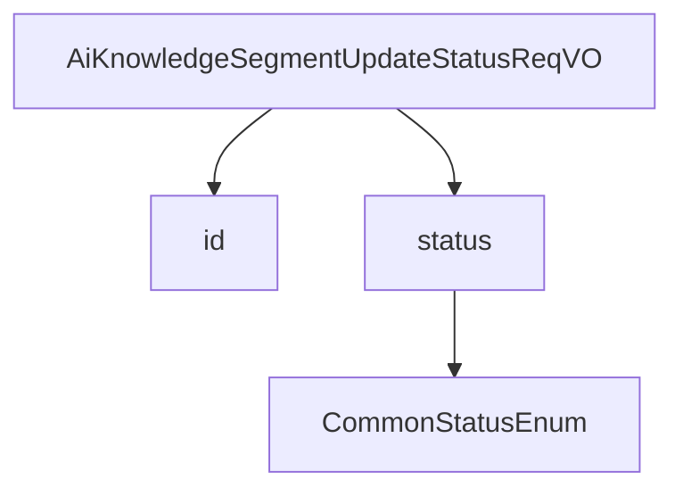

# 基础信息

|      |      |
|------|------|
| 编码语言 | .java |
| 代码路径 | yudao-module-ai/yudao-module-ai-biz/src/main/java/cn/iocoder/yudao/module/ai/controller/admin/knowledge/vo/segment/AiKnowledgeSegmentUpdateStatusReqVO.java |
| 包名 | cn.iocoder.yudao.module.ai.controller.admin.knowledge.vo.segment |
| 依赖项 | ['cn.iocoder.yudao.framework.common.enums.CommonStatusEnum', 'cn.iocoder.yudao.framework.common.validation.InEnum', 'io.swagger.v3.oas.annotations.media.Schema', 'jakarta.validation.constraints.NotNull', 'lombok.Data'] |
| 概述说明 | 管理后台AI知识库段落更新请求需包含两个必填字段：编号（长整型）和是否启用（整型，非空且符合通用状态枚举值）。 |

# 说明

管理后台的AI知识库段落更新状态请求需要包含两个必填字段：编号（id）和是否启用（status）。编号字段为长整型数据，用于唯一标识每个知识库段落。是否启用字段为整型数据，且不能为空，必须符合通用状态枚举值的要求。这两个字段是更新知识库段落状态时必须提供的，确保每个段落的启用状态能够被准确记录和管理。

# 类列表 Class Summary

| 名称   | 类型  | 说明 |
|-------|------|-------------|
| AiKnowledgeSegmentUpdateStatusReqVO | class | 管理后台 - AI 知识库段落的更新状态请求包含两个必填字段：编号（id）和是否启用（status）。编号为长整型，是否启用为整型且不能为空，需符合通用状态枚举值。 |

## 类 AiKnowledgeSegmentUpdateStatusReqVO

|      |      |
|------|------|
| 访问范围 | @Schema(description = "管理后台 - AI 知识库段落的更新状态 Request VO");@Data;public |
| 类型 | class |
| 名称 | AiKnowledgeSegmentUpdateStatusReqVO |
| 说明 | 管理后台 - AI 知识库段落的更新状态请求包含两个必填字段：编号（id）和是否启用（status）。编号为长整型，是否启用为整型且不能为空，需符合通用状态枚举值。 |

### UML类图

### 描述信息：
该UML类图展示了`AiKnowledgeSegmentUpdateStatusReqVO`类与`CommonStatusEnum`枚举类之间的关系。`AiKnowledgeSegmentUpdateStatusReqVO`类包含两个私有属性`id`和`status`，并提供了相应的getter和setter方法。`status`属性依赖于`CommonStatusEnum`枚举类来验证其值。

### 内部方法调用关系图

### 描述信息：
该图展示了 `AiKnowledgeSegmentUpdateStatusReqVO` 类中的方法调用关系。`AiKnowledgeSegmentUpdateStatusReqVO` 类包含两个主要属性：`id` 和 `status`。其中，`status` 属性通过 `InEnum` 注解与 `CommonStatusEnum` 枚举类相关联，用于验证状态值的有效性。

### 字段列表 Field List

| 名称  | 类型  | 说明 |
|-------|-------|------|
| id | Long | 编号为必填项，示例值为24790，类型为长整型。 |
| status | Integer | 该字段表示是否启用，为必填项，不能为空，且必须为CommonStatusEnum枚举类中的值，示例值为1。 |

### 方法列表 Method List

| 名称  | 类型  | 说明 |
|-------|-------|------|

