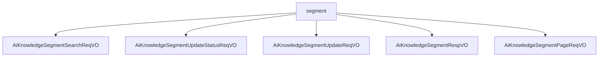

# 基础信息

|      |      |
|------|------|
| 编码语言 | .java |
| 代码路径 | yudao-module-ai/yudao-module-ai-biz/src/main/java/cn/iocoder/yudao/module/ai/controller/admin/knowledge/vo/segment |
| 包名 | cn.iocoder.yudao.module.ai.controller.admin.knowledge.vo.segment |
| 概述说明 | 管理后台AI知识库系统涉及多个关键操作，包括段落召回、更新状态、更新段落内容、文档响应及分段分页查询。段落召回需知识库编号和内容字段；更新状态需编号和启用状态字段；更新段落内容需编号和切片内容字段。文档响应包含编号、文档编号、知识库编号、向量库编号、切片内容、token数量、字符数和文档状态字段。分段分页查询涉及分段状态、文档编号和分段内容关键字，用于精确检索和分页展示知识库信息。 |

# 说明

管理后台的AI知识库系统涉及多个关键功能和数据结构，主要用于知识库段落的召回、更新、状态管理以及文档的详细描述和分页查询。首先，AI知识库段落召回请求包含两个必填字段：知识库编号和内容。知识库编号是一个唯一标识符，用于指定特定的知识库，而内容字段则描述用户希望召回的具体信息或主题。这两个字段确保了系统能够准确定位并召回相关段落，提升知识库的使用效率和用户体验。

其次，AI知识库段落更新状态请求包含两个必填字段：编号和是否启用。编号字段为长整型数据，用于唯一标识每个知识库段落，而是否启用字段为整型数据，必须符合通用状态枚举值的要求。这两个字段确保了每个段落的启用状态能够被准确记录和管理。

AI更新知识库段落请求包含两个必填字段：编号和切片内容。编号字段为长整型，用于唯一标识每个段落请求，而切片内容字段为字符串类型，用于存储具体的段落内容。这两个字段构成了更新知识库段落请求的基本数据结构，确保每个段落请求都有唯一的标识和具体的内容信息。

AI知识库文档响应VO用于描述文档的详细信息，包含多个必填字段。编号用于唯一标识该文档响应记录，文档编号标识具体的文档，知识库编号表示文档所属的知识库，向量库编号关联到文档的向量化存储位置。切片内容字段存储文档的具体内容片段，token数量字段记录文档内容在自然语言处理中的token数量，字符数字段记录文档内容的字符总数，文档状态字段标识文档的当前状态。这些字段共同构成了一个全面的文档描述，便于管理和查询文档的详细信息。

最后，AI知识库分段分页请求VO用于分页查询和筛选知识库中的分段信息，包含三个主要参数：分段状态、文档编号和分段内容关键字。分段状态标识当前分段的处理状态，文档编号用于唯一标识特定的文档，分段内容关键字用于筛选包含特定关键词的分段内容。通过这些参数的组合，用户可以实现对知识库分段信息的精确查询和分页展示，提高信息检索的效率和准确性。

### 包内部结构视图

### 描述信息：
该Mermaid图展示了`segment`文件夹下的五个Java文件之间的调用关系。每个文件都从`segment`节点派生，表示它们属于同一个文件夹。图中清晰地展示了文件之间的层级关系，便于理解代码结构。

# 文件列表 File List

| 名称   | 类型  | 说明 |
|-------|------|-------------|
| [AiKnowledgeSegmentPageReqVO.java](AiKnowledgeSegmentPageReqVO.md) | file | 管理后台AI知识库分段分页请求VO包含分段状态、文档编号和分段内容关键字三个主要参数，用于分页查询和筛选知识库分段信息。 |
| [AiKnowledgeSegmentRespVO.java](AiKnowledgeSegmentRespVO.md) | file | 管理后台AI知识库文档响应VO包含编号、文档编号、知识库编号、向量库编号、切片内容、token数量、字符数和文档状态等必填字段，用于描述文档的详细信息。 |
| [AiKnowledgeSegmentUpdateReqVO.java](AiKnowledgeSegmentUpdateReqVO.md) | file | 管理后台AI更新知识库的请求VO需包含两个必填字段：编号（长整型）和切片内容（字符串类型）。 |
| [AiKnowledgeSegmentUpdateStatusReqVO.java](AiKnowledgeSegmentUpdateStatusReqVO.md) | file | 管理后台AI知识库段落更新请求需包含两个必填字段：编号（长整型）和是否启用（整型，非空且符合通用状态枚举值）。 |
| [AiKnowledgeSegmentSearchReqVO.java](AiKnowledgeSegmentSearchReqVO.md) | file | 管理后台AI知识库段落召回请求VO需包含两个必填字段：知识库编号（如24790）和内容（如Java学习路线）。 |

