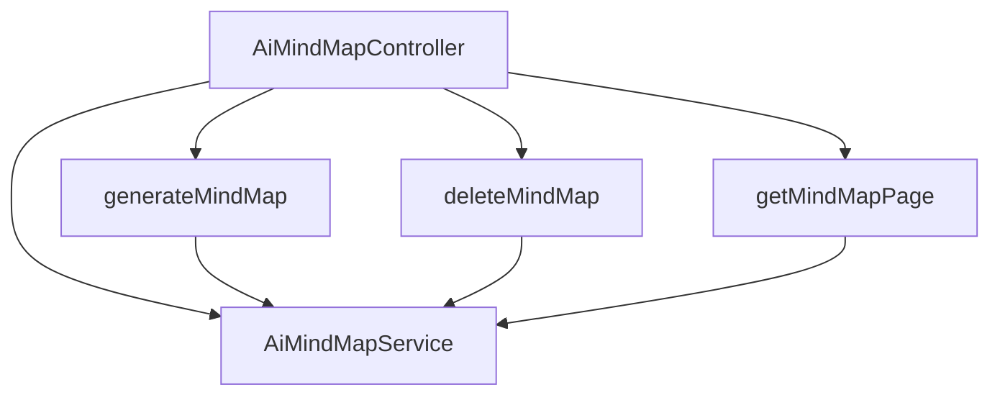

# 基础信息

|      |      |
|------|------|
| 编码语言 | .java |
| 代码路径 | yudao-module-ai/yudao-module-ai-biz/src/main/java/cn/iocoder/yudao/module/ai/controller/admin/mindmap/AiMindMapController.java |
| 包名 | cn.iocoder.yudao.module.ai.controller.admin.mindmap |
| 依赖项 | ['cn.iocoder.yudao.framework.common.pojo.CommonResult', 'cn.iocoder.yudao.framework.common.pojo.PageResult', 'cn.iocoder.yudao.framework.common.util.object.BeanUtils', 'cn.iocoder.yudao.module.ai.controller.admin.mindmap.vo.AiMindMapGenerateReqVO', 'cn.iocoder.yudao.module.ai.controller.admin.mindmap.vo.AiMindMapPageReqVO', 'cn.iocoder.yudao.module.ai.controller.admin.mindmap.vo.AiMindMapRespVO', 'cn.iocoder.yudao.module.ai.dal.dataobject.mindmap.AiMindMapDO', 'cn.iocoder.yudao.module.ai.service.mindmap.AiMindMapService', 'io.swagger.v3.oas.annotations.Operation', 'io.swagger.v3.oas.annotations.Parameter', 'io.swagger.v3.oas.annotations.tags.Tag', 'jakarta.annotation.Resource', 'jakarta.annotation.security.PermitAll', 'jakarta.validation.Valid', 'org.springframework.http.MediaType', 'org.springframework.security.access.prepost.PreAuthorize', 'org.springframework.web.bind.annotation', 'reactor.core.publisher.Flux', 'cn.iocoder.yudao.framework.common.pojo.CommonResult.success', 'cn.iocoder.yudao.framework.security.core.util.SecurityFrameworkUtils.getLoginUserId'] |
| 概述说明 | AiMindMapController 是管理后台的 AI 思维导图控制器，具备流式生成、删除和分页查询功能。流式生成通过 SSE 快速响应，删除需权限验证，分页查询返回思维导图的分页结果。 |

# 说明

AiMindMapController 是一个用于管理后台的 AI 思维导图控制器，主要提供流式生成、删除和分页查询功能。该控制器的流式生成接口采用 SSE（Server-Sent Events）技术，能够快速响应用户请求，实现实时生成思维导图的功能。删除接口则设计有权限验证机制，确保只有具备相应权限的用户才能执行删除操作，从而保障数据的安全性。此外，分页查询接口能够返回思维导图的分页结果，方便用户按需浏览和管理大量数据。通过这些功能，AiMindMapController 能够高效地支持思维导图的生成、删除和查询操作，满足后台管理的需求。

# 类列表 Class Summary

| 名称   | 类型  | 说明 |
|-------|------|-------------|
| AiMindMapController | class | AiMindMapController 是一个管理后台的 AI 思维导图控制器，提供流式生成、删除和分页查询功能。流式生成接口通过 SSE 快速响应，删除接口需要权限验证，分页查询接口返回思维导图的分页结果。 |


## 类 AiMindMapController

|      |      |
|------|------|
| 访问范围 | @Tag(name = "管理后台 - AI 思维导图");@RestController;@RequestMapping("/ai/mind-map");public |
| 类型 | class |
| 名称 | AiMindMapController |
| 说明 | AiMindMapController 是一个管理后台的 AI 思维导图控制器，提供流式生成、删除和分页查询功能。流式生成接口通过 SSE 快速响应，删除接口需要权限验证，分页查询接口返回思维导图的分页结果。 |


### UML类图

```mermaid
classDiagram
    class AiMindMapController {
        +AiMindMapService mindMapService
        +generateMindMap(AiMindMapGenerateReqVO generateReqVO) Flux~CommonResult~String~~
        +deleteMindMap(Long id) CommonResult~Boolean~
        +getMindMapPage(AiMindMapPageReqVO pageReqVO) CommonResult~PageResult~AiMindMapRespVO~~
    }

    class AiMindMapService {
        +generateMindMap(AiMindMapGenerateReqVO generateReqVO, Long userId) Flux~CommonResult~String~~
        +deleteMindMap(Long id) void
        +getMindMapPage(AiMindMapPageReqVO pageReqVO) PageResult~AiMindMapDO~
    }

    class AiMindMapGenerateReqVO {
        +String name
        +String description
    }

    class AiMindMapPageReqVO {
        +Integer pageNo
        +Integer pageSize
    }

    class AiMindMapDO {
        +Long id
        +String name
        +String description
    }

    class AiMindMapRespVO {
        +Long id
        +String name
        +String description
    }

    class CommonResult~T~ {
        +Integer code
        +String message
        +T data
    }

    class PageResult~T~ {
        +List~T~ list
        +Long total
    }

    AiMindMapController --> AiMindMapService : depends on
    AiMindMapController ..> AiMindMapGenerateReqVO : uses
    AiMindMapController ..> AiMindMapPageReqVO : uses
    AiMindMapController ..> CommonResult~String~ : uses
    AiMindMapController ..> CommonResult~Boolean~ : uses
    AiMindMapController ..> CommonResult~PageResult~AiMindMapRespVO~~ : uses
    AiMindMapService ..> AiMindMapDO : uses
    AiMindMapService ..> PageResult~AiMindMapDO~ : uses
    AiMindMapRespVO <|-- AiMindMapDO : extends
```

### 描述信息：
该UML类图展示了`AiMindMapController`类与`AiMindMapService`类之间的依赖关系，以及它们与请求和响应对象（如`AiMindMapGenerateReqVO`、`AiMindMapPageReqVO`、`AiMindMapDO`、`AiMindMapRespVO`等）的交互。`AiMindMapController`通过调用`AiMindMapService`的方法来处理思维导图的生成、删除和分页查询请求。


### 内部方法调用关系图



### 描述信息：
该图展示了`AiMindMapController`类中的三个方法`generateMindMap`、`deleteMindMap`和`getMindMapPage`与`AiMindMapService`之间的调用关系。每个方法都依赖于`AiMindMapService`来执行具体的业务逻辑，如生成思维导图、删除导图和获取导图分页数据。

### 字段列表 Field List

| 名称  | 类型  | 说明 |
|-------|-------|------|
| mindMapService | AiMindMapService | 在代码中，通过@Resource注解将AiMindMapService注入到当前类中，以便使用其提供的功能。 |

### 方法列表 Method List

| 名称  | 类型  | 说明 |
|-------|-------|------|
| deleteMindMap | CommonResult<Boolean> | 该接口用于删除思维导图，需提供编号作为参数，且要求用户具有删除权限。删除操作成功后返回布尔值true。 |
| getMindMapPage | CommonResult<PageResult<AiMindMapRespVO>> | 该代码定义了一个GET请求接口“/page”，用于获取思维导图的分页数据。接口需要用户具备“ai:mind-map:query”权限。请求参数为AiMindMapPageReqVO对象，返回结果为分页的AiMindMapRespVO数据。 |
| generateMindMap | Flux<CommonResult<String>> | 该接口使用POST方法处理"/generate-stream"请求，流式返回导图生成结果，响应较快。接口允许所有用户访问，解决了SSE响应时被拦截的问题。请求体为AiMindMapGenerateReqVO对象，返回类型为Flux<CommonResult<String>>，调用mindMapService生成导图并传入当前登录用户ID。 |


