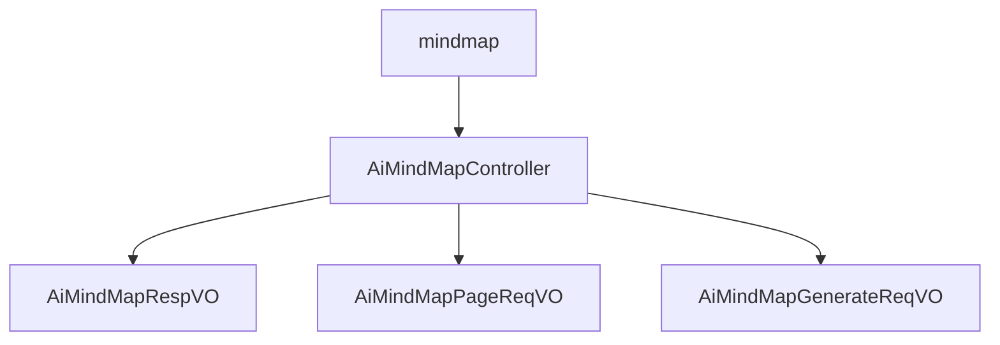

# 基础信息

|      |      |
|------|------|
| 编码语言 | .java |
| 代码路径 | yudao-module-ai/yudao-module-ai-biz/src/main/java/cn/iocoder/yudao/module/ai/controller/admin/mindmap |
| 包名 | cn.iocoder.yudao.module.ai.controller.admin.mindmap |
| 概述说明 | AiMindMapController 提供流式生成、删除和分页查询功能，支持实时生成思维导图、权限验证删除和数据分页管理。AiMindMapRespVO 类包含编号、用户编号、生成内容提示、思维导图内容、平台、模型、错误信息和创建时间等字段，确保响应数据的完整性和可追溯性。分页请求VO包含用户编号、生成内容提示和创建时间范围，用于筛选符合条件的思维导图数据。生成请求VO包含必填的“prompt”字段，用于指定思维导图内容提示。 |

# 说明

AiMindMapController 是一个专门用于管理后台 AI 思维导图的控制器，提供流式生成、删除和分页查询功能。其流式生成接口采用 SSE（Server-Sent Events）技术，能够实时响应用户请求并快速生成思维导图。删除接口设计有权限验证机制，确保只有具备相应权限的用户可以执行删除操作，保障数据安全。分页查询接口则支持返回思维导图的分页结果，方便用户浏览和管理大量数据。通过这些功能，AiMindMapController 能够高效支持思维导图的生成、删除和查询操作，满足后台管理的需求。

AiMindMapRespVO 类是一个用于管理 AI 思维导图响应的数据结构，包含多个必填字段以确保信息的完整性和可追溯性。这些字段包括编号（唯一标识响应）、用户编号（关联生成响应的用户）、生成内容提示（记录用户输入的提示信息）、生成的思维导图内容（存储 AI 生成的思维导图数据）、平台字段（标识生成平台）、模型字段（记录使用的 AI 模型）、错误信息字段（存储生成过程中的错误信息）以及创建时间字段（记录响应的生成时间）。通过这些字段，AiMindMapRespVO 类能够全面管理 AI 思维导图的生成过程及其相关数据。

管理后台 AI 思维导图分页请求 VO 是一个用于处理用户请求的数据结构，包含三个关键信息：用户编号（长整型，唯一标识用户）、生成内容提示（字符串，提供生成思维导图的内容提示或关键词）以及创建时间范围（LocalDateTime 数组，包含起始和结束时间，格式为年月日时分秒）。该数据结构帮助系统根据用户需求和时间范围筛选符合条件的 AI 思维导图数据，支持分页展示和管理。

管理后台 AI 思维导图生成请求 VO 包含一个必填字段“prompt”，用于指定思维导图的内容提示。用户输入的内容提示（如“Java学习路线”）将用于生成相关的思维导图。该字段必须填写，确保每次请求都有明确的内容提示，从而生成符合用户需求的思维导图。

### 包内部结构视图

### 描述信息：
该图展示了`mindmap`文件夹下的文件调用关系。`AiMindMapController`作为核心控制器，调用了`AiMindMapRespVO`、`AiMindMapPageReqVO`和`AiMindMapGenerateReqVO`三个VO类，分别用于响应、分页请求和生成请求的数据处理。

# 文件列表 File List

| 名称   | 类型  | 说明 |
|-------|------|-------------|
| [AiMindMapController.java](AiMindMapController.md) | file | AiMindMapController 是管理后台的 AI 思维导图控制器，具备流式生成、删除和分页查询功能。流式生成通过 SSE 快速响应，删除需权限验证，分页查询返回思维导图的分页结果。 |
| [vo](vo/_package.md) | folder | AiMindMapRespVO类用于管理后台AI思维导图响应，包含编号、用户编号、生成内容提示、思维导图内容、平台、模型、错误信息和创建时间等字段，确保数据完整性和可追溯性。管理后台AI思维导图分页请求VO包含用户编号、生成内容提示和创建时间范围，用于筛选符合条件的思维导图数据。AI思维导图生成请求VO包含必填字段“prompt”，用于指定生成思维导图的内容提示。 |

