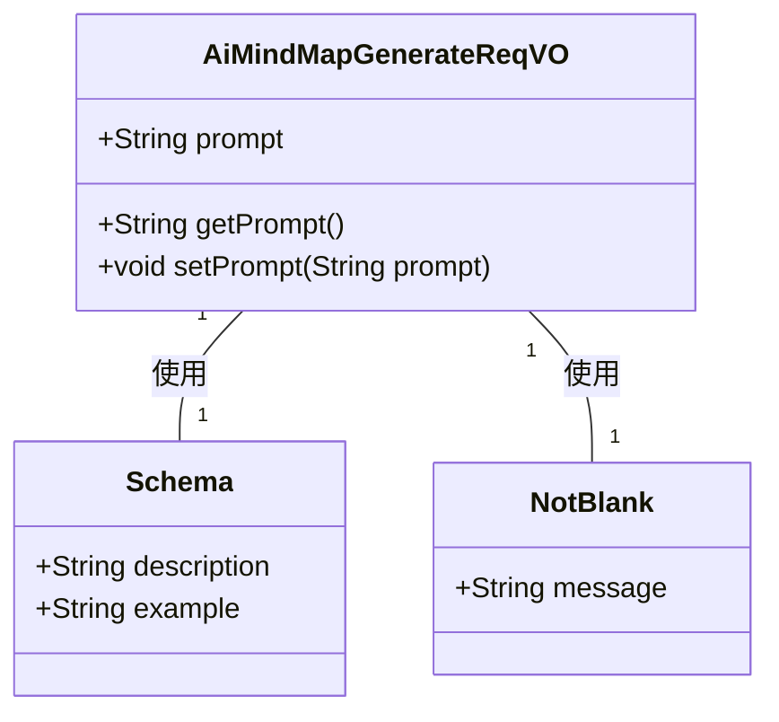
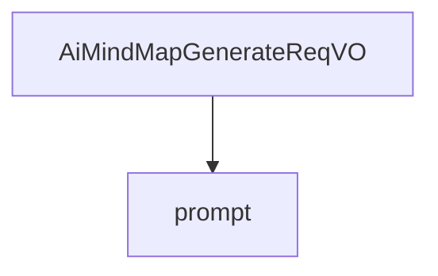

# 基础信息

|      |      |
|------|------|
| 编码语言 | .java |
| 代码路径 | yudao-module-ai/yudao-module-ai-biz/src/main/java/cn/iocoder/yudao/module/ai/controller/admin/mindmap/vo/AiMindMapGenerateReqVO.java |
| 包名 | cn.iocoder.yudao.module.ai.controller.admin.mindmap.vo |
| 依赖项 | ['io.swagger.v3.oas.annotations.media.Schema', 'jakarta.validation.constraints.NotBlank', 'lombok.Data'] |
| 概述说明 | 管理后台AI思维导图生成请求VO中必填字段“prompt”用于指定思维导图内容提示，如“Java学习路线”，且该字段不可为空。 |

# 说明

管理后台的AI思维导图生成请求VO包含一个必填字段“prompt”，该字段用于指定思维导图的内容提示。例如，用户可以输入“Java学习路线”作为提示内容，以生成相关的思维导图。这个字段是必须填写的，不能为空，确保每次请求都有明确的内容提示，从而生成符合用户需求的思维导图。

# 类列表 Class Summary

| 名称   | 类型  | 说明 |
|-------|------|-------------|
| AiMindMapGenerateReqVO | class | 管理后台AI思维导图生成请求VO包含一个必填字段“prompt”，用于指定思维导图的内容提示，例如“Java学习路线”。该字段不能为空。 |

## 类 AiMindMapGenerateReqVO

|      |      |
|------|------|
| 访问范围 | @Schema(description = "管理后台 - AI 思维导图生成 Request VO");@Data;public |
| 类型 | class |
| 名称 | AiMindMapGenerateReqVO |
| 说明 | 管理后台AI思维导图生成请求VO包含一个必填字段“prompt”，用于指定思维导图的内容提示，例如“Java学习路线”。该字段不能为空。 |

### UML类图

### 描述信息：
该UML类图展示了`AiMindMapGenerateReqVO`类，该类用于管理后台的AI思维导图生成请求。`AiMindMapGenerateReqVO`类包含一个`prompt`属性，并通过`Schema`和`NotBlank`注解进行验证和描述。`Schema`注解用于描述字段的用途和示例，`NotBlank`注解用于确保`prompt`字段不为空。

### 内部方法调用关系图

### 描述信息：
该图展示了 `AiMindMapGenerateReqVO` 类与其属性 `prompt` 之间的调用关系。`AiMindMapGenerateReqVO` 类用于管理后台的 AI 思维导图生成请求，其中 `prompt` 属性用于存储思维导图的内容提示信息。

### 字段列表 Field List

| 名称  | 类型  | 说明 |
|-------|-------|------|
| prompt | String | 思维导图内容提示字段描述为Java学习路线，要求该字段不能为空。 |

### 方法列表 Method List

| 名称  | 类型  | 说明 |
|-------|-------|------|

